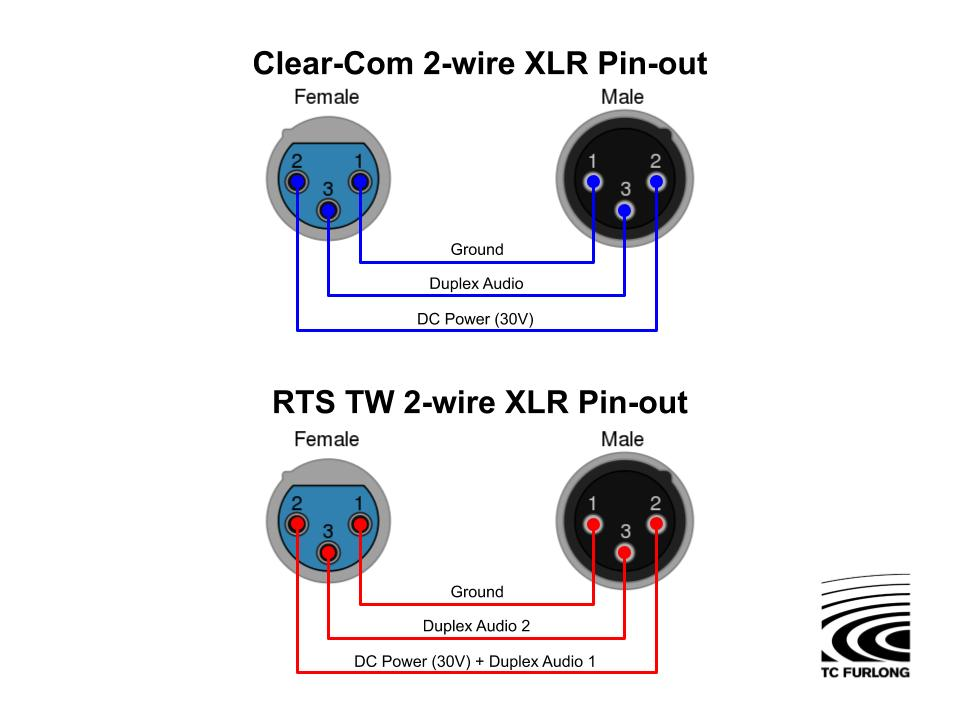
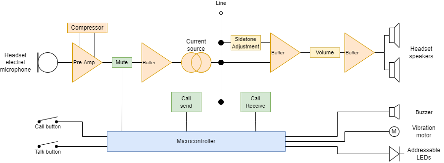
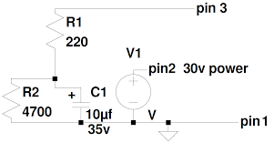
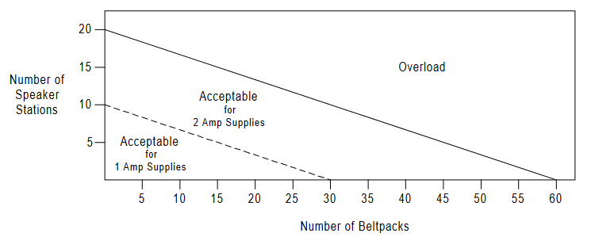
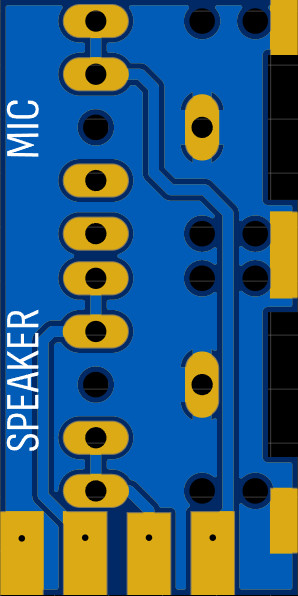

Build an opensource and afordable communication platform for proffesionals in the audiovisual buisness

<!--more-->

I mentioned in a few articles now that I sometime partake in live productions. In the world of audiovisual, concerts, shows, video, ... one thing is key: **Communication**.
If you can communicate between different parties, things start to break down.

That's why you generally have an intercom system. This system might be as simple as giving a phone call to the other person, but can get as complicated as multi-thousand dollar racks of communication equipment.

Generally, it's somewhere in between, personally I have used two kinds:
 - Talkie walkies
 - Wired beltpack system

Analog beltpack intercoms (wired ones) typically connect to what is called a partyline. Basically, it's one cable that everyone gets wired into so that they can speak together. Occasionally, we use an intercom system made by [ASLCLEAR](https://parcsmaterielsgrandest.fr/catalogue/selestat.1/son.1/interphonie.56/filaire.57/ensemble-dinterphonie-4-postes.668), apart from where we rent them I couldn't really find any information on them. I did manage to find a proper manual for the [BS15](https://github.com/OpenComs/doc_archive/blob/ced30f4c498a04c658b909e5e5cbc5604159d834/ASL/BS-15%20Manual.PDF) thought. 

This particular intercom is a single channel beltpack with a talk button, a volume knob and a call button. This is a typical configuration for lower end devices, some of them will have two channels (basically two partyline connectors or one with two lines).

For a while before starting the project, I contemplated making my own intercom. I mean, how hard can it be, you just wire them with an XLR cable, can't be that hard.
Oh boy, lets deep dive into wired analog intercom systems.

## Research

First I started to look at commercial products, the brand from my intercom system (ASL) is basically non-existent on the web. But by pure chance, I did find a [project aimed at making compatible intercoms](https://www.sonelec-musique.com/electronique_realisations_interphone_003.html) (:fr:), I did try this circuit, but had issues integrating it with the existing system (talk wasn't working or with a very low level and the call function made all the intercoms saturate like crazy)

I then let this project slide for more than 2 years. Recently, I had to use them again and now that I've gotten better at understanding and creating analog circuitry, I thought that I'll try to build a proper intercom system that would be fully opensource.

So, it began, the many hours of research to find out an ounce of information on this system. Fortunately, I rapidly found that there were two main systems with a lot of "compatible" sub-systems. These two systems are pretty similar, one is from [Clear-Com](https://www.clearcom.com/) with one channel per line and the [RTS](https://rtsintercoms.com/) system with two channels per line.

As my intercom system is only one line, I assumed that it was based on the Clear-Com system and quickly dismissed RTS because I didn't want to complicate things with two channels, as we'll see later, RTS isn't that much more complicated.

### About Clear-Com
Clear-Com was founded a while ago in 1968 actually, so they have been around and evolved a lot. The first Clear-Com product was the RS-100 intercom station, a portable unit connected using standard XLR terminated microphone cables.

The original party-line intercom system consists of a central control unit called the "master station" and several "remote stations" that are connected with a mix of a star and daisy chain configurations. Each station has a push-to-talk button that allows the user to communicate with other stations on the same line. 

One of the advantages of the Clear-Com party-line intercom system which I wanted to replicate is its simplicity and reliability. The system uses standard XLR connectors for easy connectivity and has no complicated programming or configuration requirements.

### Evolutions & Alternative
To this day, Clear-Com still continues to innovate their intercom systems. 

Since their first system, they moved onto digital intercoms. Which allows the use of a matrix that provides more flexibility and scalability, allowing for more complex configurations and communication paths. 

For instance, their Eclipse HX series, can apparently support hundreds of endpoints. They also ventured into the wireless game with their FreeSpeak II series, which, from what I could tell, works on 1.9Ghz using DECT. Clear-Com is also making IP-based intercom systems, such as the HelixNet and LQ series.

As for alternatives, there are multiples, here is a short list:
- [RTS Intercom Systems](https://rtsintercoms.com/): Their intercom systems include both party-line and digital matrix systems.
- [Telex](https://telex.com/) is another established manufacturer of intercom systems that offers a range of intercom systems, including wireless and IP-based options.
- [Unity Intercom](https://www.unityintercom.com/) is a cloud-based intercom system


### Price
Unfortunately, you can't buy new belt packs of their old system. They, however, released the ClearCom Encore system, basically the same thing but with a new name.

Let's say we need 4 intercoms for a production (in reallity we probably need 6-8 itercoms), an analog system should cost much, right? right? The most basic system is a basic base station and 4 basic belt packs, for example the [MS-702](https://www.videoplusfrance.com/fr/12766-clear-com-station-centrale-intercom-2-canaux-hp-alim-2a-1-u-rack.html) and [RS-701](https://www.videoplusfrance.com/fr/5023531-clear-com-rs-701-boitier-ceinture-mono-canal-filaire-partyline.html). At the time of writing, the total cost for such a system is €2530 + €730 * 4 = €5450

I have one word for that (three, actually): **WTF**. 5k for a wired analog intercom system, The-F is wrong with you. Even if you go used, the belt packs are still generally more than €200/€300 per unit **if you can find them**.

This is one of the big reason why I decided to try to make an open-source analog party line system. It's analog and I would be surprised if the total fro component were mode the €75. It's just that there isn't any competition.


## A bit of warning
At no point in this whole endeavor, I had access to actual Clear-Com gear. All documents that helped to create the Opencoms ecosystem were already available onlines through various means (google dorks/internet archive). I did collect a few that were especially useful in understanding the system and put them on a special github repo for you all to read throught https://github.com/OpenComs/doc_archive. 

Most of them are manuals of either current version or very old versions. I also found some installation manuals with a bit more details and a pretty great handbook from Telex.


## Understanding the original partyline system

Here are some quotes with highlighted passages from the various PDFs:

> A basic system consists of a single- or multi-channel Power Supply or Main Station connected to various single- or multi-channel Remote Stations.

> Clear-Com is a distributed amplifier system; each Main or Remote Station houses its **own microphone preamplifier**, **headset or speaker power amplifier**, and **signaling circuitry**. Stations bridge the intercom line at a **very high impedance** and place a minimum load on the line. The audio level always **remains constant**, and does not fluctuate as stations leave and join the system. . 

The last sentence is particularly intriging and is why the schematic I found to make a compatible intercom didn't really work 2 years ago

> Portable stations are connected with 3-pin XLR connectors. One wire, connected to **pin 2, carries the DC power** from a Main Station or Power Supply to all Remote Stations. The other wire, connected to **pin 3, carries the 2-way (duplex) audio** information. The shield, connected to **pin 1, acts as a common ground**. 

Note: The original RTS two wire partyline system is fundamentally the same as the ClearCom system the only thing that differs is that audio signal from the 1st channel is modulated on the power pin.


> The fundamental concept of Clear-Com Party-Line intercom is that **all channels are terminated in one location**, preferably at a Main Station or Power Supply. All intercom lines **must be terminated**. Care must be taken not to double-terminate a line. All unused intercom lines must also be terminated.

> An unterminated line will cause excessive levels, possible oscillation of line drivers, and squealing in the headsets. An intercom line with double or multiple terminations will cause low levels and the inability to null the headsets.

After quite a bit of time studying the schematics and different documents, I concluded that a clear-com compatible beltpack has at least 9 distinct parts:

### Power management
30 volts DC is supplied on pin 3 of the party line XLR connector. A diode adds protection against reverse polarity, which would cause quite a bit of damage. A small RC filter also removes unwanted noise.

From my research there's no reason the system wouldn't work on lower voltages, infact my base station will supply 24v, from reading throught the docs, it has probably more to do with cable lenght lenght (which should be kept under 150m) that anything else

#### Virtual ground:
Since the circuit is using a single voltage supply, there is a need for a virtual ground. Since it's mainly a reference and doesn't need to provide lots of current, a simple op-amp based reference with some basic filtering is used.

### Microphone preamplifier
Almost every station has some kind of mic preamp, for beltpacks, the fixed gain amplifier can use either electret microphones or dynamic one which is configurable with a dip switch

### Audio transmission
This probably what took the longest for me to understand and is why the schematic I foudn and tried in the past didn't really work most of the time, clear com systems are not simply dumping the output of an amplifier onto the line. This would lead to level changes when someone joins/leaves the partyline, cable length would also be affected. Instead, it uses a current pump to make sure audio levels stay the same regardless of the number of stations connected to the line.

This is also why there is a 220Ohm terminaison resistor on the base stations, because if it were not present it will cause excessive levels, and probably a feedback loop of the line drivers. Double terminating is not that big of a deal, it will just lower the overall volume.

### Side tone null
A specially crafted circuit takes the microphone signal and subtracts it from the speaker signal. By adjusting the level of the microphone signal, you can adjust the side tone to avoid echos and feedback loops while still beeing able to hear yourself, which is super important.

### Headphones amp
The output stage is a simple amplifier followed by two op-amps in parallel configured as unity gain to give a low impedance output for headphones

### Call transmit
The call circuit superimposes a DC offset onto the bus. Typically, dumping VCC to the bus trough around 3k of resistance. This circuit also includes an RC filter to control the rise and decay times to avoid sharp transitions of the bus that would result in a huge DC spike for the headphone amplifier and an audible pop in the headphones.

### Call receive
When a high enought DC voltage is imposed on the bus, enought current can flow through the base of a transistor to turn on a signal light. A simple RC filter is present to filter out some brief noise spikes.

### Logic
Some stations also include some basic logic, for instance, the talk and call buttons are routed through an IC, this allows for user customization, like how the talk button acts (PTT/latch/…). This also how the RMK (remote mic kill) function works. If the DC  supply drops for a short period, it's just enought to reset the IC and close the PTT button.

Here is a block diagram that resumes this:



Overall, a very clever system once you spend the time to understand it.

# Lets start making stuff
## The plan

For the first version I wanted to make something very simple, single channel, at least 4 intercoms, one base station. I did set some targets:
- Talk & Call button that are nice(ish) to the touch
- Volume control
- Sidetone control
- Very visible call indicator
- Ditch the 4pin XLR with a 3.5mm in/out for the headset


## Making a base station
### Circuit design
Thankfully, reading the docs really came handy this time, I didn't expect to find their ltspice schematic for the power supply just stting right there but here it was. It's really not complicated and basically equates to a 30v DC power supply with some filtering and a terminaison for the 3rd pin:

For testing I simply used my lab bench power supply set at 24v
### Power supply
When it came time to design the thing properly tho I decied to use the HLK-20M24 form HiLink, basically a very small 24v 20w psu which according to docs seems to be more than enought for my 4 beltpack goal:


### PCB design

I did design a stupidly simple PCB to make it easier to route cables:


images/chrome_2023_05_12_14-57-01_A7fcOzYwv5.png
images/chrome_2023_05_12_14-57-08_Bx0rtM8UuM.png


It's designed to have:
- One DC input (24v-30v)
- One button connector (with LED output)
- One switched DC output
- Two partline outputs (same line, just two outputs to split power) GND, DC, Partyline
- Switchable terminaison circuit (``Signal -- 200ohm --||-- GND`` and ``Signal -- 2.2k -- GND``)

### Remote mic kill

The remote mic kill is really usefull an so simple to implement. All the beltpacks need to disable the microphone is to reboot their microncontrollers so a cut of a few milisconds does it. This is very easylly achived by putting a normally closed momentary switch in series with the power switch

### 3D Model & CAD


images/SLDWORKS_2023-05-15_09-04-27_1856d9e2-b9e2-4998-9710-f7ac9daac4a2.png
images/SLDWORKS_2023-05-15_09-04-37_f86e0818-050d-4159-b0d1-a0265ded1b9b.png
images/SLDWORKS_2023-05-15_09-05-18_934b81bd-3fa5-415c-b04e-11f0b99995bd.png


The PCB isn't pictured in this model but it sits on the left side of the box which has a clear separation for for the 220v side and the 24v side.

### Photos

## Making a beltpack
### Circuit design
- *needs notes on how to make it less expensive*
### PCB design
#### Main PCB
#### Front panel
Pcb are generally used to make circuit, but often, hobbyist like me use them to create custom front/back panels that would otherwise cost a shit ton of money.

And this is just what I did, the front panel of this project is a simple PCB.

images/chrome_2023-04-20_23-08-32_d29e78f0-2387-42a1-ae6d-775c19778b18.png
images/chrome_2023-04-20_23-08-58_4b0225ff-b531-45cc-bee5-2c167c74f00f.png

Using a PCB means I can put components, in this case I put some WS2812B in the 4020 form factor. These are addressable LEDs that light up on the side. Romving the solder mask on the PCB makes it act like a diffuser and it produces a very nice uniform ring of light to indicate calls and PTT.
The potentiometer for the sidetone adjustment is also surface mounted, but it's not some fancy one. It's a very cheap one that comes with kits just with the legs bent the other way.

#### Back panel

I did the same thing for the back panel except with bigger holes for the XLR connectors.

images/chrome_2023-04-20_23-53-33_a482ca8a-d211-4868-8ff9-9b4605aaacd9.png
images/chrome_2023-04-20_23-53-19_2a631d98-c017-465d-8ac8-c18b65806412.png


The 3.5mm jacks have their own PCB so that I could stack them on top of each other


### 3D Model & CAD
After a few hours of CAD, I ended up with this.

images/3d_render.jpg
images/3d_render2.jpg


Basically the front panel slots in first and rest into a slot in the top of the case. The bottom of the front panel is held by the fact that the main PCB pushes it up to the end of the case. And finnaly the main PCB is held in place by the XLR connectors that are screwed into tha back panel, that is itself, screwed to the case.


### Software

The whole software can be found here: https://github.com/OpenComs/device_abp1/tree/main/firmware

And can be configured with a few macros: 
```h
#define CONF_CALL_BLINK_DURATION 1500
#define CONF_CALL_VIBRATE_AFTER 5000
#define CONF_CALL_BUZZ_AFTER 10000
#define CONF_TALK_LATCH_THRESHOLD 250
```

 - The `CONF_CALL_BLINK_DURATION` sets how long will the leds blink if a call is detected
 - The `CONF_CALL_VIBRATE_AFTER` sets how long a call signal need to be detected to enable the vibration motor
 - The `CONF_CALL_BUZZ_AFTER` sets how long a call signal need to be detected to enable the buzzer
 - The `CONF_TALK_LATCH_THRESHOLD` set the maximum time the talk button should pressed to latch the state change instead of the tremporary change


## Testing it

## More pictures

## Final thoughts
