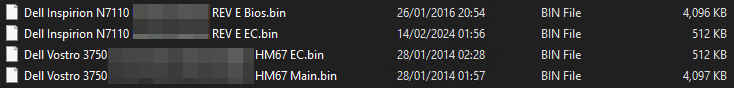

Reflashing the password locked BIOS on the Dell Vostro 3750 laptop that I salvage from the E-Waste pile

<!--more-->

At my company, we recently found a bunch of old laptops that we can't reallisticly use anymore. 
In this pile there was a lot of E-Waste (struggles to run a basic debian image). 

But there also was three [Dell Vostro 3750](https://dl.dell.com/manuals/all-products/esuprt_laptop/esuprt_vostro_notebook/vostro-3750_setup%20guide_en-us.pdf). It's fairly old but can easily run debian+gnome and do simple tasks. Perfect for an emergency laptop to do some debugging.

One thing tho.
As most organasations do, they lock BIOSes, which don't get me wrong, is perfectly acceptable.
However, if you change the password, make damn sure to change it for the whole fleet.
Because then you end up in a situation where you don't know the password. And no matter who you ask **you will not be able to get the password** 😥

At this point we could still use the laptop, we just had to setup the OS on a separate device.

But it would be nice to have access to the BIOS !

## Easy mode

### Battery / CMOS clear

The easiest way to get rid of a bios password is generaly to remove the battery or short a jumper to clear all BIOS settings.

On desktops, this works most of the time.
On laptops it generally doesn't.

Which is understandable since a laptop is much easier to steal than a desktop.

But that doesn't really help me....

### Service key

On my laptop, if you type a wrong password for a few time, at some point a "service key" will pop up.

Once you have this code you can call the manufacturer (Dell in my case), provide the proof of purchase, pay some kind of fee and they give you a "master password" that's will get you in the BIOS. 

This great right? Well no. For starters I don't wan to pay a fee, from what I've heard it's like 200$ 😮. No way I'm paying that much, and even if I wanted to pay I don't have the proof of purchase for a 10year old laptop that my company previsouly owned😞.

Then there is what I call "gray market unlocks". Basically you pay a random guy on a forum X amount of money and they will give you an unlock code. Feels way too scketchy for me 😒.

If you are lucky there also is public generator / batabases for BIOS passwords. One of them is https://bios-pw.org/. Unfortunatly there wan't any working ones for my laptop😥.

So that's it then no way to unlock this?

## Hard mode
Well no. There always is a way of doing something, it just depends how much time you want to spend on it.
So I left it for a while beacuse I didn't have time back then.

But then on last week, after a few hours of binge-watching videos on YouTube, I got this one in my feed:


For those wo aren't familliar, the BIOS of a computer is generally stored in a separate flash/eeprom chip located on the motherboard. 
Sometimes they are nice and use a socketed DIP-8 packaged chip, but now it's mostly (especially in laptops) SOP-8 (or similar) chips

I previsouly noticed that there were multiple flash chips on the laptop motherboard, and at the time, I had assumed that it was a wierd propriatery thing that dell did with their motherboard because I thought that BIOSes were supposed to be in only one chip.

But while whatching the video, he actually talks about two chips. Which re-ignited my desire to unlock this damn laptop.

### BIOS reflashing

Turns out that no, sometimes there is more than one chip:
 - One for the actual BIOS rom 
 - And one for the EC (embedded controller) ROM

The phrase "reflash the BIOS chip" sounds very scary but it's actually really easy. 

The hard part are:
 - Getting hold of the ROM to flash onto the chip
 - The service technician tool to put the proper serial number

#### Getting a ROM to flash

That was an adventure, first thing I tried was the DELL website. Which actually stil hosted the BIOS update. Great right?

Well, again, no. It's a .exe file used to update the bios and meant to be lanched on the computer itself.

I did try to launch the installer on a windows install and to my surprise it actually started to install. But then it failed with this error:

Great. That's just awesome another stupid artifical limitation ...

I'm sure there is a way to extract the ROM out of that exe but I couldn't figure it out.

That means the only way for me to move forward was to find an actual dump of some elses ROM and flash it myself.

#### Finding a ROM

This is like a game of cat an mouse, every time you seem to find a rom you get hit with a paywall.

After a few days, I managed to finnaly find an archive containing these files 🎉:

> I can't remeber exactly where I got them and I wont host them either but shoot me an email if you want them

And that was it I had a BIOS + EC rom dump.

#### Desoldering the roms & Connecting the reader

I first started by drenching the chips in flux.

**TODO**
**TODO**
**TODO**

Then I applied some hot air and picked them up with a pair of tweezers

Once that was done I simply re-soldered it to a breakout board and connected it to the programer.

At first, I got a cheap programer based on the `CH341a` but I couldn't get it to work. **At all.**

Wanting to do this now and not later, I found this repo allowing me to turn a raspberry Pico into a device capable of flashing ROM with the help of the [serprog](https://www.flashrom.org/supported_hw/supported_prog/serprog/serprog-protocol.html) protocol:



Then I simply ran: `flashrom -p serprog:dev=/dev/ttyACM0 --flash-name` to check that the ROM could be read and proceeded onto the next step.

#### Backup & Flashing

As I later found out the hard way, the rom for the vostro that was present in the archive didn't work for me. 

Instead, I used the one for the inspirion which appears to use the same motherboard so I figured it would be compatible and I could fix it later (At worse restore the backup).

The steps are pretty simple:
  - Connect the EC rom
  - Read the flash with `flashrom -p serprog:dev=/dev/ttyACM0 -r "Backup EC - serial_number_here.bin"`
  - Making sure it completed correctly and that the size is correct (For me it was `512 KB` for the EC and `4096 KB` for the BIOS)
  - Flashing the rom onto the chip with `flashrom -p serprog:dev=/dev/ttyACM0 -w "your_unlocked_ec_rom_dump_here.bin"`
  - Disconnect the EC ROM
  - Repeat with the bios chip & rom

**TODO**
**TODO**
**TODO**

#### Resoldering the roms

Once I finished flashing both chips, I desoldered them from the breakout board and re-soldered them to the laptop's motherboard.

I then cleaned the flux off the board 

**TODO**
**TODO**
**TODO**

#### First boot to bios

First boot was pretty stressful, but after spamming the bios key like a manniac I just, got in 😲.

Amazing.

After a some investigation it was obvious I need to do two things:
  - Repair the serial number
  - Putting the proper bios

#### Repairing the serial number

So, the next step is to repair the serial number.

First I needed to find an iso of the Dell service technician CD 💿

This was way easier to find I found a few version with different sizes, picked one at random, burned it onto a CD and booted into it

**TODO**
**TODO**
**TODO**

#### Updating to the latest version

This was a bit tricky but since the vostro motherboard is the same as the inspirion mother and that the bios worked, I was hopeful that I could simply run the bios updater for the vostro.

After booting in windows, I ran the tool:

Which promply began the upgrade process 🤖

Rebooted 🔄

Started the flashing process 💾

Rebooted 🔄

And after spamming the bios key ⌨, went into the BIOS

Which showed the correct bios 🤩.

## Success

It's probably going to differ from manufacturer to manufacturer and probably model to model too. 

But, after a pretty harduous processs I finally managed to unlock the laptop 😵. It'a pain in the ass to do but well worth it 🥳, if simply for the experience gained.

