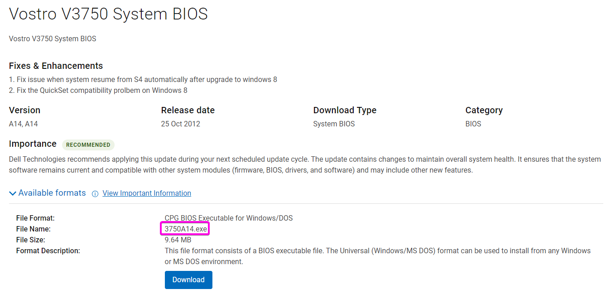

Reflashing the password locked BIOS on the Dell Vostro 3750 laptop that I salvage from the E-Waste pile

<!--more-->

At my company, we recently found a bunch of old laptops that we can't reallisticly use anymore. 
In this pile there was a lot of E-Waste (struggles to run a basic debian image). 

But there also was three [Dell Vostro 3750](https://dl.dell.com/manuals/all-products/esuprt_laptop/esuprt_vostro_notebook/vostro-3750_setup%20guide_en-us.pdf). It's fairly old but can easily run debian+gnome and do simple task. Perfect for an emergency laptop to do some debugging.

One thing tho.
As most organasations do, they lock BIOSes, which don't get me wrong, is perfectly acceptable.
However, if you change the password, make damn sure to change it for the whole fleet.
Because then you end up in a situation where you don't know the password. And no matter who you ask **you will not be able to get the password** 😥

At this point we could still use the laptop, we just had to setup the OS on a separate device.

But it would be nice to have access to the BIOS !

## Easy mode

### Battery / CMOS clear

The easiest way to get rid of a bios password is generaly to remove the battery or short a jumper to clear all BIOS settings.

On desktops, this works most of the time.
on laptops it generally doesn't.

Which is understundalbe since a laptop is much easier to steal than a desktop.

But that doesn't really help me then....

### Service key

On my laptop, if you type a wrong password for a few time, at some point a "service key" will pop up.

Once you have this code you can call the manufacturer (Dell in my case), provide the proof of purchase, pay some kind of fee and they give you a "master password" that's will get you in the BIOS. 

This greate right? Well no. For starters I don't wan to pay a fee, from what I've heard it's like 200$ 😮. No way I'm paying that much, and even if I wanted to pay I don't have the proof of purchase for a 10year old laptop that my company previsouly owned😞.

Then there is what I call "gray market unlocks". Basically you pay a random guy on a forum X amount of money and they will give you an unlock code. Feels way too scketchy for me 😒.

If you are lucky there also is public generator / batabases for BIOS passwords. One of them is https://bios-pw.org/. Unfortunatly there wan't any working ones for my laptop😥.

So that's it then no way to unlock this?

## Hard mode
Well no. There always is a way of doing something, it just depends how much time you want to spend on it.
So I left it for a while beacuse I didn't have time back then.

But then on last week, after a few hours of binge-watching videos on YouTube, I got this one in my feed:


For those wo aren't familliar, the BIOS of a computer is generally stored in a separate flash/eeprom chip lcoated on the motherboard. 
Sometimes they are nice and use a socketed DIP-8 packaged chip, but now it's mostly (especially in laptops) SOP-8 (or similar) chips

I previsouly noticed that there were multiple flash chips on the laptop motherboard, and at the time, I had assumed that it was a weired propriatery thing that dell did with their motherboard because I thought that BIOSes were supposed to be in only one chip.

But while whatching the video, he actually talks about two chips. Which re-ignited my desire to unlock this damn laptop.

### BIOS reflashing

Turns out that no, sometimes there is more than one chip:
 - One for the actual BIOS rom 
 - And one for the EC (embedded controller) ROM

The phrase "reflash the BIOS chip" sounds very scary but it's actually really easy. The hard part is getting hold of the ROM

#### Getting a ROM to flash

That was an adventure, first thing I tried was the DELL website. Which actually stil hosted the BIOS update. Great right?

Well, again, no. It's a .exe file used to update the bios and meant to be lanched an the computer itself.

I did try to launch the installer on a windows install and to my surprise it actually started to install. But then it failed with this error:

Great. That's just awesome another stupid artifical limitation ...

That meant I was obligated to find an actual dump of some elses ROM and flash it myself.

