Creating a DIY open-source and budget-friendly bidirectional 3G-SDI to fiber converter using readily available components and determination.

<!--more-->


This is a stupidly long article, it details the different phases thoroughly, you'll need probably some time to really read it


Every once in a while, I have the pleasure of working with my local choir. Every few years, they perform on stage, featuring around 3 hours of music 🎶. In the past, my involvement was mostly behind the scenes👻, helping wherever I could. However, last year, I decided to take on a more ambitious role and conduct an experiment that would elevate the entire performance.

I took every piece of video equipment I could get my hands on and set out to record the shows and provide live Image Magnification (IMAG) of the band 🎥. This would be a significant step up from previous years, where recording had been outsourced with mixed results. The idea was to bring a new level of engagement for both the audience and the performers, while also creating a high-quality record of the event 🎞.

The rest of the tech staff later admitted that they were, at first, skeptical of this 🤨. But it turned out to be a resounding success. The live IMAG was enthusiastically received by both the singers and the audience, adding a dynamic visual element that enhanced the overall experience 🥳. It allowed those seated further back to see the work of the musicians 🥁. As for the recording, the quality far exceeded my expectations, surpassing in many ways what had been achieved in previous years 🤩.


images/IMG_7224.jpg
images/IMG_7254.jpg
images/IMG_7256.jpg


## Why

The last show was wonderful, but I always want to improve things. Something that's been bugging me in my video setup is that it was a mess. I mean, I had HDMI cables here, SDI there, some RTSP streams, and even NDI feeds. Talk about a tech salad 🥗!

Don't get me wrong, it worked… *mostly*, and that's what happens when your budget is almost none. But I had to run custom scripts before the show 📜 and more than once the IMAG showed the blank Elgato logo or a freeze-frame ⬛. So, I kept thinking, "There's got to be a better way to do this." 

As I mentioned, the issue had always been the budget 💰, I was at the time an apprentice in a different field with no contacts or knowledge in the AV production world. Video isn't exactly the cheapest part of a live production. The technology evolves rapidly, which means the quality is always increasing.

So for the next show, I want to do one thing: simplify the heck out of my video system, specifically transport 🔌.

I started digging into different options and, there are a few contenders:

  - **NDI:** This system is pretty slick, but there is a catch: you either need fancy cameras that speak NDI right out of the box, or you have to shell out for converters that will set me back at least 300 EUR a pop 🙁. Not to mention that if you want to get low latency, you need special mixers.
  - **RTSP:** Now, this one's tempting: It's wonderful and very popular, but it's got a bit of a lag issue, and you still need converter boxes. Although they are a bit cheaper.
  - **HDMI:** It's pretty reliable but length is a severe issue 🔭 unless you use active cables.
  - **SDI:** Now we're talking! This is like the Goldilocks of video options for me. It's not dirt cheap, but compared to the others, it's a steal. You can find affordable converters to and from HDMI and it's used all over the place in pro setups.

But wait, it gets better! SDI got a neat trick up its sleeve - you can easily convert it to fiber ⚪. Like effortlessly convert it!

My idea is the following: an MPO-12 breakout (fancy connector with 12 fibers) and an armored MPO-12 cable. Throw them in a DIY stage box, and boom! We're in business: one cable, multiple cameras.
This setup would be like the Swiss Army knife 🔪 of video transport. I'm thinking of something like 2 fibers for 10 Gb Ethernet 🌐, at least 8 for video feeds 📹, and 2 spares that I'll probably use for audio in the future. 

However, the cost of fiber converters can be a hurdle, almost as much as IP converters (NDI/RTSP). For example, Blackmagic offers a 12G SDI to fiber converter priced at around 155 EUR 💸: 



While this is a reliable and professional option, the price tag is a bit hefty for a project that's meant to be low-cost and accessible. I don't really need 8k video, 1080p60 is more than fine for IMAG, so 3G-SDI will do.

Unfortunately, I couldn't find a cheaper alternative, even for lower data rates. I was on the lookout for more budget-friendly alternatives, and purely by chance, I stumbled upon this post on X by twi_kingyo.



The post was a game-changer for me. From the picture, it certainly looks like SDI-HDMI converters plugged into a test board with a fiber cable in the middle. Very crude, DIY approach to 3G-SDI to fiber conversion, but that looked both affordable and in line with what I had been envisioning. 

As I read a bit more, I immediately thought that this is precisely what I want to do

## Research
I started this journey by researching a ton on the two major components of this project, namely SDI and SFPs.

### SFP / SFP+

SFP (Small Form-factor Pluggable) and SFP+ (enhanced SFP) modules are compact, hot-swappable transceivers used in networking to transmit and receive data over optical or copper connections. They are widely used in switches, routers, and other networking equipment.

Their key features include
  - Form Factor: Small size allows for high port density.
  - Hot-swappable: Can be replaced without turning off the device.
  - Versatility: Supports various protocols (1GbE / 10GbE / Video).

See this Wikipedia page about them for more information:


SFP modules take very few signals:

| Description                            | Pin   | Pin No | Pin No | Pin         | Description                                                   |
|----------------------------------------|------:|:------:|:------:|:------------|---------------------------------------------------------------|
| Transmitter ground                     | VeeT  | 20     | 1      | VeeT        | Transmitter ground                                            |
| Transmit differential pair (Neg)       | TD-   | 19     | 2      | TxFault     | Transmitter fault indication                                  |
| Transmit differential pair (Pos)       | TD+   | 18     | 3      | TxDisable   | Optical output disabled when high                             |
| Transmitter ground                     | VeeT  | 17     | 4      | MOD-DEF(0)  | 2-wire serial interface data line                             |
| Transmitter power (3.3 V, max. 300 mA) | VccT  | 16     | 5      | MOD-DEF(1)  | 2-wire serial interface clock                                 |
| Receiver power (3.3 V, max. 300 mA)    | VccR  | 15     | 6      | MOD-DEF(2)  | Module absent, GND indicates module presence |
| Receiver ground                        | VeeR  | 14     | 7      | RS0         | Rate select 0                                                 |
| Receive differential pair (Pos)        | RD+   | 13     | 8      | LOS         | Receiver loss of signal indication                            |
| Receive differential pair (Neg)        | RD-   | 12     | 9      | RS1         | Rate select 1                                                 |
| Receiver ground                        | VeeR  | 11     | 10     | VeeR        | RX Ground                                                     |

Most of them don't need to be dynamically adjusted, and some can be ignored outright. As long as the module gets power, has the correct rate and has its transmitter is enabled, it should work fine.

What's even better is that basic modules (short distance, multimode ones) are relatively "passive". Some include a reclocker that resyncs the data, but not always.

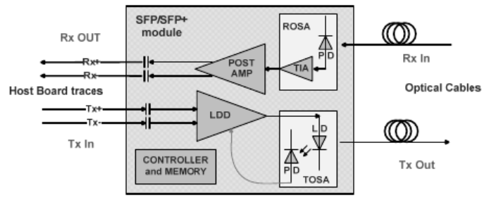

This means that, as long as it's a differential signal, you can feed just about anything to the module





And, as long as they support it, they can be relatively easily managed using the [DDM (Digital Diagnostics Monitoring)](https://cdn.hackaday.io/files/21599924091616/AN_2030_DDMI_for_SFP_Rev_E2.pdf) protocol





What's even better is that they are cheap. The SFP+ transceivers that I have are the [DELL FTLX8571D3BCL-FC](https://www.dell.com/en-us/shop/c2g-finisar-ftlx8571d3bcl-compatible-10gbase-sr-mmf-sfp-transceiver-module-taa-sfp-transceiver-module-10-gigabi/apd/a8568835/pc-accessories). I got them for around 8 EUR, but you can get them cheaper: here is an eBay listing for ten modules for 70 EUR. 



There are special ones for video that can handle weirder and faster signals with better signal integrity (12G-SDI for example) but from my testing, 3G SDI works just fine on these modules.

### SDI

SDI (Serial Digital Interface) is a family of digital video interfaces first standardized by SMPTE. It's a widely used family of standards for transmitting uncompressed digital video signals over coaxial or fiber optic cables. It's primarily utilized in professional broadcasting and video production. SDI enables high-quality video transmission with low latency, making it ideal for live broadcasts and studio environments.

It supports a ton of formats 📼📀💾 described in the following table:

|                    Standard                                                          |       Name       |  Bitrates (Mbit/s)  | Example video formats |
|--------------------------------------------------------------------------------------|------------------|---------------------|-----------------------|
| [SMPTE 259M](https://en.wikipedia.org/wiki/SMPTE_259M)                               | SD-SDI           | 270, 360, 143, 177  | 480i, 576i            |
| [SMPTE 344M](https://en.wikipedia.org/wiki/SMPTE_344M)                               | ED-SDI           | 540                 | 480p, 576p            |
| [SMPTE 292M](https://en.wikipedia.org/wiki/SMPTE_292M)                               | HD-SDI           | 1485 and 1485/1.001 | 720p, 1080i           |
| [SMPTE 372M](https://en.wikipedia.org/wiki/SMPTE_372M)                               | Dual Link HD-SDI | 2970 and 2970/1.001 | 1080p60               |
| [SMPTE 424M](https://en.wikipedia.org/wiki/SMPTE_424M)                               | 3G-SDI           | 2970 and 2970/1.001 | 1080p60               |
| [SMPTE ST 2081](https://pub.smpte.org/doc/st2081-10/20180102-pub/st2081-10-2018.pdf) | 6G-SDI           | 6000                | 1080p120, 2160p30     |
| [SMPTE ST 2082](https://pub.smpte.org/latest/st2082-10/st2082-10-2018.pdf)           | 12G-SDI          | 12000               | 2160p60               |
| SMPTE ST 2083                                                                        | 24G-SDI          | 24000               | 2160p120, 4320p30     |

SDI uses uncompressed digital video and audio formats. The data is typically encoded in a YCbCr color space, with 10-bit or higher color depth, ensuring a high dynamic range and color fidelity. Alongside video, an SDI signal may contain up to 16, 48 kHz, 24-bit audio channels.

Data is encoded in NRZI format, and a linear feedback shift register is used to scramble the data to reduce the likelihood that long strings of zeroes or ones will be present on the interface. Thanks to NRZI encoding, the interface is self-synchronizing and self-clocking ⏱. SDI uses a form of forward error correction to maintain signal integrity, which is especially important for long-distance transmissions 🔭

On the physical layer side, SDI transmits signals using coaxial cables with BNC connectors, designed for minimal signal loss and interference. And as mentioned, it can also use fiber optic cables for longer distances and increased bandwidth.

See the Wikipedia page for more details:



SDI is way more complicated to handle and most often requires an FPGA with specialized components, see this DIY pattern generator for example:



Thankfully, for this project, I don't actually need to decode/encode anything myself. Just to convert signals, which is generally cheap.

## First prototype

After this extensive research, It would seem that all that I really need is a cable equalizer for RX and a cable driver for TX to convert the 75-ohm single-ended and 100-ohm differential pairs 🤷‍♂️.

When I saw [@twi_kingyo](https://x.com/twi_kingyo) post, I quickly found the [LMH0397,](https://www.ti.com/product/LMH0397) which looked prefect at first glance. The description said `3G SDI bidirectional I/O with integrated reclocker`.

I got very excited 🤪 and quickly (too quickly) designed a PCB and sent it to production 🏭.

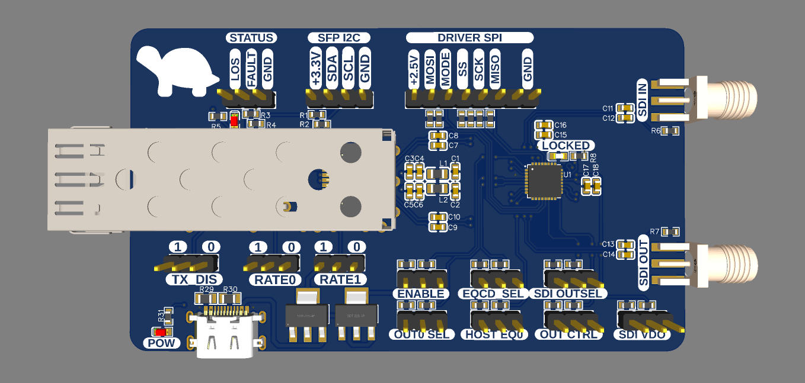

I usually spend at least a week 📅 on a prototype. However, I treated this more as a breakout board than a proper prototype, which means I skimmed 🏄‍♀️ through plenty of things.

And it worked, well, partially worked.

### Stupid mistake

In my haste, I didn't fully read the datasheet 🙄. While it is bidirectional in the sense that I can do both directions. It cannot, however, do it at the same time.

Something that I would have seen if I read the f-ing 🤬 datasheet:

> The LMH0397 is a 3G-SDI 75-Ω bidirectional I/O with
integrated reclocker. This device can be configured
**either** in **input mode** as an adaptive cable equalizer **or**
in **output mode** as a dual cable driver, allowing
system designers the flexibility to use a single BNC
either as an input or output port to simplify HD-SDI
video hardware designs.

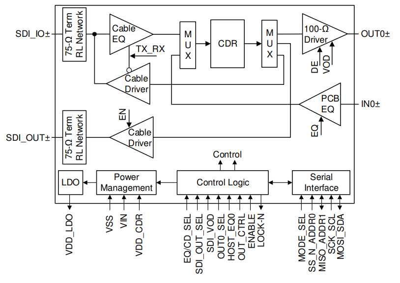

If I had read things more carefully, I would have done things differently, but it worked and that meant I had a proof of concept.

## Second prototype
The second prototype was very cost minded 💰. My target was around 25eur per converter

The LMH0397 is a great chip, but it is 18.5 EUR per unit 💸 in low volumes and has redundant features not needed for a simple media converter.

I spent a while searching for an alternative. First thing I did is to take the reclocker out of the equation 🧮 which, while useful, isn't needed in most cases, especially at lower data rates. Now, I needed a simple cable equalizer and a cable driver. There are a few options, for instance [Texas Instrument](https://www.ti.com/interface/serial-digital-interface/overview.html) or [Semtech](https://www.semtech.com/products/broadcast-video) have some interesting chips.

But the ones I choose are from [Microchip](https://www.microchip.com/en-us/products/high-speed-networking-and-video/data-and-video-transceivers), the [EQCO30T5](https://www.microchip.com/en-us/product/eqco30t5) and [EQCO30R5](https://www.microchip.com/en-us/product/eqco30r5).

While these chips are marketed as HD-SDI Transmitter/Receiver, they are capable of 3G-SDI Video. Interestingly 🤔, they also seem to be able to be used for a data back-channel and power over coax, but this won't be of any use for me.

### Schematic
The schematic (at least the interesting parts) is based on the typical application circuit of both schematics. 
Compared to the LMH0397, the EQCO30T5 and EQCO30R5 are super simple to connect.

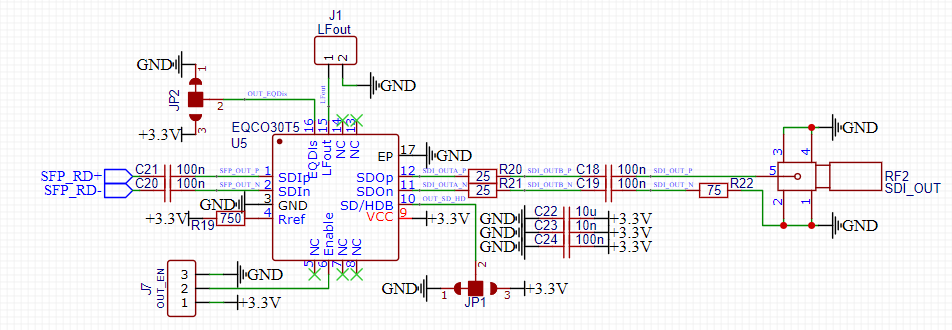
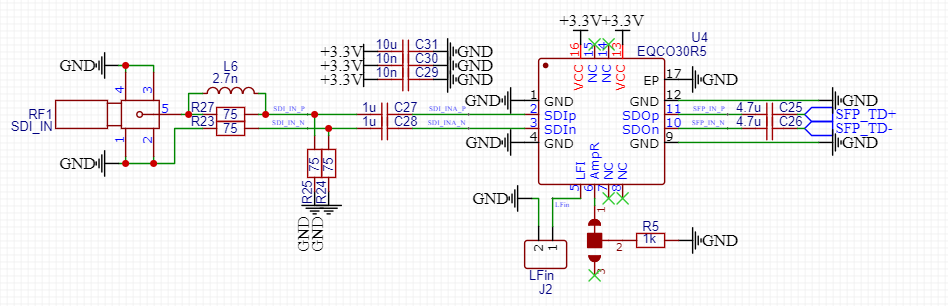

### PCB
This is the first prototype with the appropriate dimensions, my plan was to fit everything into a 1U case (fiber splitter, converter modules, …). This means it has to be at most 45 mm tall, but I decided that my target would be 35 mm 📏. This would leave enough space for the chassis, mounting & cables.

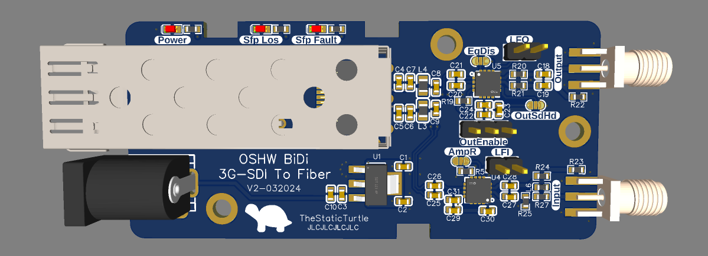

### First test
Once I received the PCBs, I immediately soldered four chips on two separate boards. Powered them up and amazingly there wasn't any magic smoke 🌋! 

I then screwed in SMA to BNC adapters and connected my HDMI-SDI & SDI-HDMI 🖥️ converters. Same as before, to avoid destroying an SFP+ module, I took a 1m DAC cable and connected the two boards.

And it worked! I got a picture on my monitor!



But I was far from done 😓.

### Issues for longer distances

Using a 1m DAC is fine and all, but the goal is at least a 50m distance. 
To start things out, I used a 15m cable and as the video showed, it still worked. *Somewhat*

I used Jellyfin to play videos on the output and mysteriously, while I had the window in the foreground everything was fine, no issues at all! But, as soon as I clicked elsewhere, the link crashed and would not come back up.

While the "Sync" LED indicated that it was trying to sync, using my 50m fiber cable didn't show any picture in any condition!

After some investigation, I realized that the only thing that changed in the source picture was the color of the title bar of the window:

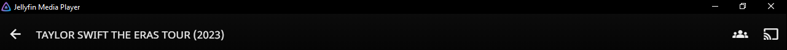
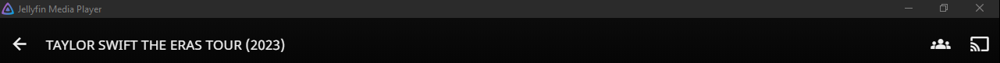

After grabbing the pixel color (which was RGB `43, 43, 43`), I did a quick test with paint to try to reproduce the issue. And as you can see, it appears that this color is indeed part of the problem:



My best guess is that this color somehow translates to the gray (RGB `68, 68, 68` YCbCr `68, 128, 128`) part of the SDI pathological test pattern.

> The SDI pathological test pattern is specifically designed to stress test the SDI equalizer and PLL performance.
> The test pattern consists of a static test image with the top half of the lines filled with a shade of magenta, and the bottom half of the lines filled with a shade of gray.



From what I understand, these colors basically produce long strings of zeros and ones 👨‍💻 in the data stream. This type of pattern is particularly challenging for SDI equalizers and PLLs to process and keep synced correctly.

At this point, I was sure that the issue was caused by a bad design on my part 🤦‍♂️ and feared that maybe the `EQCO30T5`/`EQCO30R5` were pushed too far with 3G SDI. However, I couldn't shake off the feeling that there might be something else at play here 🤔.

So instead of re-thinking my test setup, I went ahead and started working on the third prototype. 

## Third prototype

Alright, so, let's dive into the third prototype 3️⃣. 

The second prototype had many issues, the biggest one is, as demonstrated, the SDI pathological test patterns. 
This was the main thing I wanted to tackle with this iteration, and I was hopeful that it would be the last one.

### Changes
#### SDI equalizer

First off, I swapped out the `EQCO30R5` SDI equalizer for the `LMH0344`. 

While both chips are designed for `SD-SDI` & `HD-SDI` with the capability to go up to `3G-SDI`, the `EQCO30xx` chips seem not to be designed for this application but more to be used in the other direction.

On the other hand, the datasheet of the `LMH0344` talks way more about 3G-SDI. Alongside that, it also has a `Mute` pin and `Cable/Carrier detect` signaling pin.
It also mentions that the footprint is compatible with the `LMH0044`, `LMH0384` and `LMH0074`; It also states that it replaces both the `GS2974A` and `GS2974B` chips from Semtech.

This gives me a lot of flexibility in case I want to change chips in the future 📅.

But, as it turns out, the footprints of the `EQCO30R5` and `LMH0344` are extremely similar (at least the important parts), a few pins are marked DNC on the `EQCO30R5` and a capacitor is needed by the `LMH0344` where there isn't one for the `EQCO30R5`.  
Both of these issues can be solved by adding 0-ohm resistors that may or may not be placed during assembly.

In my head, this switch was good because the new component offered better performance and more flexibility 🤸‍♂️.

#### Power supply

During my tests, I noticed that the AMS1117 LDO regulator that I was using to provide 3.3v to the SFP+ module and other ICs was getting rather hot 🔥.

A quick search online + digging around in datasheets revealed the issue:
  - The SFP+ module alone consumes around 500mA
  - The `EQCO30T5` typically consumes 45mA
  - The `EQCO30R5` typically consumes 55mA 

Which gives a total of 600mA ⚡.

A quick calculation for the max power dissipation of the `AMS1117` shows that current consumption is borderline over the limit, which explains why I had a furnace on my board 😂.

While I choose an LDO to reduce the risk of electrical noise producing more issues, this won't do. The end goal is to stack several of these boards together, which means that heat might cause issues.

Instead, I complicated things a bit more 🙄 and went with the `TPS5430`, a 3A step-down buck converter which integrates the MOSFET. The buck converter will provide a more efficient voltage regulation and can handle higher current demands without getting hot. The **only** reason I chose this model is that it's part of the "Basic" parts selection of JLCPCB which means I don't have to pay extra later.

But I recently used the `AP62200` for another project and I quite like this chip, mainly due to its size and the fact that it can accept 5V (something the TPS5430 doesn't 😥).

#### Fixed layout

The previous prototypes all had different size, different mounting hole locations, etc…

I wanted to change that, so I decided on a fixed layout ⚓ for every "external" component:
  - SFP cage & connector
  - Status LEDs
  - SDI In & Out connectors
  - Mounting holes

This resulted in something like this:

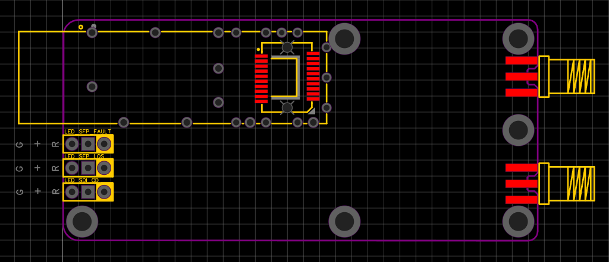

I then decided that if I were to do another prototype, these components would not change location.

### PCB

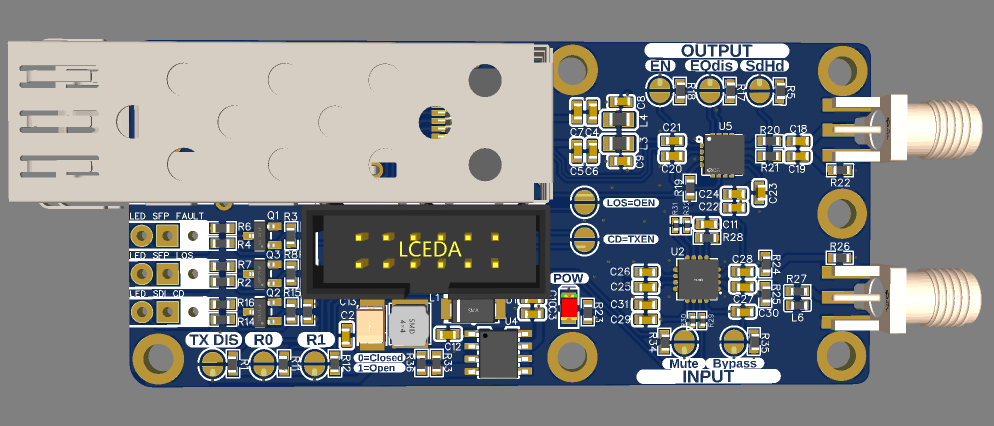

As you can see, I also added configuration pads for the SFP+ module and experimentally added a link between the LOS signal of the SFP to the output enable of the cable driver, I also added a link between the cable detect of the equalizer and the TXDIS of the SFP


images/IMG_20240829_015459.jpg
images/IMG_20240829_015513.jpg
images/IMG_20240829_015531.jpg


### Issues for longer distances still present

I wish I had a video to show you but as I'll explain later, I don't have any V3 boards that are fully populated anymore

Even with all the improvements / changes I made in the third prototype, the performance issues were still a nagging problem. Using a 15m fiber cable worked, but extending that to even longer distances like 50 meters didn't work whatsoever. When I hooked up my setup to test it over this distance, there wasn't any picture at all on the receiving end.

### A potential solution

While doing some tests, I realized that the very first prototype used the `LMH0397` which, while unidirectional, did include a reclocker ⏱.

After getting this board up and running again, I managed to get some partial success. The artifacts were completely gone with the 15m fiber 😃 and the 50m one now showed a picture but still had artifacts present in some cases 😕.

I was thinking that maybe if I had them on each side, it would work better, but that would raise the price so much. Instead, I decided that I would investigate a bit more before committing to this solution.

### Oh, f---, that was the issue!

After spending countless hours tweaking my design and trying different configurations, I was about ready to pull my hair out. It seemed like, regardless of what changes I made, those pesky signal integrity issues persisted. 

Then one day, while discussing this with some friends, we discussed the fact that it would be a good idea to have "proper" equipment to validate my design. Up to now, I used cheap-ish converters I bought off AliExpress, so I decided to buy the [Micro Converter Bidirectional SDI/HDMI 3G](https://www.blackmagicdesign.com/fr/products/microconverters/techspecs/W-CONU-09) from Blackmagic.

After waiting a few days for the parcel to arrive, I proceeded to test it. To my surprise, everything worked, flawlessly, even with the 50m cable 📏. 

I then tried using the cheap HDMI to SDI converter with the Blackmagic one acting as the receiver, and I could see that the lock indicator flickered. The other way around worked but showed the same symptoms as before.

In the end, most of these issues were caused by these cheap converters. Once I switched them out for higher-quality ones, everything clicked into place. The long-distance performance improved drastically, and the intermittent issues vanished.

This is when I realized two things:
  - The converters I had are not suitable for long distances!
  - I had to buy new converters that are twice the price 💸.

For fun, I also tried to chain every piece of fiber and coax I had ⛓️. This came to a total of 95m of fiber and 30m of coax, if this test was completed successfully, it would mean that the signal would have traveled 220m 🤔, and to my surprise, **IT WORKED 😮🥳**

I also decided that I wasn't happy with the current version, mainly due to the LEDs and the fact that these prototypes were still using a 2-layer board, which is a hell of a sin with high-speed signaling.

## Fourth prototype / Final versions

Nothing significant changed in these versions.

The only things that changed are:
  - SMT LEDs for status & power indicators
  - Changed the footprint of the jumpers to allow floating configuration
  - Power input via the center mounting hole
  - Debug port with all the signals and I2C connections

One thing that I also wanted to change was the connector. The ones I was using were 50-ohm SMA connectors, which are both the wrong impedance and connector for SDI.

As mentioned before, SDI uses 75-ohm cabling & connectors, the most common of which are [BNCs](https://en.wikipedia.org/wiki/BNC_connector). That said, other connectors exist such as HD-BNC or [DIN 1.0/2.3](https://en.wikipedia.org/wiki/DIN_1.0/2.3)

Initially, I wanted to use proper BNC connectors, but after browsing Digikey I quickly found that they are SHOCKINGLY expensive 😮. Proper edge connectors from the likes of [Amphenol RF](https://www.amphenolrf.com/) or others costs a minimum of 5 EUR per connector.

This is unacceptable for such a low-cost device.

Instead, I simply used the footprint of the [034-1030-12G](https://www.amphenolrf.com/034-1030-12g.html) from Amphenol which is a 12G 75-ohm right angle HD-BNC connector. This means that these boards are technically compatible with a connector, but there's no way in hell I'm going to use it.

Instead, I'm buying [SDI male-male panel mount patch cables](https://aliexpress.com/item/1005003231536595.html), cutting them in half ✂️ and soldering them directly to the PCB.

According to the responses, I got from my question on electronics.stackexchange.com:



It should be perfectly fine to solder them directly.

One thing I did differently is that I made two versions of this prototype, one being the "Normal" version using the `EQCO30T5` and the "Reclocked" version using the `LMH0397`

This was done for three reasons:
  - One of the SDI links is the main output going to the IMAG, and while I can tolerate a camera going down due to signal integrity, I cannot accept the main output acting a way it shouldn't.
  - Debugging 🐛. Due to the way it's routed, I can technically use one of these boards as a poor's man eye diagram to help me show signal integrity issues. I could even use it as a repeater if I really wanted to.
  - I already had the chips for my previous prototype 🤷‍♂️.
 
### "Normal" version

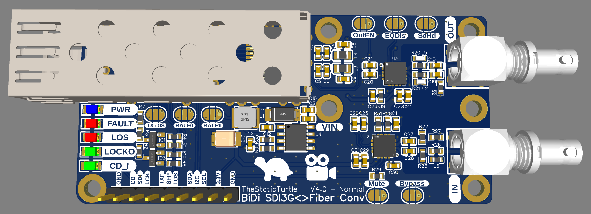

Here is a photo of it soldered to a BNC pigtail:
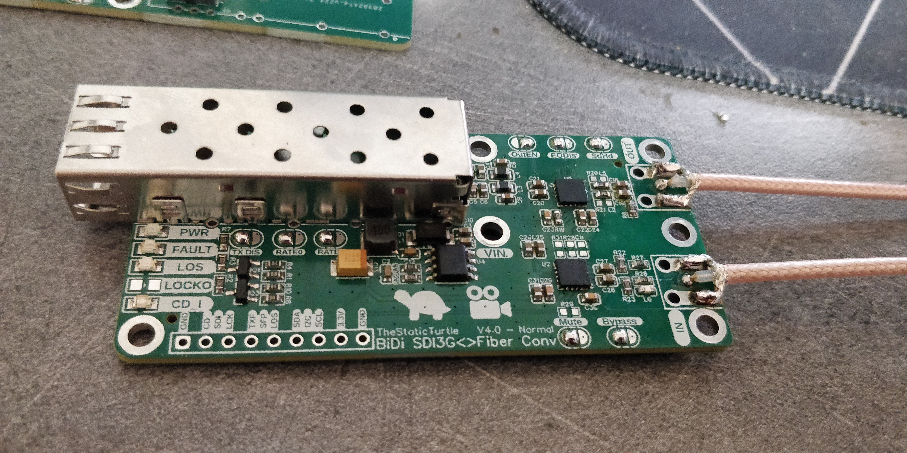

### "Reclocked" version

Here is a photo of it soldered, unfortunately the rest of the pigtails and SFP cages hadn't arrived yet:
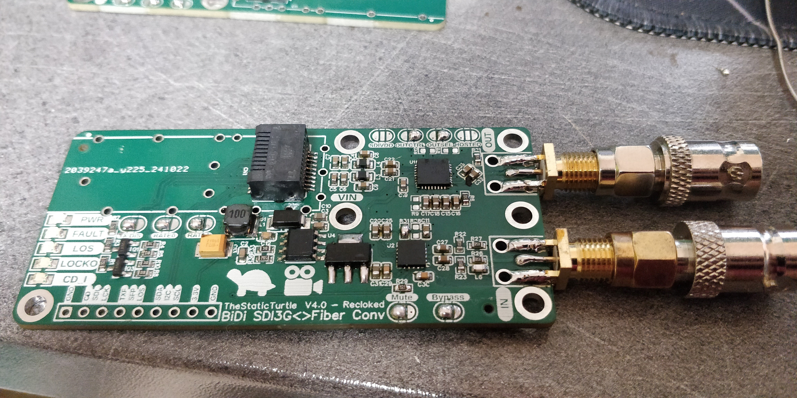

## Assembly

Fortunately, making 4 prototypes means that I actually had almost enought chips to fully assemble everything, so I went to work.
After a few hours, I was done with what I had.

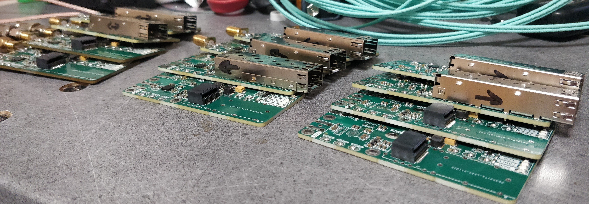

When I designed the PCBs, I originally wanted to use standoffs to carry current. But when assembly time came, I realized that that would be a nightmare to disassemble 😫. So, to solve this, I decided to create a custom 3D-printed mount that could house eight of these converters (with only 6 slots populated, two reclocked bidirectional and four unidirectional normal ones). 

This setup ensured that all components were neatly organized and securely mounted. The 3D-printed base also includes integrated power distribution 🔌 with JST connectors, making it easy to plug in & out each converter for troubleshooting without any messy wiring. 


images/IMG_20241116_225348.jpg
images/IMG_20241116_225402.jpg


## Conclusion

Unfortunately, I haven't got a 1U rackmount case to show yet 😥 because I'm not fully committed to the SDI-only stage box design that these converters will live in, but I'll either make a new post or update this one once done ✍.

As for the price, without including the time it took to design and assemble them, I would say that I reached my price target by a small enough margin 🤑.
But what I do realize is that if I had to pay someone to design this, it wouldn't be economical, at all 💸. And suddenly the 155 EUR price of the Blackmagic converter (which can do 12G-SDI) seems much more reasonable, I would even say cheap!

That being said, what a journey! From the partial success of the initial prototype to the very frustrating issues with long-distance signal integrity 🤬, I learned some valuable lessons along the way 🚀. 

Looking back, the most important takeaways are:

  - **Testing equipment matters**, when dealing with unknown & difficult stuff that requires external components, always prioritize the quality of the equipment you use to validate your design, even if pricier 💰. In that spirit, I'll probably upgrade a bunch of equipment in my lab.
  - **Paying attention to detail**, be it reading datasheets more carefully 🔍 or properly tweaking a design. Every little detail counts for a production tool. 
  - **Iterative design** isn't something I generally do, mostly due to budget constraints 💵. Except that in this instance, each prototype taught me something new, leading to better performance in the next iteration 🔄. I'll definitively do it more

Here is the repo holding the schematic & PCB for each version:



While this project has come a long way from that first proof of concept, there's always room for improvement 🚀. The pro-AV space is exciting and constantly evolving, so there are plenty of opportunities to innovate. I'm already thinking about other projects 🤐 (audio over fiber, anyone?). 

If you read this out to the end, first congrats 🎓, second, don't hesitate to reach out. I'm always down for a chat. Happy hacking! 🔧✨