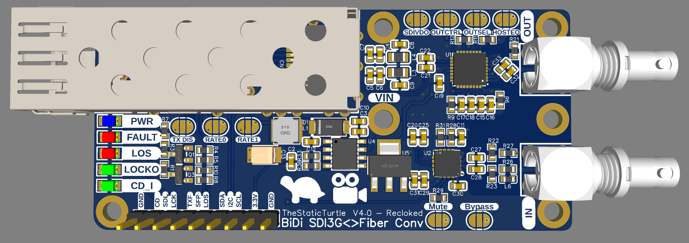

Building a very affordable and opensource bidirectional 3G-SDI to Fiber converter.

<!--more-->

**WARNING: This is a stupidly long article, it details the concept, design, and construction phases thoroughly, you'll need probably more than 45 min to really read it**

Every once in a while, I have the pleasure of working with my local choir. Every few years they perform on stage featuring around 3 hours of music 🎶. In the past, my involvement was mostly behind the scenes👻, helping out wherever I could. However, last year, I decided to take on a more ambitious role and conduct an experiment that would elevate the entire performance.

I took every piece of video equipment I could get my hands on and set out to not only record the shows but also provide live Image Magnification (IMAG) of the band 🎥. This would be a significant step up from previous years, where recording had been outsourced with mixed results. The idea was to bring a new level of engagement for both the audience and the performers, while also creating a high-quality record of the event 🎞.

The rest of the tech staff later admited that they were, at first, skeptical of this 🤨. But it turned out to be a resounding success. The live IMAG was enthusiastically received by both the singers and the audience, adding a dynamic visual element that enhanced the overall experience 🥳. It allowed those seated further back to see the work of the musicians 🥁. As for the recording, the quality far exceeded my expectations, surpassing in many ways what had been achieved in previous years 🤩.

 Photo IMAG 

## Why

Last year's show was pretty awesome, but I always want to improve things. Something that's been bugging me in my video setup is, that, it was kind of a mess. I mean, I had HDMI cables here, SDI there, some RTSP streams, and even NDI feeds. Talk about a tech salad 🥗!

Don't get me wrong, it worked... mostly. But I had to run custom scripts before the show 📜 and more than once the IMAG showed the blank elgato logo or a freezed frame ⬛. So I kept thinking, "There's gotta be a better way to do this." 

The issue always had been the budget 💰, I was at the time an apprentice in a different field with no contacts or knowledge in the AV production world. Video isn't exactly cheapest part of a live production, and the technology evolves very quickly, the quality always need to increase.

So for next show, I want to do one thing: simplify the heck out of my video system, specifically transport 🔌.

I started digging into different options and, there are a few contenders:

  - **NDI:** This system is pretty slick. But there is a catch, you either need fancy cameras that speak NDI right out of the box or you gotta shell out for converters that will set me back at least 300 euros a pop 🙁.
  - **RTSP:** Now, this one's tempting. It's really good, but it's got a bit of a lag issue. And, you still need converter boxes. They're a bit cheaper though.
  - **HDMI:** It's pretty reliable but has severe length issue 🔭 unless you use active cables.
  - **SDI:** Now we're talking! This is like the goldilocks of video options for me. It's not dirt cheap, but compared to the others, it's a steal. You can find affordable converters to and from HDMI, and it's used all over the place in pro setups.

But wait, it gets better! SDI's got a neat trick up its sleeve - you can easilly convert it to fiber ⚪. 

My idea is the following: an MPO-12 breakout (fancy connector with 12 fibers) and an armored MPO-12 cable. Throw in a DIY stage box, and boom! We're in business, one cable, multiple cameras.
This setup would be like the Swiss Army knife 🔪 of video transport. I'm looking at 2 fibers for 10Gb ethernet 🌐, at least 8 for video feeds 📹, and I've even got 2 spares that I'll use for audio (maybe). 

However, the cost of fiber converters can be a hurdle, almost as much as IP converters (NDI/RTSP). For example, Blackmagic offers a 12G SDI to fiber converter priced at around 155 EUR 💸: 



While this is a reliable and professional option, the price tag is a bit hefty for a project that's meant to be low-cost and accessible. I don't really need 8k video, 1080p60 is more than fine for IMAG so 3G sdi will do.

Unfortunatly I couldn't find a cheaper alternative even for lower data rates. I was on the lookout for more budget-friendly alternatives, and purely by chance, I stumbled upon this post by twi_kingyo.



The post was a game-changer for me. It showed a very crude, DIY approach to 3G-SDI to fiber conversion that was both affordable and in line with what I had been envisioning. 

As I read a bit more I immediately though that this is exactly what I want to do

## Research
I started this journey by researching a ton on the two major components systems of this project, namely SDI and SFPs.

### SFP / SFP+

SFP (Small Form-factor Pluggable) and SFP+ (enhanced SFP) modules are compact, hot-swappable transceivers used in networking to transmit and receive data over optical or copper connections. They are widely used in switches, routers, and other networking equipment.

Their key features include
  - Form Factor: Small size allows for high port density.
  - Hot-swappable: Can be replaced without turning off the device.
  - Versatility: Supports various protocols (1GbE / 10GbE / Video).

See the this wikipedia page about them for more information:

The SFPs modules that I have are cheap 10Gb SFP+ transcivers that I got for arround 8eur on [eBay](https://www.ebay.fr/itm/115579010576) (the [DELL FTLX8571D3BCL-FC](https://www.dell.com/en-us/shop/c2g-finisar-ftlx8571d3bcl-compatible-10gbase-sr-mmf-sfp-transceiver-module-taa-sfp-transceiver-module-10-gigabi/apd/a8568835/pc-accessories)).

SFP modules take very few signals:

| Description                            | Pin   | Pin No | Pin No | Pin         | Description                                                   |
|----------------------------------------|------:|:------:|:------:|:------------|---------------------------------------------------------------|
| Transmitter ground                     | VeeT  | 20     | 1      | VeeT        | Transmitter ground                                            |
| Transmit neg differential pair         | TD-   | 19     | 2      | TxFault     | Transmitter fault indication                                  |
| Transmit pos differential pair         | TD+   | 18     | 3      | TxDisable   | Optical output disabled when high                             |
| Transmitter ground                     | VeeT  | 17     | 4      | MOD-DEF(0)  | 2-wire serial interface data line                             |
| Transmitter power (3.3 V, max. 300 mA) | VccT  | 16     | 5      | MOD-DEF(1)  | 2-wire serial interface clock                                 |
| Receiver power (3.3 V, max. 300 mA)    | VccR  | 15     | 6      | MOD-DEF(2)  | Module absent, GND indicates module presence |
| Receiver ground                        | VeeR  | 14     | 7      | RS0         | Rate select 0                                                 |
| Receive pos differential pair          | RD+   | 13     | 8      | LOS         | Receiver loss of signal indication                            |
| Receive neg differential pair          | RD-   | 12     | 9      | RS1         | Rate select 1                                                 |
| Receiver ground                        | VeeR  | 11     | 10     | VeeR        | RX Ground                                                     |

Most of them don't need to be dynamically adjusted and some can be ignored outright. As long as the module gets power, has the correct rate and has it's transmitter is enabled it's fine.

What's even better is that basic modules (short distance, multimode ones) are relatively "passive". Some include a reclocker that resyncs the data but not always.

This means that, as long as it's a differential signal, you can feed pretty much anything to the module





And, as long as they support it, they can be relatively easily managed using the [DDM (Digital Diagnostics Monitoring)](https://cdn.hackaday.io/files/21599924091616/AN_2030_DDMI_for_SFP_Rev_E2.pdf) protocol





### SDI

SDI (Serial Digital Interface) is a family of digital video interfaces first standardized by SMPTE, it's a widely used family standard for transmitting uncompressed digital video signals over coaxial or fiber optic cables. It's primarily utilized in professional broadcasting and video production, SDI enables high-quality video transmission with low latency, making it ideal for live broadcasts and studio environments.

It supports a ton of formats 📼📀💾 described in the following table:

|                    Standard                             |       Name       |  Bitrates (Mbit/s)  | Example video formats |
|---------------------------------------------------------|------------------|---------------------|-----------------------|
| [SMPTE 259M](https://en.wikipedia.org/wiki/SMPTE_259M)  | SD-SDI           | 270, 360, 143, 177  | 480i, 576i            |
| [SMPTE 344M](https://en.wikipedia.org/wiki/SMPTE_344M)  | ED-SDI           | 540                 | 480p, 576p            |
| [SMPTE 292M](https://en.wikipedia.org/wiki/SMPTE_292M)  | HD-SDI           | 1485 and 1485/1.001 | 720p, 1080i           |
| [SMPTE 372M](https://en.wikipedia.org/wiki/SMPTE_372M)  | Dual Link HD-SDI | 2970 and 2970/1.001 | 1080p60               |
| [SMPTE 424M](https://en.wikipedia.org/wiki/SMPTE_424M)  | 3G-SDI           | 2970 and 2970/1.001 | 1080p60               |
| SMPTE ST 2081                                           | 6G-SDI           | 6000                | 1080p120, 2160p30     |
| SMPTE ST 2082                                           | 12G-SDI          | 12000               | 2160p60               |
| SMPTE ST 2083                                           | 24G-SDI          | 24000               | 2160p120, 4320p30     |

SDI uses uncompressed digital video and audio formats. The data is typically encoded in a YCbCr color space, with 10-bit or higher color depth, ensuring a high dynamic range and color fidelity. Alongside with video, an SDI signal may contain up to 16, 48 kHz, 24-bit audio channels.

Data is encoded in NRZI format, and a linear feedback shift register is used to scramble the data to reduce the likelihood that long strings of zeroes or ones will be present on the interface. Thanks to the NRZI encoding the interface is self-synchronizing and self-clocking. SDI uses form of forward error correction to maintain signal integrity, which is especially important for long-distance transmissions

On the physical layer side, SDI transmits signals using coaxial cables with BNC connectors, designed for minimal signal loss and interference. It can also use fiber optic cables for longer distances and increased bandwidth.

See the wikipedia page for more details:



SDI is way more complicated to handle and most often requires an FPGA, see this DIY pattern genertor for example:



Thankfully, for this project I don't actually need to decode/encode anything myself.

## First prototype

After this extensive research, It would seems that all that I really need is a cable equalizer for RX and a cable driver for TX to convert the 75Ohm single-ended and 100Ohm differential pairs 🤷‍♂️.

When I saw [@twi_kingyo](https://x.com/twi_kingyo) post, I very quickly found the [LMH0397](https://www.ti.com/product/LMH0397) which looked prefect at first glance. The description said `3G SDI bidirectional I/O with integrated reclocker`.

I got very excited 🤪 and **very** quickly designed a PCB and sent it to production 🏭.

I usually spend at least a week 📅 for a prototype, however, I treated this more as a breakout board than a proper prototype, which means I skimmed 🏄‍♀️ throught a lot things.

And it worked, well partially worked.

 Video DEMO of the first prototype + my mistake 

### Stupid mistake

In my haste I didn't fully read the datasheet 🙄. While it is bi-directional in the sense that I can do both directions. It cannot however, do it a the same time.

Something that I would have seen if I read the f-ing 🤬 datasheet:

> The LMH0397 is a 3G-SDI 75-Ω bidirectional I/O with
integrated reclocker. This device can be configured
**either** in **input mode** as an adaptive cable equalizer **or**
in **output mode** as a dual cable driver, allowing
system designers the flexibility to use a single BNC
either as an input or output port to simplify HD-SDI
video hardware designs.

If I read things more carfully I would have done things differently, but it worked and that meant I had a proof of concept.

## Second prototype
The second prototype was very cost minded 💰 my target was arround 25eur per converter

The LMH0397 is a great chip but it is 18.5eur per unit 💸 in low volumes and has redundant features not needed for a simple media converter.

I spent a while searching for alternative. First thing I did is to take the reclocker out of the equation which, while usefull, isn't needed in most cases especially at lower data rates. I now needed a simple cable equalizer and a cable driver. There are a few options, for instance [Texas Instrument](https://www.ti.com/interface/serial-digital-interface/overview.html) or [Semtech](https://www.semtech.com/products/broadcast-video) have some interesting chips.

But the ones I choose are from microchip, the [EQCO30T5](https://www.microchip.com/en-us/product/eqco30t5) and [EQCO30R5](https://www.microchip.com/en-us/product/eqco30r5).

While these chips are marketed as HD-SDI Transmitter/Receiver, they are capable of 3G-SDI Video. Interstingly 🤔, they also seem to be able to be used for a data backchannel and power over coax, but this won't be of any use for me tho.

### Schematic
The schematic (at least the intersting parts) is based on the typical application circuit of both schematic. 
Compared to the LMH0397, the EQCO30T5 and EQCO30R5 are super simple to connect.

### PCB
This is the first prototype with the appropriate dimentions, my plan was to fit everything into a 1U case (fiber splitter, converter modules, ...). This means it has to be at most 45mm tall but decieded that my target would be 35mm. This would leave enought space for the chassis, mounting & cables.

### First test
Once I received the PCBs I imediatly soldered four chips on two separate boards. Powered them up and amazingly there wasn't any magic smoke! 

I then screwed in SMA to BNC adapters and connected my HDMI-SDI & SDI-HDMI converters. Same as before, to avoid destroying a SFP+ module, I took a 1m DAC cable and connected the two boards.

And it worked! I got a picture on my monitor!

 Video DEMO of the second prototype 

### Issues for longer distances

Using a 1m DAC is fine and all but the goal is at least a 50m distance. 
To start things out, I used a 15m cable and it still somewhat worked !?

I used jellyfin to play videos on the output and mysteriously, while I had the window in the foreground everything was fine, no issues at all! But, as soon as I clicked elsewhere, the link crashed and would not come back up.

While the "Sync" LED indicated that it was trying to sync, using my 50m fiber cable didn't show any picture in any condition!

After some investigation, I realized that the only thing that changed in the source picture is the color of the title bar of the window:

After grabbing the pixel color (which was RGB `43, 43, 43`), I did a quick test with paint to try to reproduce the issue. And as you can see, it seems that this color is indeed part of the problem:



My best guess is that this color somehow translates to the gray (RGB `68, 68, 68` YCbCr `68, 128, 128`) part of the SDI pathological test pattern.

> The SDI pathological test pattern is specifically designed to stress test the SDI equalizer and PLL performance.
> The test pattern consists of a static test image with the top half of the lines filled with a shade of magenta, and the bottom half of the lines filled with a shade of gray.



From what I understand, these colors basically produce long strings of zeros and ones in the datastream. This type of pattern is particularly challenging for SDI equalizers and PLLs to process correctly.

At this point I was sure that the issue was caused by a bad design on my part or that the `EQCO30T5`/`EQCO30R5` were pushed too far with 3G SDI. However, I couldn't shake off the feeling that there might be something else at play here.

So instead of re-thinking my test setup, I went ahead and started working on the third prototype. 

## Third prototype

Alright, so, let's dive into the third prototype. 

The second prototype had many issues, the biggest one is, as demonstraded the SDI pathological test patterns. 
This was the main thing I wanted to tackle with this iteration and I was hopeful that it would be the last one.

### Changes
#### SDI equilizer

First off, I swapped out the SDI equalizer from the `EQCO30R5` to the `LMH0344`. 

While both chips are designed for `SD-SDI` & `HD-SDI` with the capability to go up to `3G-SDI`, the `EQCO30xx` chips seem not to be designed for this application but more to be used in the other direction.

On the otherhand the datasheet of the `LMH0344` talks way more about 3G-SDI. Alongside that it also has a `Mute` pin and `Cable/Carrier detect` signaling pin.
It also mentions that the footprint is compatible with the `LMH0044`, `LMH0384` and `LMH0074`; It also states that it replaces the `GS2974A` and `GS2974B` chips from Semtech.

This gives me a lot of flexibility in case I want to change chips in the future.

But, as it turns out, the footprints of the `EQCO30R5` and `LMH0344` are extremly similar (at least the important parts), a few pins are marked DNC on the `EQCO30R5` and a capacitor is needed by the `LMH0344` where there isn't one for the `EQCO30R5`.  
Both of these issues can be solved by adding 0ohm resitors that may or may not be placed during assembly.

In my head, this switch was good because the new component offered better performance and more flexibility.

#### Power supply

During my tests, I noticed that the AMS1117 LDO regulator that I was using to provide 3.3v to the SFP and other was getting rather hot.

A quick search online + digging arorund in datasheets revealed the issue:
  - The SFP+ module alone consumes arround 500mA
  - The `EQCO30T5` typically consumes 45mA
  - The `EQCO30R5` typically consumes 55mA 

Which gives a total of 600mA.

A quick calculation for the max power dissipation of the `AMS1117` shows that current consumption is borderline over the limit which explains why I had a furnace on my board 😂.

While I choose an LDO to reduce the risk of electrical noise producing more issues, this won't do. The end goal is to stack a bunch of these boards together which means that heat might cause issues.

Instead I complicated things and went with the `TPS5430`, a 3A step-down buck converter which integrates the mosfet. The buck converter will provide a more efficient voltage regulation and can handle higher current demands without getting hot. The **only** reason I choose this model is because it's part of the "Basic" parts selection of JLCPCB which means I don't have to pay extra later.

But I recently used the `AP62200` for another project and I quite like this chip, mainly due to it's size and the fact that it can accept 5V (something the TPS5430 doesn't 😥).

#### Fixed layout

The previous prototypes all had different size, different mounting hole locations, etc...

I wanted to change that so I decided on a fixed layout for every "external" component:
  - SFP cage & connector
  - Status LEDs
  - SDI In & Out connectors
  - Mounting holes

This resulted in something like this:

I then decided that if I were to do another prototype theses components would not change location.

### PCB

I wish I had something else than a render to show you but as I'll explain later, I don't have any board that is fully populated

As you can see I also added configuration pads for the SFP+ module and experimentally added a link between the LOS signal of the SFP to the output enable of the cable driver, I also added a link between the cable detect of the equalizer and the TXDIS of the SFP

### Issues for longer distances still present

Even with all the improvements / changes I made in the third prototype, the performance issues were still a nagging problem. Using a 15m fiber cable worked, but extending that to even longer distances like 50 meters didn't work at all. When I hooked up my setup to test it over this distance, there wasn't any picture at all on the receiving end.

 Missing some boilerplate stuff 

### A potential solution

While doing some tests, I realized that the very first prototype used the `LMH0397` which while uni-directional, does include a reclocker.

After getting this board up and running again, I managed to get some partial success. The arteffacts where completly gone with the 15m fiber and the 50m one now showed a picture but still had arteffacts present in some cases.

I was thinking that maybe if I had them on each side it would work better but that would raise the price so much. Instead, decided that I would investigate a bit more before committing to this solution.

### Oh, f---, that was the issue!

After spending countless hours tweaking my design and trying different configurations, I was about ready to pull my hair out. It seemed like no matter what changes I made, those pesky signal integrity issues persisted. 

Then one day, while discussing this with some friends, we talked about the fact that it would be a good idea to have "proper" equipment to validate my design. So I decided to buy the [Micro Converter BiDirectional SDI/HDMI 3G](https://www.blackmagicdesign.com/fr/products/microconverters/techspecs/W-CONU-09) from blackmagic.

After waiting a few days for the parcel to arrive I proceded to test it. To my surprise, everything worked, flawlessly even with the 50m cable. 

I then tried using the cheap HDMI to SDI converter with the blackmagic one acting as the receiver, and I could see that the lock indicator flickered. The other way arround worked but showed the same symptoms as before.

In the end, most of these issues where caused by these cheap converters. Once I switched them out for higher-quality modules, everything clicked into place. The long-distance performance improved drastically, and the intermittent issues vanished.

This is when I realized two thing:
  - The converters I had are suitable for long distance
  - I had to buy new converters that are twice the price.

For fun I also tried to chain every piece of fiber and coax I had. This came to a total of 95m of fiber 30m of coax if this test completed successfully it would mean that he sgianl would have traveled 220m 🤔. And to my surprise, **IT WORKED 😮🥳**

I also decided that I wasn't happy with the current version mainly due to the fact that these prototype were still using a 2 layer board which is a hell of a sin with high speed signaling

## Fourth prototype / Final versions

Nothing really important changed in these version.

The only thing that changed are:
  - SMT Leds for status & power indicators
  - Changed the footprint of the jumpers to allow floating configuration
  - Power input via the center mounting hole
  - Debug port with all the signals and I2C connections

One thing that I also wanted to change is the connector. The one I was using were 50Ohm SMA connectors which is both the wrong impedance and connector for SDI.

Initially I wanted to use proper BNC connectors but after browsing digikey I quickly found that they are SHOCKINGLY expensive. Proper edge connectors from the likes of [Amphenol RF](https://www.amphenolrf.com/) or others costs a minimum of 5eur per connector.

This is unacceaptable for such a low cost device.

Instead I used the footprint of the [034-1030-12G](https://www.amphenolrf.com/034-1030-12g.html) from amphenol which is a 12G 75Ohm right angle HD-BNC connector. This means that these boards are technically compatible with a connector but there's no way in hell I'm going to use it.

Instead I'm buying [SDI male-male panel mount patch cables](https://aliexpress.com/item/1005003231536595.html) cutting them in half and soldering them directly to the PCB.

According to the responses I got from my question on electronics.stackexchange.com:



It should be perfectly fine to solder them directly.

One thing I did differently is that I made two version of this prototype, one being the "Normal" version using the `EQCO30T5` and the "Reclocked" version using the `LMH0397`

### "Normal" version

 Soldered photo 

### "Reclocked" version

 Soldered photo 

## Assembly

 Photo of all cards 

 Photo of the converter block 

### 1U rack chassis conversion

 Photo of the assembly 

 Video real test with the MPO-12 breakout 

## Conclusion

This taught me the (expensive) lesson that when dealing with unknown & diffcult stuff that requires external components, always prioritize the quality of the equipment you use to validate your design
