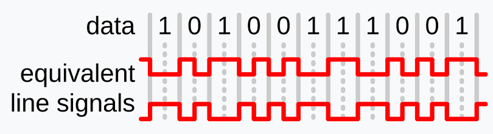
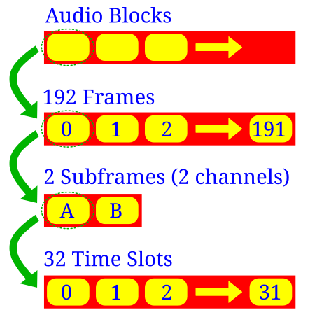
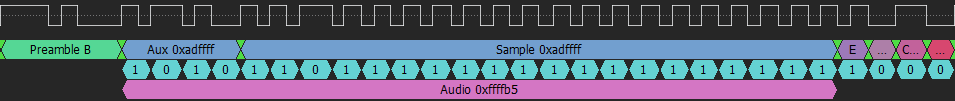
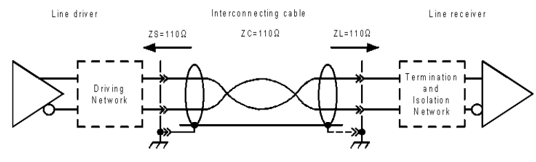
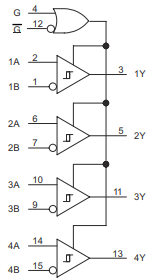
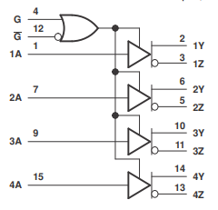
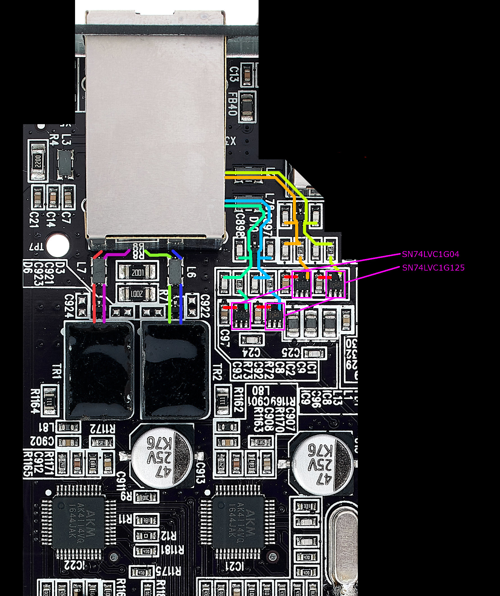
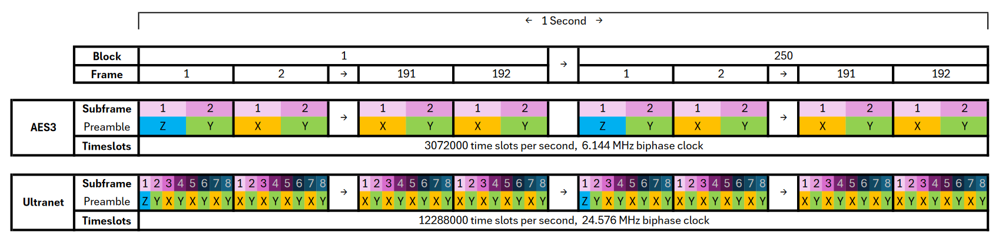

Deep-diving into ultranet and re-implementing both a receiver and transimtter on FPGA.

<!--more-->


This is a stupidly long article, it details the different phases thoroughly, you'll need probably some time to really read it


## Why

In my last article about the opensource SDI to fiber converter, I briefly talked about my brand new MPO-12 cable with 12 OM3 fibers.
I've also hinted that I might use the two spare fibers I had for audio.

When I first started this project there were three "mainstream" ways I thought I could do this:

- [S/PDIF (Sony/Philips Digital Interface)](https://en.wikipedia.org/wiki/S/PDIF) (or it's proffestional big brother [AES/EBU](https://en.wikipedia.org/wiki/AES3)) is a type of digital audio interface. The signal is transmitted over various connectors, or even fibre-optic cables. This would be the most obvious option, AES3 can already be transmitted over fiber so it wouldn't be that difficult to adapt it to OM3 with an SFP module for example.
    - The main upside is that there are plenty of modules that already exist to convert analog to digital and vice-versa
    - The main downside is that it is only two channels per link
- [ADAT Lightpipe](https://en.wikipedia.org/wiki/ADAT_Lightpipe) Lightpipe uses the same connection hardware as S/PDIF: fiber optic cables (hence its name) to carry data, with Toslink connectors and optical transceivers at either end. The main difference stems from the fact that ADAT supports up to 8 audio channels at 48 kHz, 24 bit.
    - The main upside is that 8 channels is plenty
    - The main downside is that from some quick reasearch there isn't a recent IC or implementation that exists and devices that implement the protocol cost way too much for my use.
- [Dante](https://en.wikipedia.org/wiki/Dante_(networking)) / [AES67](https://en.wikipedia.org/wiki/AES67), they are a combination of software, hardware, and network protocols that delivers uncompressed, multi-channel, low-latency digital audio over a standard Ethernet network using Layer 3 IP packets.
    - The main upside is that there are plenty of channels (max 512), it's easy to **use** and it's implemented on a bunch of devices
    - The main downside is that implementing it to get low latency is going to be a nightmare

I didn't really like any of these, I did try to build a prototype ADAT board based on the AL1401/A1L402 ICs but I didn't have any luck.

Then the universe dropped this gem from Christian Noeding:



And this is really what kickstarted the whole thing. From the video, it seemed that Ultranet is somewhat based on two AES3 signals each containing 8 channels.
This would mean either 8 channels bi-directional or 16 uni-directional. 
Moreover I do have (limited) access to hardware that can send and receive ultranet so I can easilly test my implementation.

Pretty good so lets get started.

*Note: for the story's sake events and discoveries aren't neccesarally in chronological order.*

## Research

As always I did some research, this part also contains discoveries I made along the project.

### AES/EBU

I mentioned that ultranet is based on AES/EBU so let's start there, how the hell does this work.
Well AES3 is a standard, related standards include IEC60958 and AES-2id

 More information is need on the specification other documents 

#### Electrical

AES3 can by transmitted over two main kinds of connections:
- **IEC60958 Type I**: It uses balanced, three-conductor, 110-ohm twisted pair cabling with XLR connectors. Type I connections are most often used in professional installations and are considered the standard connector for AES3
- **BNC connectors**: AES/EBU signals can also be run using an unbalanced 75-ohm coaxial cable. The unbalanced version has a very long transmission distance as opposed to the 150 meters maximum for the balanced version. The AES-3id standard defines a 75-ohm BNC electrical variant of AES3

 More information is need on voltages and impedances of the different methods 

#### Encoding

AES3 was designed primarily to support stereo [PCM](https://en.wikipedia.org/wiki/PCM) encoded audio in either [DAT](https://en.wikipedia.org/wiki/Digital_audio_tape) format at 48 kHz or [CD](https://en.wikipedia.org/wiki/CD) format at 44.1 kHz. No attempt was made to use a carrier able to support both rates; instead, AES3 allows the data to be run at any rate, and encoding the clock and the data together using [biphase mark code (BMC)](https://en.wikipedia.org/wiki/Biphase_mark_code).

Biphase mark code also known as differential manchester encoding, is a method to transmit data in which the data and clock signals are combined to form a single two-level self-synchronizing data stream. Each data bit is encoded by a presence or absence of signal level transition in the middle of the bit period (Known as time slot for AES3), followed by the mandatory level transition at the beginning. The code is also insensitive to an inversion of polarity

Unlike the diagram on top, AES uses the BMC variant where the codes makes a transition for 1 and no transition for 0.

Differential Manchester encoding has the following advantages:
- A transition is guaranteed at least once every bit, for robust clock recovery.
- If the high and low signal levels have the same magnitude with opposite polarity, the average voltage around each unconditional transition is zero. Zero DC bias reduces the necessary transmitting power, minimizes the amount of electromagnetic noise produced by the transmission line, and eases the use of isolating transformers.

These positive features are achieved at the expense of doubling the clock frequency needed to encode the data stream.

 This chapter needs re-writting to make it easier to understand 

#### Blocks, frames, time slots

Now that we know of bits flows let's talk about what those bits actually mean!

AES3 is composed of what is called `Audio blocks` these audio blocks are composed of 192*`Frames` each frame containes 2*`Subframes` which in turns contain 32*`Time slots`

 Needs better graphics to explain this 

A subframe is composed of:

| Time slot     | Name                        | Description                                                                                                                    |
| ------------- | --------------------------- | ------------------------------------------------------------------------------------------------------------------------------ |
| 0–3           | Preamble                    | A synchronisation preamble                                                                                                     |
| 4–7           | Auxiliary sample            | A low-quality auxiliary channel used as specified in the channel status word.                                                  |
| 8–27          | Audio sample                | Audio sample stored MSB last. Can be extented to use the auxiliary sample to increase quality                                  |
| 28            | Validity (V)                | Unset if the audio data are correct and suitable for D/A conversion. .                                                         |
| 29            | User data (U)               | Forms a serial data stream for each channel.                                                                                   |
| 30            | Channel status (C)          | Bits from each subframe of an audio block are collated giving a 192-bit channel status word.                                   |
| 31            | Parity (P)                  | Even parity bit for detection of errors in data transmission. Excludes preamble; Bits 4–31 need an even number of ones.        |

The preamble can be one of three values:

|  Name  | Bits (Last was 0) | Bits (Last was 1) | Function                                                                     |
|:------:|:-----------------:|-------------------|------------------------------------------------------------------------------|
| Z or B |      11101000     |      00010111     | Marks a word for channel A (left) at the start of an audio block             |
| X or M |      11100010     |      00011101     | Marks a word for channel A (left), other than at the start of an audio block |
| Y or W |      11100100     |      00011011     | Marks a word for channel B (right).                                          |

#### Practical example 

That's a lot to take in so let's look at a practical example from my logic analyser:

Let's see what we can figure out:
- This subframe starts with the B preamble, this tells us that it's the **start of an audio block** and that it's the **left** channel.
- We are going to consider that the auxiliary bits are use for audio, if we change the bit order from LSB-first (AES3) to MSB-first (what is generally used for audio) the 24bit **audio data is 0xffffb5**
- Even tho we have data the validity bit tells us that **this frame is invalid** and that it shouldn't be played
- Then comes the user bit with an undefined structure
- The is the channel status word, this tells us that the first bit of the word is **a 0 indicating S/PDIF data**
- Finnaly the parity bit **is 0** because the number of asserted **bits in the 4-30 range is already an even number of 1s**

And that's it really, the M preamble will then be used for the rest of the left channel subframes and the W will be used for the right channel. 
Then after 384 subframe, there will be an other B preamble signaling a new block.

### Ultranet

Now how does ultranet differs from AES3?

As there is no official documentation that is publicly availible (or any leaks for that matter), everything that not straight out of a product sheet is informed speculation, reverse-engeinerring and trial & error and might not reflect excatly the actual protocol

#### What we know from product sheets:

- **Digital Processing**
  - **A/D conversion:** 24-bit, 44.1 / 48 kHz sample rate
  - **Latency:** <0.9 ms (from P16-I to P16-HQ)
- **System**
  - **Signal:** 16 channels, plus bus-power for P16-HQ
  - **Power**: 
    - P16-M consumes max. 5W
    - P16-D consumes max. 40W
- **Cabling**
  - **Connectors:** RJ45
  - **Cables:** Shielded CAT5
  - **Cable length:** max. 246 ft / 75 m recommended

Appart from the channel count, given the audio format and that the signal runs over cat5 it sounds a lot like AES3. The product sheet also tells us that power is ran on the same cable somehow.

 More facts, presented better? 

#### Probing and reverse-engeenering the electronics 🍑 

As I said before, the work that Christian did is what kickstarted this project, at this point he already published his video and figured out that as ultranet uses generic CAT5 cables which means they most likely that they also use standard wiring.

As it turns out (and we'll see why later in the protocol section), ultranet does not send 16 channels down a single stream, instead, it sends 8 channels over two separate (but synchronized) streams.
That means 2 out 4 pairs are used for audio, and leaves 2 pairs for power which looks a lot like 100BASE-T with PoE mode B 😅.

| Pin | Pair | Use for 100BASE-T with PoE mode B | Use for Ultranet |
|:---:|:----:|--------------------------------------|------------------|
| 1   | 3    | 📤 TX+                               | 🔊 CH_1-8_+     |
| 2   | 3    | 📤 TX-                               | 🔊 CH_1-8_-     |
| 3   | 2    | 📥 RX+                               | 🔊 CH_1-8_+     |
| 4   | 1    | 🔌 48VDC                             | 🔌 15VDC        |
| 5   | 1    | 🔌 48VDC                             | 🔌 15VDC        |
| 6   | 2    | 📥 RX-                               | 🔊 CH_1-8_+     |
| 7   | 4    | 🔌 48VDC                             | 🔌 15VDC        |
| 8   | 4    | 🔌 48VDC                             | 🔌 15VDC        |

To convert the differential pairs to actual signals that can be read should be too difficult. Reading the `EBU Tech 3250-2004 Specification of the digital audio interface (AES/EBU)` document, there is a whole section on how AES3 should be wired:

 Needs a higher resolution graphics 

Here are a few of the characteristics that have to be respected:
> The interconnecting cable shall be balanced and screened (shielded) with nominal characteristic impedance of 110 Ohms at frequencies from 0.1 to 128 times the maximum frame rate.

> The line driver shall have a balanced output with an internal impedance of 110 Ohm ± 20%, at frequencies from 0.1 to 128 times the maximum frame rate when measured the output at terminals.
  
> The signal amplitude shall lie between 2 and 7 V peak-to-peak, when measured across a 110 Ohm resistor connected to the output terminals, without any interconnecting cable present.

> Any common mode component at the output of the equipment shall be more than 30 dB below the signal at frequencies from DC to 128 times the maximum frame rate.

That's a bunch of information, and there is even more in the document. But to by honest for a prototype, I just YOLO-ed based on quick datasheet read-throughs and the work of Christian.

So where to start, well we know a few important things:
  - 110 Ohms ± 20%
  - Between 2 and 7 volts peak-to-peak
  - The AES3 bitstream is 6.144 Mbit/s for 48Khz 2ch and I for now we are going to assume that ultranet is 8ch/stream, so 24.576 Mbit/s
  - They seem to skirt the "this breaks the spec" line of every specification they based ultranet upon.

So it's very likely that they are using standard line driver running at 5V over generic ethernet pulse transformer which are typically 100 Ohms (which fits the tolerance)

 Paragraphs on top need re-wording 

During his project, Christian made a small PCB to receive ultranet, he used the [SI-52008-F](https://www.mouser.fr/datasheet/2/643/belfs08419_1-2290057.pdf) an RJ-45 connector with integrated magnetics and PoE capability. This connector is then wired to the [AM26LV32](https://www.ti.com/lit/ds/symlink/am26lv32.pdf), a `Low-Voltage, High-Speed Quadruple Differential Line Receiver` that can handle up to 32MHz data rates can receive 5V signals and outputs 3.3V.

This seems pretty good, but writing this article I did notice that the common-mode range is 2 volts under the AES3 spec but I doubt it's going to cause massive issues and I won't be swapping it for something else for part 2.

The [AM26LV32](https://www.ti.com/lit/ds/symlink/am26lv32.pdf) also have a brother, the [AM26LV31](https://www.ti.com/lit/ds/symlink/am26lv31.pdf) a `Low-Voltage High-Speed Quadruple Differential Line Driver` which has pretty much the same specs but goes into the other direction:

 Explain / reword the part on top 

While writting this article I speak as tho this is obvious and the only option. Truth is until very late into the project I was extremly unsure about the electronics. At the time, I was struggling getting a signal in/out from real hardware and I was suspecting these circuit more and more.

This lead me down the path of trying to reverse-engeenier the electrical side of a proprietary protocol with nothing but google image. After much research I stumbled onto the [Klark Teknik DM80-Ultranet](https://www.thomann.fr/klark_teknik_dm80_ultranet.htm) an ultranet expention card for the [DM8000](https://www.klarkteknik.com/product.html?modelCode=0829-AAC). What was really interesting was the very nice, high resolution, top view of the pcb.

After loading the image into gimp I began tracing out connections and with the help of [The ultimate SMD marking codes database](https://smd.yooneed.one/) I managed to get the information I was looking for:

 More photos (+ nedd to archive them before publishing) 

The AES3 signals both go into a [SN74LVC1G04](https://www.ti.com/lit/ds/symlink/sn74lvc1g04.pdf) `Single Inverter Gate` and a [SN74LVC1G125](https://www.ti.com/lit/ds/symlink/sn74lvc1g125.pdf) `Single Bus Buffer Gate` which gives a 5V differential signal. It then goes into what I assume to be filters, a protection diode, and a common mode choke, before going into either, the conector directly or through magnetics (we can only guess here but I think it goes straight to the connector).

The receive side goes from the connector (again, maybe through magnetics but I doubt it) through what I assume to be a common mode choke into what I guess is a pulse transformer and I didn't bother going further as I already had this working and it worked for Dr. Nöding.

After this evening I was confdent that the implementation that we'll see later was correct enought to work!

#### Reverse-engeenering the protocol

So how would you send 16 channels of digital audio down a CAT5 cable?

A important thing to remeber is that while is it's own thing, Ultranet is based on existing protocols and from what I've seen they try to not break them too much.

From different photos of main boards of products that implement ultranet, we can see a recuring a recurring pattern, there always seem to be two for the same ICs, the [AK4114](https://media.digikey.com/pdf/Data%20Sheets/AKM%20Semiconductor%20Inc.%20PDFs/AK4114.pdf). This IC is a `High Feature 192kHz 24bit Digital Audio Interface Transceiver`

> The AK4114 is a digital audio transceiver supporting 192kHz, 24bits. The channel status decoder supports both consumer and professional modes. The AK4114 can automatically detect a Non-PCM bit stream. When combined with the multi channel codec (AK4527B or AK4529), the two chips provide a system solution for AC-3 applications. The dedicated pins or a serial µP I/F can control the mode setting.

Features include:
  - AES3, IEC60958, S/PDIF, EIAJ CP1201 Compatible
  - Unlock & Parity Error Detection
  - Validity Flag Detection 
  - Up to 24bit Audio Data Format
  - Master Clock Outputs

From all of this it seems that it's a bog-standard AES3/SPDIF receiver. Which means that once again Behringer didn't go too far into customizing the protocol.

So how do you fit 16 channels into the 192kHz the chip supports?  Well you don't, as I mentioned before there are two chips.  
But wait this still leaves 8 channels, so how do you do this? Well 48Khz is for two channels, math tells us that `2 * 4 = 8` and that `48 * 4 = 192` that means it can theoratically fit.

Okay enought guessing: it would seem that ultranet basically is AES3 running at 192Khz with the 8 channels multiplexed together. 

 Needs better graphics to explain this 

I'll explain later why I think that something fishy is going on and that there is more to channel ordering than this but it's the basic idea!

That leaves the content of those bits, are they different? Well yes!, somewhat!:
  - Because the use standard parts the preambles are the same
  - As well as the audio data.
  - The validity bit seems to be inverted, which seems logicial when you think about it.
  - The user bits seem to be unused
  - The channel bits are used but not idea for what yet changing them seemed to have no audible effect.
  - And again, because the use standard parts, the parity bit simply cannot change (which I discovered the hard way) 

 Needs a better chapter ending 

## Building a dev-board
And that's it really so let's start doing some tangible stuff for this project.

I decided that my first step would be to design a prototype devellopment board where I could easylly explore different avenues before going straight into final-ish design.

### Board bring-up & mistakes

## Blind implementation
### Transmitter
### Receiver
### Alllll the channels
### It's working ?

## Testing on real hardware
### Transmitter
### Receiver
### Transmitter again
#### Oh, f---, that was the issue!
### It's working (encore) ?

## What's next

## Conclusion

During the project I thought multiple times about ditching the FPGA implementation and using the AK4114, however, it's EOL and was quite expensive. There are alternatives from TI for example but where's the fun in that 😭?
