Deep-diving into Ultranet and re-implementing both a receiver and transmitter on FPGA.

<!--more-->


This is a stupidly long article, it details the different phases thoroughly, you'll need probably some time to really read it


## Why

In my last article about the open-source SDI to fiber converter, I briefly talked about my brand new MPO-12 cable with 12 OM3 fibers 🔦.
I've also hinted that I might use the two spare fibers I had for audio 🔊.

These audio channels will be used mostly as side-channels, stuff like LTC time code, backup sound pickup, and (maybe) intercom

When I started this project, there were four "mainstream" ways I thought I could tackle this:

- [S/PDIF (Sony/Philips Digital Interface)](https://en.wikipedia.org/wiki/S/PDIF) (or it's professional big brother [AES/EBU](https://en.wikipedia.org/wiki/AES3))<br>It's a digital audio interface transmitted over various connectors, such as (plastic) fiber-optic cables. This would be the most obvious option, AES3 can already be transmitted over fiber so it wouldn't be that difficult to adapt it to OM3 with an SFP module for example.
    - The main upside is that there are plenty of cheap modules that already exist to convert analog to digital and vice versa
    - The main downside is that it is only two channels per link 🤔
    <br><br>
- [ADAT Lightpipe](https://en.wikipedia.org/wiki/ADAT_Lightpipe)<br>Lightpipe uses the same connection hardware as S/PDIF: fiber optic cables (hence its name) to carry data, with TOSLINK connectors and optical transceivers at either end. The main difference stems from the fact that ADAT supports up to 8 audio channels at 48 kHz, 24 bits.
    - The main upside is that 8 channels is pretty good 
    - The main downside is that from some quick research, there isn't a recent IC or implementation that exists and devices that implement the protocol cost too much for my use.
    <br><br>
- [Multichannel Audio Digital Interface (MADI) / AES10](https://en.wikipedia.org/wiki/MADI) <br>This interface supports serial digital transmission over coaxial cable or fiber-optic lines of 28, 56, 32, or 64 channels and sampling rates to 96 kHz and beyond with an audio bit depth of up to 24 bits per channel.
    - The main upside is the number of channels and the fact that it already runs over multimode fiber 🔦. 
    - The main downside is that it's even worse than ADAT, there isn't a recent/easy implementation that exists and devices that implement the protocol have a prohibitive cost for hobbyist use.
    <br><br>
- [Dante](https://en.wikipedia.org/wiki/Dante_(networking)) / [AES67](https://en.wikipedia.org/wiki/AES67)<br>This is a combination of software, hardware, and network protocols that delivers uncompressed, multichannel, low-latency digital audio over a standard Ethernet network 🌐 using Layer 3 IP packets.
    - The main upside is that there are plenty of channels (max 512) 📈, it's easy to **use**, and it's implemented on countless devices
    - The main downside is that implementing it to get low latency ⏱ will be a nightmare


I didn't really like any of these 😕, I did try to build a prototype ADAT board based on the AL1401/A1L402 ICs, but I didn't have any luck 🙁.

I did dip my toes in AES67 for another project, but access to the full specification as a hobbyist is a bit complicated and the overall setup required to get it working at all without dealing with latency requires a lot of work ⏳.

Then the universe dropped this gem 💎 from Christian Nöding:



This is what kickstarted the whole thing. From the video, it seemed that Ultranet, a protocol that I have seen but never used, is somewhat based on two AES3 signals each containing 8 channels.
This would mean either 8 channels bidirectional or 16 uni-directional channels on two fiber 🤩. 
Moreover, I do have (limited) access to hardware that can send and receive Ultranet so I can easily test my implementation.
But the most important thing is that Christian proved it was possible to do it 🥳!

*Note: for the story's sake, events and discoveries aren't necessarily in chronological order.*

## Research

As always for big projects, I started by doing some research 📜, this part also contains discoveries and light-bulb moments I had during the project.

### AES/EBU

I mentioned that Ultranet is based on AES3, also known as AES/EBU so let's start there, how the hell does this work, and where do we start?

The [Audio Engineering Society (AES)](https://www.aes.org/), is a professional society 🏢 devoted exclusively to audio technology. Alongside other groups like the [European Broadcasting Union (EBU)](https://www.ebu.ch/) 🎥 they standardize different technologies in the audio/broadcasting industry. 

This article will talk exclusively about AES3. Newer standards are behind a paywall. Fortunately, AES3 is as older than me. It was first published in 1985 and was revised in 1992, 2003 and 2009. That means that we can find semi-recent leaked PDFs without much difficulty.

Moreover, there are a bunch of other documents linked to AES3 from which we can scoop up information:
  - [AES/EBU EG](https://tech.ebu.ch/docs/other/aes-ebu-eg.pdf) - ``Engineering Guidelines - (The AES/EBU audio interface)``
  - [EBU Tech 3250-2004](https://tech.ebu.ch/docs/tech/tech3250.pdf) - ``Specification of the digital audio interface (The AES/EBU interface)``
  - [IEC60958](https://webstore.iec.ch/en/publication/62829) - ``Digital audio interface - Part 1: General``
  - AES-2id - ``Guidelines for the use of the AES3 interface``

#### Electrical signals

AES3 can be transmitted over two main kinds of connections:
- **IEC60958 Type I**: This defines a balanced, three-conductor, 110-ohm twisted pair cable with XLR connectors. Type I connections are most often used in professional installations and are considered the standard connector for AES3
- **IEC60958 Type II**: It defines an unbalanced electrical or optical interface for consumer electronics applications. This implementation is the one used by S/PDIF. S/PDIF and AES3 are interchangeable at the protocol level, but differ at the physical level (voltage / impedances).
- **BNC connectors**: AES/EBU signals can also be run using an unbalanced 75-ohm coaxial cable. The unbalanced version has a very long transmission distance, instead of the 150 meters maximum for the balanced version. The AES-3id standard defines a 75-ohm BNC electrical variant of AES3.

From the `EBU Tech 3250-2004` document, we can get a bunch of information about the electrical characteristics of AES3, which boils down in my opinion to the most important being that the system needs an impedance of 110 Ohm ± 20% with an amplitude that lies between 2 and 7 V peak-to-peak.

#### Data encoding

AES3 was designed primarily to support stereo [PCM](https://en.wikipedia.org/wiki/PCM) 📊 encoded audio in either [DAT](https://en.wikipedia.org/wiki/Digital_audio_tape) format at 48 kHz 🎤 or [CD](https://en.wikipedia.org/wiki/CD) format at 44.1 kHz 💿. Instead of using an elaborate scheme to support both rates, AES3 allows instead to be run at any rate 💪, and encodes the clock and the data together using [biphase mark code (BMC)](https://en.wikipedia.org/wiki/Biphase_mark_code).

Biphase mark code, also known as differential Manchester encoding, is a method to transmit data in which the data 💾 and clock 🕓 signals are combined to form a single two-level self-synchronizing data stream. Each data bit is encoded by a presence or absence of signal level transition in the middle of the bit period (known as time slot for AES3), followed by the mandatory level transition at the beginning of the period. This also means that by design the encoding is insensitive to an inversion of polarity 🔀.

There are two variants of BMC:
 - Transition on a 1 which is the one used for AES3
 - Transition on a 0 which is irrelevant for this project

Here is an example diagram representing how the signal behave, there is a transition on each solid line plus a transition on the dotted line if the bit is a one:

")

Differential Manchester encoding has the following advantages:
- A transition is guaranteed at least once every bit, for robust clock recovery.
- If the high and low signal levels have the same magnitude with opposite polarity, the average voltage around each unconditional transition is zero. Zero DC bias reduces the necessary transmitting power and minimizes the electromagnetic noise produced by the transmission line.

All of these positive features come at the expense of clock speed 🏃‍♂️. BMC needs a clock twice as fast as the data rate to encode the bit stream

#### Blocks, frames, time slots

Now that we know how to read the bits, let's talk about what those bits actually mean!

AES3 is composed of what is called audio blocks, these audio blocks are composed of 192 frames, each frame contains 2 subframes, which in turns, contain 32 time slots.

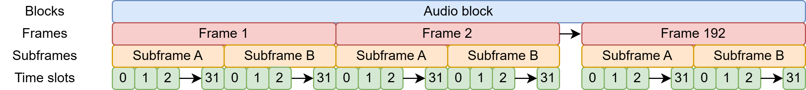

A subframe is composed of:

| Time slot     | Name                        | Description                                                                                                                    |
| ------------- | --------------------------- | ------------------------------------------------------------------------------------------------------------------------------ |
| 0–3           | Preamble                    | A synchronization preamble                                                                                                     |
| 4–7           | Auxiliary sample            | A low-quality auxiliary channel used as specified in the channel status word.                                                  |
| 8–27          | Audio sample                | Audio sample stored MSB last. It can be extended to use the auxiliary sample to increase quality                                  |
| 28            | Validity (V)                | Unset if the audio data is correct and suitable for D/A conversion.                                                           |
| 29            | User data (U)               | Forms a serial data stream for each channel.                                                                                   |
| 30            | Channel status (C)          | Bits from each subframe of an audio block are collated, giving a 192-bit channel status word.                                   |
| 31            | Parity (P)                  | Even parity bit for detection of errors in data transmission. Excludes preamble; Bits 4–31 need an even number of ones.        |

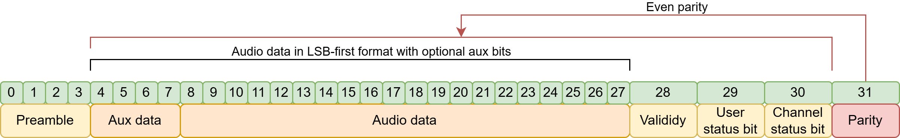

The preamble can be one of three values:

|  Name  | Timeslot (Last was 0) | Timeslot (Last was 1) | Function                                                                     |
|:------:|:---------------------:|:---------------------:|------------------------------------------------------------------------------|
| Z or B |        11101000       |        00010111       | Marks a word for channel A (left) and the start of an audio block            |
| X or M |        11100010       |        00011101       | Marks a word for channel A (left), besides at the start of an audio block |
| Y or W |        11100100       |        00011011       | Marks a word for channel B (right).                                          |

#### Channel status word

Between the AES3 and S/PDIF standards, the contents of the 192-bit channel status word differ significantly, although they both standards agree that the first channel status bit distinguishes between the two 🤝. In the case of AES3, the standard describes, in detail, the function of each bit.

Broadly speaking, the channel status word indicates the type of data, has information about the clocks and various metadata such as channel origin/destination.

I won't go into more detail in this article mainly because it's mostly irrelevant for Ultranet 🧐. 
For AES3, you can find the full format in the `EBU Tech 3250-2004` document. For consumer S/PDIF it's a bit more blurry but the English Wikipedia article has a nice table 📅.

#### Practical example 

That's a lot to take in, so let's look at a practical example from my logic analyzer:


Let's see what we can figure out:
- This subframe starts with the B preamble, this tells us that it's the **start of an audio block** and that it's the **left channel** left.
- We are going to consider that the auxiliary bits are used for audio. This gives us ``0xadffff``, if we change the bit order from LSB-first (AES3) to MSB-first 🔀 (what is generally used for audio) the 24bit **audio data is ``0xffffb5``**.
- Even tho we have data the validity bit tells us that **this frame is invalid** 🛑 and that it shouldn't be played
- Then comes the user bit with an undefined structure.
- There is the channel status word, this tells us that the first bit of the word is **a 0 indicating S/PDIF data**
- Finally, the parity bit **is 0** because the number of **asserted bits in the 4-30 range** already are an **even number of 1s** 🧮

And that's it really, the M preamble will then be used for the rest of the left channel subframes and the W will be used for the right channel. 
Then after 384 subframe, there will be another B preamble signaling a new block.

### Ultranet

Now, how does Ultranet differ from AES3?

As there is no official documentation that is publicly available (or any leaks for that matter), everything that not straight out of a product sheet is informed speculation, reverse-engineering and trial & error and might not reflect exactly the actual protocol

#### What we know from product sheets:

I read through the datasheets/quick guides from several Ultranet compatible devices from Behringer and its subsidiaries. Here is what is always present and important to this project:

- **Digital Processing**
  - **A/D conversion:** 24-bit, 44.1 kHz / 48 kHz sample rate
  - **Latency:** <0.9 ms (from [P16-I](https://www.behringer.com/product.html?modelCode=0609-AAA) to [P16-HQ](https://www.behringer.com/product.html?modelCode=0609-AAP))
- **System**
  - **Signal:** 16 channels, plus bus-power
  - **Power**: 
    - P16-M consumes max. 5W
    - P16-D consumes max. 40W
- **Cabling**
  - **Connectors:** RJ45
  - **Cables:** Shielded CAT5
  - **Cable length:** max. 246 ft (ca. 75 meters) recommended

Apart from the channel count, given the audio format & latency plus the fact that the signal runs over CAT5, it sounds a lot like AES3 🤔. The product sheet also tells us that power is running on the same cable somehow.

#### Probing and reverse-engineering the electronics 🍑 

As I said before, the work that Christian did is what kickstarted this project. At this point, he already published his video and figured out that as Ultranet uses generic CAT5 cables, which means they most likely also use standard wiring.

As it turns out (and we'll see why later in the protocol section), Ultranet does not send 16 channels down a single stream. Instead, it sends 8 channels over two separate (but synchronized) streams.
That means 2 out 4 pairs are used for audio and leaves 2 pairs for power, which looks a lot like 100BASE-T with POE mode B 😅.

| Pin | Pair | Use for 100BASE-T<br>with POE mode B | Use for Ultranet |
|:---:|:----:|--------------------------------------|------------------|
| 1   | 3    | 📤 TX+                               | 🔊 CH_1-8_+     |
| 2   | 3    | 📤 TX-                               | 🔊 CH_1-8_-     |
| 3   | 2    | 📥 RX+                               | 🔊 CH_1-8_+     |
| 4   | 1    | 🔌 48VDC                             | 🔌 15VDC        |
| 5   | 1    | 🔌 48VDC                             | 🔌 15VDC        |
| 6   | 2    | 📥 RX-                               | 🔊 CH_1-8_+     |
| 7   | 4    | 🔌 48VDC                             | 🔌 15VDC        |
| 8   | 4    | 🔌 48VDC                             | 🔌 15VDC        |

Earlier I briefly talked about the AES3 electrical specifications. Again the `EBU Tech 3250-2004` document comes to the rescue, there is a whole section on differential pairs and how AES3 should be wired 🔌:

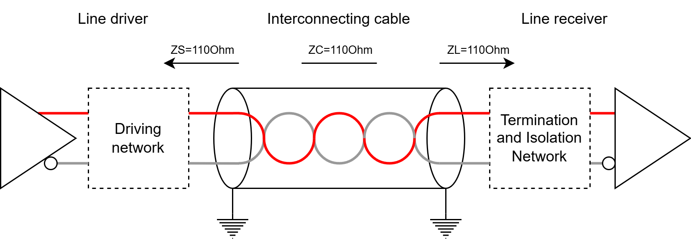

Here are a few other important characteristics that have to be respected:
> The interconnecting cable shall be balanced and screened (shielded) with nominal characteristic impedance of 110 Ohms at frequencies from 0.1 to 128 times the maximum frame rate.

> The line driver shall have a balanced output with an internal impedance of 110 Ohm ± 20%, at frequencies from 0.1 to 128 times the maximum frame rate when measured the output at terminals.
  
> The signal amplitude shall lie between 2 and 7 V peak-to-peak, when measured across a 110 Ohm resistor connected to the output terminals, without any interconnecting cable present.

> Any common mode component at the output of the equipment shall be more than 30 dB below the signal at frequencies from DC to 128 times the maximum frame rate.

That's a bunch of information, and there is even more in the document. But to be honest, for a prototype, I just YOLO-ed the design 🤡 based on a quick datasheet read through and the work of Christian.

So to summarize, the important things are:
  - 110 Ohms ± 20%
  - Between 2 and 7 volts peak-to-peak
  - The AES3 bit stream is 6.144 Mbit/s for 48Khz 2ch and if we assume that Ultranet is 8ch/stream, that is 24.576 Mbit/s
  - Behringer seem to skirt the "this breaks the spec" line of every specification they based Ultranet upon.

So we can safely assume 🧐 that they are using a standard line driver running at 5V over a generic Ethernet pulse transformer which are typically 100 Ohms (which fits the tolerance)

During his project, Christian made a small PCB to receive Ultranet, he used the [SI-52008-F](https://www.mouser.fr/datasheet/2/643/belfs08419_1-2290057.pdf) an RJ-45 connector with integrated magnetics and POE capability. This connector is then wired to the [AM26LV32](https://www.ti.com/lit/ds/symlink/am26lv32.pdf), a `Low-Voltage, High-Speed Quadruple Differential Line Receiver` that can handle up to 32MHz data rates, can receive 5V signals and outputs 3.3V.


images/chrome_2025-03-23_14-24-40_2037adcc-535c-4214-934e-fe13cc91facc.png "Christian's PCB (Top)"
images/chrome_2025-03-23_14-23-39_c403c642-afb7-4cc8-b862-0bc40edab97f.png "Christian's PCB (Bottom)"
images/chrome_2025_03_20_11-23-59_MV5yxRStla.png "AM26LV32 Logic diagram"



This seems pretty good, but writing this article I did notice that the common-mode range is 2 volts under the AES3 spec, but I doubt it's going to cause massive issues 🧨 for the prototype and I probably won't be swapping it for something else for part 2.

The [AM26LV32](https://www.ti.com/lit/ds/symlink/am26lv32.pdf) also has a brother, the [AM26LV31](https://www.ti.com/lit/ds/symlink/am26lv31.pdf) a `Low-Voltage High-Speed Quadruple Differential Line Driver` which has just about the same specs but goes into the other direction:


> While writting this article I say things as tho they are obvious and the only option. Truth is until very late into the project I was extremly unsure about the electronics. At the time, I was struggling getting a signal in/out from real hardware and I was suspecting these circuit more and more.

All of this uncertainty lead me down the path of trying to reverse-engineering the electrical side of a proprietary protocol with nothing but Google Images 🖼. After much research, I stumbled onto the [Klark Teknik DM80-Ultranet](https://www.thomann.fr/klark_teknik_dm80_ultranet.htm) an Ultranet expansion card for the [DM8000](https://www.klarkteknik.com/product.html?modelCode=0829-AAC). What was fascinating was the very nice and high resolution 🔍 top view of the pcb.

After loading the image into Gimp I began tracing out connections and with the help of [The ultimate SMD marking codes database](https://smd.yooneed.one/), I managed to get the information I was looking for:


images/15667910.jpg "Klark Teknik DM80-Ultranet"
images/ultranet_hardware_2.png "DM80-Ultranet bottom side (Power)"
images/ultranet_hardware_1.jpg "DM80-Ultranet top side (Signal)"


The AES3 signals both go into a [SN74LVC1G04](https://www.ti.com/lit/ds/symlink/sn74lvc1g04.pdf) `Single Inverter Gate` and a [SN74LVC1G125](https://www.ti.com/lit/ds/symlink/sn74lvc1g125.pdf) `Single Bus Buffer Gate` which gives a 5V differential signal. It then goes into what I assume to be filters, a protection diode, and a common mode choke before going into either, the connector directly or through magnetics 🧲 (we can only guess here, but I think it goes straight to the connector).

The input circuitry goes from the connector (again, maybe through magnetics, but I doubt it) through what I assume to be a common mode choke into what I guess is a pulse transformer and I didn't bother going further as I already had this working, and it worked for Dr. Nöding.

After this evening, I was confident that the implementation that we'll see later was correct enough to work 😎!

#### Reverse-engineering the protocol

So how would you send 16 channels of digital audio down a CAT5 cable?

An important thing to remember is that while is its own unique thing, Ultranet is based on existing protocols and from what I've seen, they try not to break ⛓ them too much.

From different photos of main boards of products that implement Ultranet, we can see a recurring pattern, there always seem to be two of the same ICs, the [AK4114](https://media.digikey.com/pdf/Data%20Sheets/AKM%20Semiconductor%20Inc.%20PDFs/AK4114.pdf). This IC is a `High Feature 192kHz 24bit Digital Audio Interface Transceiver` 🔊

> The AK4114 is a digital audio transceiver supporting 192kHz, 24bits. The channel status decoder supports both consumer and professional modes. The AK4114 can automatically detect a Non-PCM bit stream. When combined with the multi channel codec (AK4527B or AK4529), the two chips provide a system solution for AC-3 applications. The dedicated pins or a serial µP I/F can control the mode setting.

Features include:
  - AES3, IEC60958, S/PDIF, EIAJ CP1201 Compatible
  - Unlock & Parity Error Detection
  - Validity Flag Detection 
  - Up to 24bit Audio Data Format
  - Master Clock Outputs

From all of this, it appears that it's a bog-standard AES3/SPDIF receiver. Which means that once again, Behringer didn't go too far into customizing the protocol 🔧.

So how do you fit 16 channels 🗜 into the 192kHz the chip supports?  Well, you don't, as I mentioned before, there are two chips. <br>
But wait, this still leaves 8 channels, so how do you do this? Well, 48Khz is for two channels, math tells us that `2 * 4 = 8` and that `48 * 4 = 192` that means it can fit, with some tinkering 🤔.

Okay, enough guessing: it would seem that Ultranet basically is AES3 running at 192Khz with the 8 channels multiplexed together. 

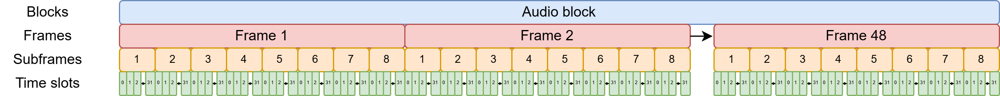

You'll see later why I think that something fishy 🐟 is going on and that there is more to channel ordering than this, but it's the basic idea!

That leaves the content of those bits, are they different? Well, yes, somewhat!
  - Because they use standard ICs the preambles need to be the same
  - As well as the audio data.
  - The validity bit seems to be inverted, which is a good call when you think about it.
  - The user bits seem to be unused
  - The channel bits are used but not idea for what, yet changing them seemed to have no audible effect.
  - And again, since they use standard ICs, the parity bit simply cannot change (which I discovered the hard way) 

And that's it, really. Behringer created a very elegant solution 😎 stretching existing specification/protocols to meet their needs and didn't completely reinvent the wheel!

## Building a dev-board

I decided that my first step would be to design a prototype development board 🦾 where I could easily explore different avenues before going straight into a final design. This approach allows me to test various configurations and functionalities without committing too much time or resources upfront.

Where to start? A microcontroller 📟 seems like a good choice, but dealing with the specific signals required for this project is impractical on a traditional MCU (not to mention potential latency issues). While it might be possible to implement everything using a standard MCU, it would most likely require a specialized 👷 digital interface chip (DIX) such as the AK4114. Given these constraints and my interest in exploring new technologies, this was the perfect project to finally start working with FPGAs.

A mention must also be given to the [XMOS series of ICs](https://www.xmos.com/) ‼️. This is what Behringer is using in their Ultranet products (specifically the [XL216-512-TQ128](https://www.xmos.com/download/XL216-512-TQ128-Datasheet(1.16).pdf) in the P16-M). XMOS chips are weird 🫠 (in a good way) they are multicore microcontrollers dedicated to audio processing which means they have many peripherals related to audio as well as reference implementations. 

XMOS chips are something that I definitively want to try someday 🤔 but FPGAs have been on my radar for quite some time now, I never had a practical use case until now. 

This project can be boiled down to shifting bits around, which is precisely what an FPGA does best! By using an FPGA, I can implement complex digital logic directly in hardware, which offers significant advantages over software-based solutions when it comes to speed.

However, as I never dealt with FPGAs before, this is project is a bit of a long shot 🏹, but for hobby projects I almost always work like that, so let's get started!

### But which FPGA

FPGA characteristics are far and wide; they range from tiny FPGAs capable of running basic tasks to monstrous devices that can handle hundreds of gigabits of data per second 🌐. 

Given my project requirements, I need something that is powerful enough to :
 - Receive and transmit two AES3 streams at 192 kHz
 - Handle at least 4 stereo I2S inputs
 - Handle at least 4 stereo I2S outputs

I also want something powerful enought in case I want to do fancier stuff like mixing/equalizer/filters in the future 🎚️.

So it mainly came down to what I could get on a devboard for cheap and fast, there are two options I considered:
  - [Arduino MKR Vidor 4000](https://docs.arduino.cc/hardware/mkr-vidor-4000/)
    - This board uses the Intel Cyclone 10CL016 FPGA. 
    - It offers an integrated ARM Cortex-M0+ microcontroller and a full suite of onboard peripherals, making it versatile for various applications. 
    - The Cyclone 10CL016 is capable of handling moderate complexity tasks and has sufficient resources to manage the AES3 streams efficiently. [It can even do SDI with some help](https://blog.tempus-ex.com/pro-video-with-arduinos-an-intro-to-sdi-video-and-pcb-fab/)
    - It's what Dr. Nöding successfully used in his project.
  - [SiPEED Tang Nano 9K](https://wiki.sipeed.com/hardware/en/tang/Tang-Nano-9K/Nano-9K.html)
    - This board uses the Gowin GW1NR-9 FPGA. 
    - It provides a cost-effective solution with an integrated USB interface, making it easy to program and debug. 
    - The GW1NR-9 FPGA is smaller but still offers enough logic resources for my project's requirements.
    - Thanks to its price it's a pretty popular option among hobbyists.

In the end, despite that the RTL I'm basing this project upon was successfully tested on the  Vidor 4000, I decided to proceed with the Tang Nano 9K due to its cost-effectiveness💸, ease of use, and adequate performance for my project's needs. This choice allows me to focus 🎯 on developing the core FPGA functionality without the unnecessary complications of having to use the Arduino IDE alongside the Quartus Prime IDE.


### I/O

As this, a devboard that I want to potentially re-use in other projects ♻️, I went all in and included a wide range of connectivity options that would make this board versatile enought.

Instead of implementing the 16 inputs and 16 outputs that Ultranet uses, which would render this already big pcb even bigger. I opted to implement only half ✂️, which is good enought for development purposes as I can still receive one of the AES3 streams in its entirety.

The second part of this project will probably have some way to get the full 16 channels, but I think that 8 is enough for now anyway 🤷‍♂️. 

At the very beginning, I mentioned that the end goal of this project is to run it over fiber 🔦, so I decided to incorporate an SFP cage along with the appropriate line [driver](https://www.ti.com/product/SN65LVDT2/part-details/SN65LVDT2DBVR) and [receiver](https://www.ti.com/product/SN65LVDS1/part-details/SN65LVDS1DBVR). 

> If you want to read more about SFP/SFP+ modules you can read the chapter I wrote on it for my [3G-SDI to fiber project](https://blog.thestaticturtle.fr/diy-opensource-bidirectional-sdi-to-fiber-converter/#sfp--sfp)

I also included footprints for DLT1150R and DLT1150T Toslink connectors 🔦. These optical audio connectors support up to 16 Mbps data transfer, so I can't pass Ultranet on them, but they provide an additional layer of flexibility 🤸‍♂️ for connecting various audio devices using the "normal" implementation of AES3. And who knows, maybe I'll implement ADAT someday.

Finally, the star ⭐ feature of this project is the inclusion of Ultranet transmit and receive ports with the isolation transformers and line driver/receiver discussed before. 

As a last-minute touch, I added several status LEDs 💡 and three buttons on the 1.8v GPIO port of the tang 9k which I didn't want to use for anything else.

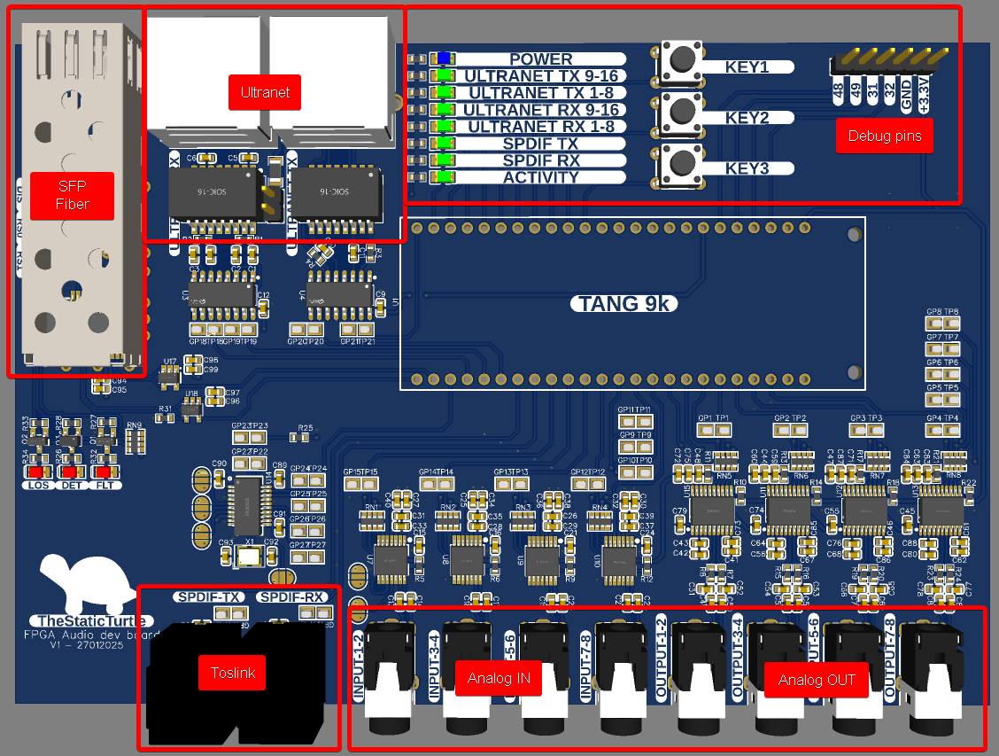

### Analog domain

When it comes to handling audio signals of the project 🔊, there are multiple options available. You can use dedicated DACs (Digital-to-Analog Converters) and ADCs (Analog-to-Digital Converters), or you can opt for CODECs (ADC+DAC combined generally with some additional features), each with its own advantages ⚖️. 

However, in this case, using a codec is a terrible choice 👎. CODECs typically share the same reference clocks between the ADC and DAC part. 
This doesn't work for my application because while I generate the master clock for the transmit side, the decoder recovers it from the AES3 stream. In theory, they are the same but in practice various factors will slightly influence the clock speed 🕝.

While I'm sure it's possible to implement some sort of sample rate synchronization, I opted for the much simpler option of using dedicated ADCs and DACs each with their clocks.

The analog to digital converter I choose is the [PCM1808](https://www.ti.com/lit/ds/symlink/pcm1808.pdf) 👈. This device is a high-quality single-ended, analog-input 24-bit ADC capable of operating at up to 96 kHz sample rate in stereo mode.

The digital to analog converter I went for is the [PCM5102A](https://www.ti.com/lit/ds/symlink/pcm5102a.pdf) 👈. This device is a high-performance audio stereo DAC with an integrated PLL (meaning I don't have to generate the master clock), capable of handling up to 384 kHz sample rates and supporting 32-bit PCM interfaces. 

The choice of ICs came down to familiarity ✨ with the specific chips and ease of configuration. Given that both the PCM1808 and PCM5102A are well-documented and widely used components by both enthusiasts and professionals, they provide a reliable foundation for my project requirements. 

Compared to other ICs, these are configured only by pin strapping 🔌 this means it's easier to troubleshoot, and I don't need to implement another protocol like I2C or SPI in the FPGA just to configure them.

#### ADC: PCM1808

The schematic of the ADC is almost straight out of the typical application schematic provided in the datasheet. The datasheet does mention that in certain application an additional antialiasing filter could be required. But this is a prototype with the main goal of getting any sound at all 🔊, not necessarily a high-quality one.

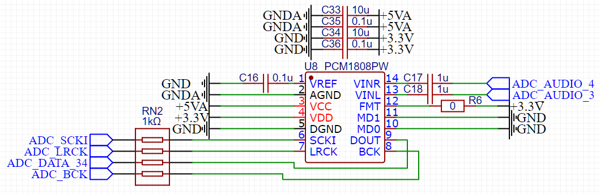

The ``FMT`` pin is tied to 3.3V for all ICs which tells the ADC to send data in the left-justified format. The other option would be I2S, neither format is the perfect as it depends on the implementation and simply changes the way the data is sent. Simply put, I2S mode offsets the data by one BCLK cycle which is a bit more annoying to deal with.

| FORMAT NO. | FMT (Pin 12) | FORMAT                 |
|------------|--------------|------------------------|
| 0          | Low          | I2S, 24-bit            |
| 1          | High         | Left-justified, 24-bit |

The other two strapping pins (``MD1`` & ``MD0``) control whether the IC operates in master or slave mode. 
The schematic on top is the one from the second ADC which handles channel 3 & 4. The first ADC is almost identical 🪞. It simply has additional test pads on these pins that allow me to easily change this behavior.

This leaves me the flexibility of not needing to implement the word clock & bit clock dividers in the FPGA. 

| MD1 (PIN 11) | MD0 (PIN 10) | INTERFACE MODE                                    |
|--------------|--------------|---------------------------------------------------|
| Low          | Low          | Slave mode (256 FS, 384 FS, 512 FS autodetection) |
| Low          | High         | Master mode (512 FS)                              |
| High         | Low          | Master mode (384 FS)                              |
| High         | High         | Master mode (256 FS)                              |


In the end, I did use slave mode because of one very specific line of the datasheet that you could easily miss:

> **7.3.5.1.1 Master Mode**<br>
> In master mode, BCK and LRCK work as output pins, timing which from the clock circuit of the PCM1808 device controls these pins. The frequency of BCK is constant at 64 BCK/frame.
>
> **7.3.5.1.2 Slave Mode**<br>
> In slave mode, BCK and LRCK work as input pins. The PCM1808 device accepts 64-BCK/frame or 48-BCK/frame format (only for a 384-fS system clock), not 32-BCK/frame format.

Typically, you would expect a 24 bit ADC to use 48 cycles but the PCM1808 offers the possibility of using a 64 cycle bit clock 🎉. This significantly simplifies the clock generation and also allocates me a bit of time to process the data because I get an "extra" 8 clock cycle per channel to move data around.

#### DAC: PCM5102A

Once again, the schematic of the DAC is almost straight out of the typical application schematic provided in the datasheet 📋.

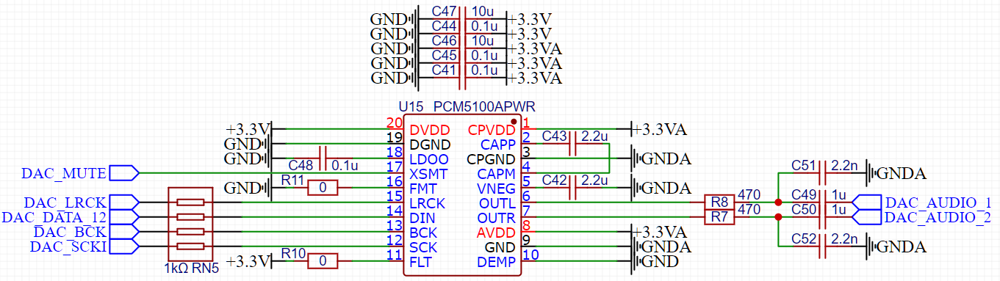

The ``FMT`` pin is (unfortunately 🤦‍♂️) set to use the I2S format. 

Additionally, this DAC has extra pins like the ``FLT`` pin which controls the filter used (normal latency [FIR](https://en.wikipedia.org/wiki/Finite_impulse_response) or low latency [IIR](https://en.wikipedia.org/wiki/Infinite_impulse_response)) or the ``DEMP`` pin which enables the de-emphasis when used at sampling rate of 44.1 kHz.

It also has the ``XSMT`` to allow external devices to mute the DAC with a simple binary signal 🔇. The datasheet provides a good example of how to use this pin to mute the signal in case of an "unplanned shutdown" or under-voltage condition which will avoid (or at least reduce) the dreaded "pop" sound 💥.

#### PCB

Just like for the schematic, the PCB layout is practically the same as the datasheets.

You will notice the fuckload of test points 🚀 (some being outside the screenshot and always accompanied by their ground point 🌱). This is used to easily connect my logic analyzer and facilitate debugging.

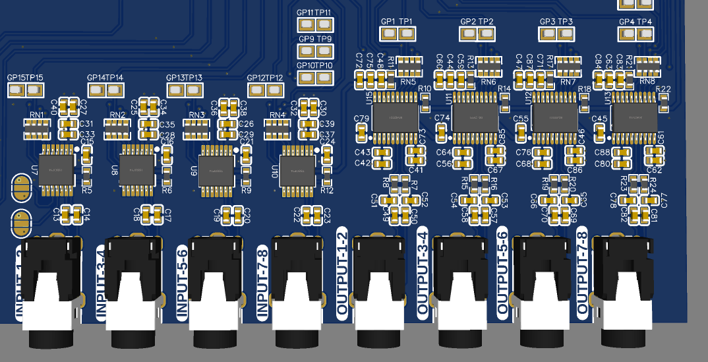

### Clocks

Clock signals ⏱️ are the heartbeat of any digital circuit, providing a consistent timing reference that ensures all operations within the system occur in harmony. Without precise clock signals, systems would operate chaotically, leading to data corruption and unreliable performance. 

The Tang 9k has a 27MHz crystal 🏃‍➡️ on board and two PLLs on-chip, which could theoretically be used to generate the "master-clock" needed for the audio ICs.
However, after conducting preliminary tests before designing the PCB, I found it challenging 😵‍💫 to achieve precise clock generation from these on-chip resources. The internal PLLs did not provide the exact frequencies required for audio processing requirements, and configuring them was a bit complex.

Given that I'm lazy 🥱, at some point I simply didn't want to deal with this anymore, I decided to use a dedicated clock generation chip, specifically the [PLL1707](https://www.ti.com/lit/ds/symlink/pll1707-q1.pdf).

I can't stress how awesome this chip is 🤩. It's a perfect example of "don't re-invent the wheel". For a few bucks more, it's an excellent choice to offload the generation of a precise and stable clock signal, especially since it's specifically designed for audio applications. One of its key features is its ability to generate frequencies of 512 (up to 768 actually) times the sampling frequency, which means it can produce the 24.576 MHz clock signal (48kHz * 512) needed for my project.

For internal operations within the FPGA that require faster speeds, instead of deriving from the 27MHz clock, I utilized this 24.576 MHz signal and multiplied it by 10 with a PLL to achieve higher-frequency clock signals for internal processes 🧩. 

#### Schematic 

By now you should get the idea. I read the datasheet and copied and pasted the schematic 😅. I'm kidding of course, generally I read it through at least once before drawing it 🤡.

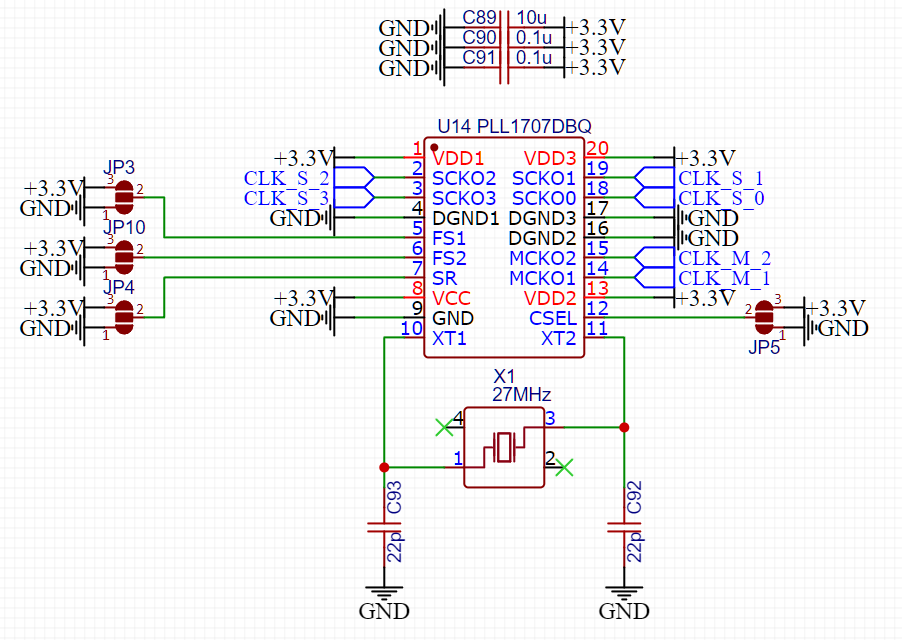

The chip is configured to use the "Double sampling rate" mode (``SR`` pin) for a 96Khz sampling frequency (``FS1`` & ``FS2`` pins) plus ``CSEL`` set to high. This configuration gives me the following clocks:

| Clock | Frequency   |
|-------|-------------|
| SCKO0 | 33.8688 MHz |
| SCKO1 | 24.576 MHz  |
| SCKO2 | 24.576 MHz  |
| SCKO3 | 36.864 MHz  |
| MCKO1 | 27 MHz      |
| MCKO2 | 27 MHz      |

#### PCB

Unfortunately, the datasheet doesn't provide a typically pcb layout 😕, thankfully this IC is simple to route so it wasn't a big issue. 
Again, there are a bunch of test points to facilitate debugging.

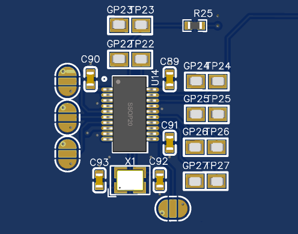

### Board bring-up & mistakes

The bring-up ⚡is the process involving initial testing the board to ensure everything functions correctly. This includes setting up power, verifying analog connections, and ensuring digital 📱interfaces work as intended.

When I first plugged my logic analyzer into the board, I noticed that there was absolutely no activity on the data lines of the analog side 😵. This is weird because the master clock (and the derived word & bit clock) were present, and the ADC should be autonomous 🤖. 

Turns out, I connected the 3.3VA and 5VA supply lines to the ADCs and DACs, but I completely forgot to actually supply power to these connections 🔌 which is of course, essential for the chip to power up. Thankfully, as I had plastered the board with test points and 0-ohm resistors, the fix was relatively effortless 👌.

During the first reception test I noticed that while I was sending data and the right clocks to the DAC, I wasn't getting any audio 🔇. It turns out that the XSMT pin cannot be left floating, so I had to add a pull-up. As luck had it, the XMST line ran directly next to the 3.3V supply, so I could simply scrape the solder mask and solder a small resistor. You wouldn't even know it's a bodge. 😅

Further down in the development, I also needed to alter the configuration of the PCM5102A from the I2S format to the left-justified format, which was a bit easier to deal with 😮‍💨.

Another less important issue is that in my haste to get his devboard out the door, I swapped 🔀 the left and right channels of the DACs.
Continuing with issues on the DAC side, I also messed up the output filters 🎛️ which reduced the audio quality quite a bit!

Apart from these relatively minor issues, everything surprisingly worked just fine.

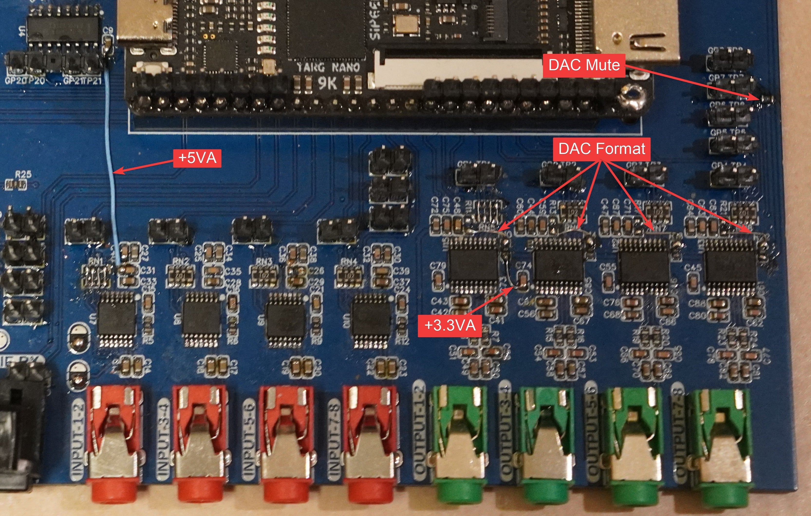

## FPGA implementation

Ok, let's start writing code (valid for FPGAs it's called RTL). 

When I started writing the implementation, I did not have access to any hardware that supports Ultranet, so I started by writing a blind implementation, meaning I wrote both the transmitter and receiver parts at the same time, validating that they were working by connecting them together and looking at logic analyzer captures.

I also foolishly didn't start a git repository right away because at the beginning I was "just messing around". That means that the implementation shown here is mostly the final version for part 1.

### Transmitter

Here is a pretty good overview of how the transmitter works:

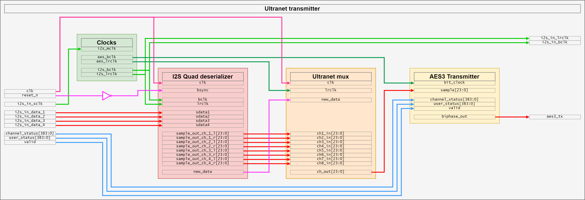

#### Clock

The `Clocks` block is responsible for deriving the required clock signals for different parts of the module based on the master clock. It takes the 24.576 MHz clock and generates the following clocks:
- AES3 bit clock running at 24.576 MHz (simply "buffered")
- AES3 word clock running at 192Khz
- I2S Bit clock running at 3.072 MHz
- I2S Word clock running at 48Khz

The process of dividing a clock is simple to do, you simply need a counter. Here is for example the process for the bit clock:
```vhdl
i2s_bit_clock: process(mclk)  begin
    if(rising_edge(mclk)) then
        count_i2s_bclk <= count_i2s_bclk + 1;
        if(count_i2s_bclk = 3) then
            i2s_bclk <= not i2s_bclk;
            count_i2s_bclk <=0;
        end if;
    end if;
end process;
```

As I said, the aes3 bit clock can simply be "buffered" like so:
```vhdl
aes_bclk <= mclk;
```

#### I2S Deserializer

The `I2S Quad deserializer` block is responsible for reading the bits of the serial audio data coming from the ADCs in sync with the different clock signals.
The special thing about this block is that it takes four different inputs and already integrates the left/right demuxer to output the eight different 24bit vectors.

The module starts with a few edge detectors, the processes run on the much higher +100Mhz clock and their sole purpose is to detect a rising/falling edge. Here is an example for the bit clock:
```vhdl
detect_bclk_edge: process(clk) begin
    if rising_edge(clk) then
        zbclk <= bclk;
        zzbclk <= zbclk;
        zzzbclk <= zzbclk;
        if zzbclk = '1' and zzzbclk = '0' then
            bclk_pos_edge <= '1';
        elsif zzbclk = '0' and zzzbclk = '1' then
            bclk_neg_edge <= '1';
        else
            bclk_pos_edge <= '0';
            bclk_neg_edge <= '0';
        end if;
    end if;
end process;
```

Explain edge detectors

Then there are two processes, the first one is the one that makes the counters tick and more generally, where the flow of data is "managed".
The second one is reading the serial data on the positive edge of a bit clock and shifting it into the appropriate buffer when told so by the first process.
```vhdl
detect_sample: process(clk) begin
    if rising_edge(clk) then
        if bsync_pos_edge = '1' then
            -- Sync detected, reset every signal
            bit_cnt <= 0;
            new_data <= '0';
        else
            if lrck_edge = '1' then
                -- Left/right clock edge detected this means new channel -> reset the bit counter
                bit_cnt <= 0;
            end if;

            if bclk_pos_edge = '1' then
                -- Bit clock positive clock edge detected -> increment the bit counter
                bit_cnt <= bit_cnt + 1;
            end if;

            if bclk_neg_edge = '1' then  	
                -- Bit clock negative clock edge detected ->
                -- Only read the first 24 bits, check the counter and set the signal appropriatly
                if bit_cnt = 0 then
                    has_data <= '1';
                elsif bit_cnt >= 24 then
                    has_data <= '0';
                end if;
            end if;

            -- Raise new_data at the end of the last bit, only for one clk cycle
            if bit_cnt = 31 and bclk_neg_edge = '1' and lrclk = '0' then 
                new_data <= '1';
            else
                new_data <= '0';
            end if;

              -- Output the data
            if lrck_pos_edge = '1' then
                sample_out_ch_1_r <= sample_ch_1_r_buf;
                sample_out_ch_2_r <= sample_ch_2_r_buf;
                sample_out_ch_3_r <= sample_ch_3_r_buf;
                sample_out_ch_4_r <= sample_ch_4_r_buf;
            end if;
            if lrck_neg_edge = '1' then
                sample_out_ch_1_l <= sample_ch_1_l_buf;
                sample_out_ch_2_l <= sample_ch_2_l_buf;
                sample_out_ch_3_l <= sample_ch_3_l_buf;
                sample_out_ch_4_l <= sample_ch_4_l_buf;
            end if;
        end if;
    end if;
end process;

get_data: process(clk) begin
    if rising_edge(clk) then
        if bclk_pos_edge = '1' and has_data = '1' then
            if lrclk = '1' then
                sample_ch_1_l_buf <= sample_ch_1_l_buf(sample_ch_1_l_buf'high-1 downto sample_ch_1_l_buf'low) & sdata1;
                sample_ch_2_l_buf <= sample_ch_2_l_buf(sample_ch_2_l_buf'high-1 downto sample_ch_2_l_buf'low) & sdata2;
                sample_ch_3_l_buf <= sample_ch_3_l_buf(sample_ch_3_l_buf'high-1 downto sample_ch_3_l_buf'low) & sdata3;
                sample_ch_4_l_buf <= sample_ch_4_l_buf(sample_ch_4_l_buf'high-1 downto sample_ch_4_l_buf'low) & sdata4;
            else
                sample_ch_1_r_buf <= sample_ch_1_r_buf(sample_ch_1_r_buf'high-1 downto sample_ch_1_r_buf'low) & sdata1;
                sample_ch_2_r_buf <= sample_ch_2_r_buf(sample_ch_2_r_buf'high-1 downto sample_ch_2_r_buf'low) & sdata2;
                sample_ch_3_r_buf <= sample_ch_3_r_buf(sample_ch_3_r_buf'high-1 downto sample_ch_3_r_buf'low) & sdata3;
                sample_ch_4_r_buf <= sample_ch_4_r_buf(sample_ch_4_r_buf'high-1 downto sample_ch_4_r_buf'low) & sdata4;
            end if;
        end if;
    end if;
end process;
```

#### Ultranet muxer

The `Ultranet mux` block has a simple job, each time the AES3 word clock rises or falls, it needs to increment the channel counter and output the data for said channel. Additionally, it takes a "copy" of the input vectors each time it sees that ``new_data`` is rising.

Once again, the module starts with some edge detectors, but the main logic can be seen below. As you can see, it's pretty simple!
```vhdl
process(clk) begin
    if (rising_edge(clk)) then
        if new_data_pos_edge = '1' then
            -- Buffer the sample for each input channel
            ch1_buffer <= ch1_in;
            ch2_buffer <= ch2_in;
            ch3_buffer <= ch3_in;
            ch4_buffer <= ch4_in;
            ch5_buffer <= ch5_in;
            ch6_buffer <= ch6_in;
            ch7_buffer <= ch7_in;
            ch8_buffer <= ch8_in;

            -- Reset the channel counter
            channel_cnt <= 0; 
        end if;

        if aes_lrck_edge = '1' then		
            -- Increment the channel counter on each pulse
            channel_cnt <= channel_cnt + 1; 

            -- Output the corrsponding sample
            if channel_cnt = 0 then
                ch_out <= ch1_buffer;
            elsif channel_cnt = 1 then
                ch_out <= ch2_buffer;
            elsif channel_cnt = 2 then
                ch_out <= ch3_buffer;
            elsif channel_cnt = 3 then
                ch_out <= ch4_buffer;
            elsif channel_cnt = 4 then
                ch_out <= ch5_buffer;
            elsif channel_cnt = 5 then
                ch_out <= ch6_buffer;
            elsif channel_cnt = 6 then
                ch_out <= ch7_buffer;
            elsif channel_cnt = 7 then
                ch_out <= ch8_buffer;
            end if;

        end if;
    end if;
end process;
```

#### AES3 Transmitter

Here I can't take much of the credit, I heavily based my work on the following S/PDIF transmitter project:



But I adapted it to support the long 384-bit vector for the two channel statuses as well as supporting the user bits and validity bit. Spoiler: this is going to bite me in the ass later!

### Receiver 

Here is the overview of how the receiver works:

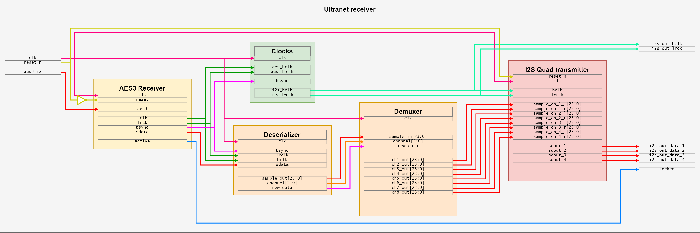

#### AES3 Receiver

I can't take credit for this block either, it's almost a copy-paste of the fantastic aes3rx project:



This block takes a very fast clock plus the aes3 input and spits out the recovered clock signals (bit clock & word clock), the sound data and the block start signal.

It also output an "active" signal that can be used to indicate that a signal is being received.

#### Clocks

Just like the transmitter, the `Clocks` block is responsible for deriving the I2S clock signals based on the AES3 clocks and bsync signal. It takes the 12.288 MHz bit clock and 192 kHz word clock and generates the following clocks:
- I2S Bit clock running at 3.072 MHz
- I2S Word clock running at 48Khz

The clock dividers are a bit different from the ones used for the transmitter. First, I have edge detectors for `bsync`, `aes_bclk` and `aes_lrclk`. 

Then the I2S bit clock divider is a standard divider with the addition of bsync check so that it resets to the correct state.
```vhdl
i2s_bit_clock: process(aes_bclk)  begin
    if(rising_edge(aes_bclk)) then
        -- Make sure the clock is properly synchronized at the block start
        if(bsync_pos_edge = '1') then
            i2s_bclk <= '1';
            count_i2s_bclk <= 0;
        else
            -- Divide the AES3 bit clock to get the I2S bit clock 
            count_i2s_bclk <= count_i2s_bclk + 1;
            if(count_i2s_bclk = 1) then
                i2s_bclk <= not i2s_bclk;
                count_i2s_bclk <= 0;
             end if;
        end if;
    end if;
 end process;
```

The word clock is even more complex, instead of synchronizing on just the AES3 word clock and the bsync signal, I also make sure it's properly synchronized to the bit clock:
```vhdl
i2s_lr_clock: process(clk) begin
    if(rising_edge(clk)) then
        -- Make sure the clock is properly synchronized at the block start
        if(bsync = '1') then
            i2s_lrclk <= '0';
            count_i2s_lrclk <= 0;
        else
            -- Make sure the word clock is properly synchronized to the bit clock
            if(aes_bclk_neg_edge = '1' and aes_lrclk_pos_edge = '1') then
                -- Divide the AES3 word clock to get the I2S word clock 
                count_i2s_lrclk <= count_i2s_lrclk + 1;
                if(count_i2s_lrclk = 1) then
                    i2s_lrclk <= not i2s_lrclk;
                    count_i2s_lrclk <=0;
                end if;
            end if;
        end if;
    end if;
end process;
``` 

#### Ultranet Deserializer

The Ultranet deserializer block is similar to the I2S deserializer of the transmitter. It is responsible for reading the bits of the serial audio data coming from AES3 receiver block in sync with the different clock signals. It then outputs a 24bit vector containing the audio data, a 3bit vector containing the channel index associated with the data and a "new data" signal that is asserted when the data is ready to be used.

Just like the I2S deserializer, there are two processes, the first one is the one that makes the counters tick and keeps things in sync.
The second one is reading the serial data and shifting it into the buffer when told so by the first process.

```vhdl
detect_sample: process(clk) begin
    if rising_edge(clk) then
        -- Check if we are starting a new block
        if bsync_pos_edge = '1' then 
            -- Yes, reset counters and signals
            bit_counter <= 0;
            channel_counter <= 4;
            new_data <= '0';
        else
            -- No, check if we are on the rising or falling edge of the word clock
            if lrclk_edge = '1' then
                -- Yes, reset the bit counter
                bit_counter <= 0;
                -- Increment the channel counter up to the defined number of channels then reset to 0
                if channel_counter < (CHANNELS-1) then
                    channel_counter <= channel_counter + 1;
                else
                    channel_counter <= 0;
                end if;
            end if;

            -- Increment the bit counter (up to 32 bits) on a rising edge of the bit clock
            if bclk_pos_edge = '1' then
                if bit_counter < 31 then
                    bit_counter <= bit_counter + 1; -- increment bit_counter until bit 31
                end if;
            end if;
                
            -- Sample the data on the falling edge of the bit clock
            if bclk_neg_edge = '1' then  	
                -- Set the audio data region signal if we are in the correct range [....AAAASSSSSSSSSSSSSSSSSSSSEUCP]
                if bit_counter = 4 then
                    in_sound_data_region <= '1';
                elsif bit_counter >= 24+4 then
                    in_sound_data_region <= '0';
                end if;
            end if;
                
            -- Assert the new data signal within the unused 4bits at the end of the frame
            if bit_counter = 30 and bclk_neg_edge = '1' then 
                new_data <= '1';
            else
                new_data <= '0';
            end if;
        end if;
    end if;
end process;
    
-- Send the data out
sample_out <= sample_data;
channel <= to_unsigned(channel_counter, channel'length);

get_data: process(clk) begin
    if rising_edge(clk) then
        -- Receive individual bits for audio-data (24 bits) on the rising edge of the bit clock and only if in the correct region
        if bclk_pos_edge = '1' and in_sound_data_region = '1' then
            -- in AES3/EBU the first bit after preamble is LSB, so we have to shift from the left to the right
            sample_data <= sdata & sample_data(sample_data'high downto 1);
        end if;
    end if;
end process;
```

#### Ultranet demuxer

The Ultranet demuxer is probably the simplest block on this whole project. In retrospect, it should probably be integrated into the deserializer. The only thing it does is splitting the audio data into individual vectors according to the index received when the new data signal is asserted:

```vhdl
process(clk) begin
	if (rising_edge(clk)) then
	    -- Store individual channels to output-vectors on the rising edge of new data
		if new_data_pos_edge = '1' then
			if channel = 0 then
				ch1_out <= sample_in;
			elsif channel = 1 then
				ch2_out <= sample_in;
			elsif channel = 2 then
				ch3_out <= sample_in;
			elsif channel = 3 then
				ch4_out <= sample_in;
			elsif channel = 4 then
				ch5_out <= sample_in;
			elsif channel = 5 then
				ch6_out <= sample_in;
			elsif channel = 6 then
				ch7_out <= sample_in;
			elsif channel = 7 then
				ch8_out <= sample_in;
			end if;
		end if;
	end if;
end process;
```

#### I2S Transmitter

Thanks to the move from I2S mode to left-justified mode on the DACs the implementation of the transmitter is basic.
As always, there are some edge detectors, followed by the two main processes.

The first one is keeping the bit counter in sync in relation to the bit clock and reset signal. It also handles loading the sample buffer on the last bit.
The second process simply output the audio data to the correct channel.

```vhdl
detect_sample: process(clk) begin
	if rising_edge(clk) then
		if reset_n = '0' then 
			bit_counter <= 0;
		else
            -- If the left/right channel changes, reset the output bit counter
			if lrclk_edge = '1' then
				bit_counter <= 0;
			end if;
                
            -- Increment the bit counter a positive edge of the bit clock
			if bclk_pos_edge = '1' then
				bit_counter <= bit_counter + 1;
			end if;
                
            -- Update the sample buffers on the last positive bit clock edge 
            -- TODO: Shouldn't this be on the negative edge of LRCLK?
			if bclk_pos_edge = '1' then  	
				if bit_counter = DATA_WIDTH-1 then
                    sample_ch_1_l_buf <= sample_ch_1_l;
                    sample_ch_1_r_buf <= sample_ch_1_r;
                    sample_ch_2_l_buf <= sample_ch_2_l;
                    sample_ch_2_r_buf <= sample_ch_2_r;
                    sample_ch_3_l_buf <= sample_ch_3_l;
                    sample_ch_3_r_buf <= sample_ch_3_r;
                    sample_ch_4_l_buf <= sample_ch_4_l;
                    sample_ch_4_r_buf <= sample_ch_4_r;
				end if;
			end if;
		end if;
	end if;
end process;	
	
send_data: process(clk) begin
	if rising_edge(clk) then
		if reset_n = '0' then
            -- Reset asserted, send zeros to the output
			sdout_1 <= '0';
			sdout_2 <= '0';
			sdout_3 <= '0';
			sdout_4 <= '0';
		else
            -- Normal state, output the proper bit (left or right) for each channel on the negative bit clock edge
			if bclk_neg_edge = '1' then  	
                if lrclk = '1' then
                    sdout_1 <= sample_ch_1_l_buf(DATA_WIDTH - 1 - bit_counter);
                    sdout_2 <= sample_ch_2_l_buf(DATA_WIDTH - 1 - bit_counter);
                    sdout_3 <= sample_ch_3_l_buf(DATA_WIDTH - 1 - bit_counter);
                    sdout_4 <= sample_ch_4_l_buf(DATA_WIDTH - 1 - bit_counter); 
                else
                    sdout_1 <= sample_ch_1_r_buf(DATA_WIDTH - 1 - bit_counter);
                    sdout_2 <= sample_ch_2_r_buf(DATA_WIDTH - 1 - bit_counter);
                    sdout_3 <= sample_ch_3_r_buf(DATA_WIDTH - 1 - bit_counter);
                    sdout_4 <= sample_ch_4_r_buf(DATA_WIDTH - 1 - bit_counter);
                end if;
			end if;

		end if;
	end if;
end process;    
```

### It's working?

Well, after a lot of tuning, the answer is YES!🎉 And honestly, it's working pretty well considering that this is my first time working with FPGAs. Here's a logic analyzer capture I took right after I got everything up and running for the first time 🏆:

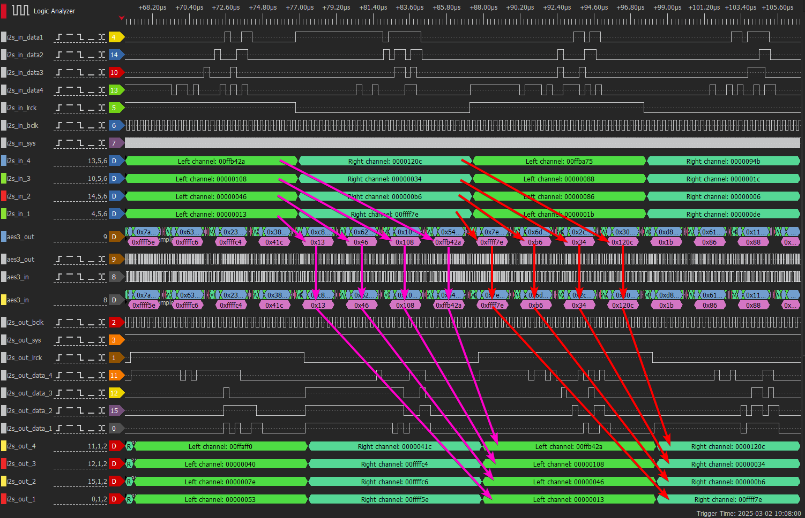

Demo video

I'm much happier with the implementation of the receiver, it's much more stable/polished than the transmitter. The biggest thing by far is that the `reset` signal is actually used and everything re-sync correctly after it has been asserted.

I think that, the only reason the transmitter seems to work at all is that the clocks are never actually stopped during operation 😅.

Still, it’s more than good enough for a first prototype 👍.

## Testing on real hardware

So let's have fun with some real hardware that supports Ultranet. I managed to borrow these devices:
- The [Midas DL-16](https://www.midasconsoles.com/product.html?modelCode=0606-ACJ) which is a `16 Input, 8 Output Stage Box with 16 Midas Microphone Preamplifiers, ULTRANET and ADAT Interfaces`.<br>I can use it in standalone mode as an overkill A/D converter to convert the 16 analog inputs to Ultranet. 
- The [Turbosound TFX122M-AN](https://www.turbosound.com/product.html?modelCode=0315-ABC) which is a `Coaxial 1100W 2-Way 12" Stage Monitor with Klark Teknik DSP Technology and ULTRANET`.<br>Unfortunatly it's the only piece of hardware with an Ultranet input I had access to. It has the downside of being a loudspeaker so bit-shift mistakes at 2am are quite annoying. But at the same time the configuration app proved unexpectedly useful for debugging.

### Transmitter

I started by verifying the transmitter. I was feeling pretty confident since everything had worked on my devboard so far. So, I plugged the RJ-45 cable into the speaker, expecting things to work. But then, disaster struck 🌪️. I couldn't even select the Ultranet input from the speaker's built-in controls.

F---, that means that either my implementation is not working at all or that I messed-up something 😕. I decided to troubleshoot by downloading the Turbosound Edit app and connecting to the speaker. Unexpectedly, I was able to force the input to be an Ultranet input but was then immediately prompted by this error message:

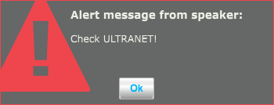

To my surprise 🤯, even though the error appeared, the speaker did seem to switch to the Ultranet input. I started hearing something that could only be described as audio thrown into a blender, chopped up, and distorted (Fun fact this first test was at 3am, I wasn't the favorite person in the morning!).

This told me that my implementation wasn’t completely broken. It was close, but just not quite there yet.

After much troubleshooting 🛠️, I figured out that the Ultranet inverts the validity bit. Once I applied this fix, I was able to get rid of the `Check ULTRANET!` error message. This discovery not only unlocked the built-in controls but also the VU-meter on the Turbosound Edit app:

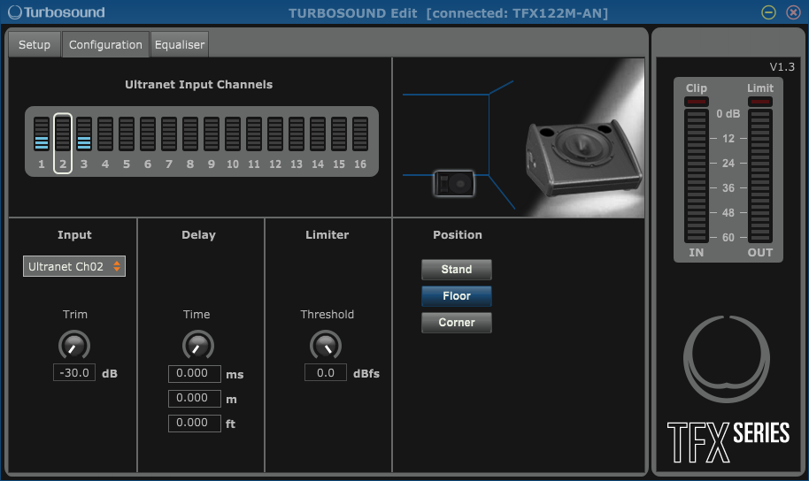

This was interesting because I only sent an audio signal on channel 1, not the third one 🧐. During testing, I got multiple variants of this, for example, sending audio on channel 2 resulted in audio on channel 2, 4, 6 and 8. 

No matter what adjustments I made, the audio was always barely recognizable, and it sounded like it was skipping samples.

I also went downs the rabbit hole of updating the speaker because I saw that the changelog included something about ultranet compatibility. Unfortunatly this didn't change anything to my situation.

At that point, I decided to take a step back from the transmitter and turn my attention to the receiver, maybe I'll have better luck 🍀.

### Receiver

So, the receiver… well, how do I put this? It was even worse than I expected 😢. I couldn't get anything stable or consistent. All I could capture were small chunks of audio, with the aes3rx module showing an "active" status only intermittently. Definitely not the kind of reliable performance I was aiming for.

At this point, I decided to go back and re-watch the video that originally inspired this whole project 📺. While watching Christian troubleshoot similar issues, I noticed that he had solved his problems by increasing the clock speed going into the aes3rx module, pushing it up to 200 MHz 💨. This immediately stood out to me as a potential fix for my situation.

*Note: At this point I was still deriving the "main clock" from the 27 MHz crystal provided by the Tang Nano 9k. I was also only providing a ~100MHz clock to the aes3rx module.*

So, I went ahead and tested this. I decided to increase the PLL factors of the main clock to push it closer to that 200 MHz target. Unfortunately, this is where my lack of experience with FPGAs really showed. No matter what I tried, I couldn't make it work properly. The best I could manage was around 150 MHz, and anything beyond that would cause the module to brick 🧱.

But after much trial and error, I stumbled upon a "solution". Instead of using the 27 MHz crystal, I switched to the 24.576 MHz clock from the PLL1707. I fed that into the PLL, adjusting the factors until I could reach a 245.76 MHz "main clock". And just like that… I was able to decode the data.

While this was a breakthrough, I’m not entirely happy with the outcome 😕. For one, it means that 44.1 kHz Ultranet support is now off the table. Moreover, the whole project now relies heavily on a "patch" that I don’t fully understand, something I’ll definitely need to revisit for part 2 🤔.

Demo video

Now, here’s the really strange part: the channel offset is all kinds of messed up. For example, if I send audio into channels 1-2 of the DL-16, it ends up on channels 5-6 on my devboard. Even weirder: when using the "Through" port of the TFX speaker, the channel offset becomes totally random 🎲. Every so often it’s 1-2, other times 3-4, etc.

The odd thing is, when I plug the DL-16 into the TFX and look at the VU meters in the Turbosound Edit app, it indicates that the audio first gets received on the wrong channels, but then automatically corrects itself to the right ones (Probably after the channel status has been received completely). This is the fishy behavior I mentioned in the research section of this article 🐟.

But hey, let’s not get bogged down in the details. **I GOT AUDIO WORKING!!!🥳** And, more importantly, this weird offset issue doesn’t affect devboard-to-devboard communication, which is somewhat of a relief 😌.

### Transmitter again

With this renewed boost in confidence 🚀, I was finally ready to tackle the transmitter once more. Knowing that the receiver was working properly, and that the transmitter had worked with my receiver before, meant that a significant portion of the transmitter's implementation was already functioning as expected. The hard part seemed to be behind me.

I quickly ruled out a few possibilities: the preambles were fine, the audio data was correct, and the validity bit was being set properly. That narrowed it down to a few suspects: the channel status bits, the user bits and the parity calculation.

Determined to get to the bottom of this, I painstakingly recorded the Ultranet stream coming from the DL-16 under various input combinations 💾. I spent a few hours capturing 500ms slices of data at 200 MHz, trying to build a database in which I could search for any anomalies that could give me a clue.

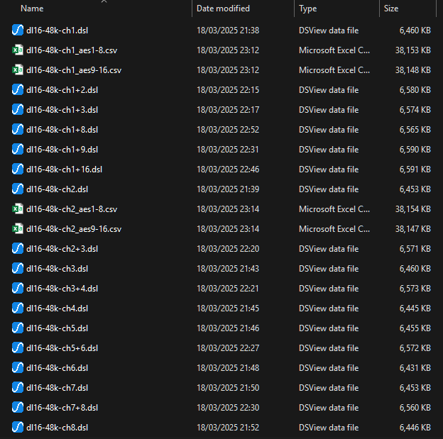

After writing a script to analyze all of this 📜, the conclusion was pretty simple:

The parity was untouched (duh or it wouldn't work with off-the-shelf chips 🤦‍♂️), the user bits were unused (always 0) and the channel status bit repeated the following pattern:

<pre style="word-break: break-all; white-space: pre-wrap;">
000000000000000000000000000000000000000000000000000000000000000011000000111100110000000000000000000000000000000000000000000000000000000000000000000000000000000000000000000000000000000000000000000000000000000000000000000000000000000000000000000000000000000000000000000000000000000000000000000000000000000000000000000000000000000000000000000000000000000000000000000000000000000000000000
</pre>

Interpreted like the 2 AES3 subframes but with 8 subframes it would provide this information:

<ul>
    <li style="font-size: unset">Subframe 1: <code>00000000 11000000 00000000 00000000 00000000 00000000</code></li>
    <li style="font-size: unset">Subframe 2: <code>00000000 11000000 00000000 00000000 00000000 00000000</code></li>
    <li style="font-size: unset">Subframe 3: <code>00000000 01000000 00000000 00000000 00000000 00000000</code></li>
    <li style="font-size: unset">Subframe 4: <code>00000000 01000000 00000000 00000000 00000000 00000000</code></li>
    <li style="font-size: unset">Subframe 5: <code>00000000 00000000 00000000 00000000 00000000 00000000</code></li>
    <li style="font-size: unset">Subframe 6: <code>00000000 00000000 00000000 00000000 00000000 00000000</code></li>
    <li style="font-size: unset">Subframe 7: <code>00000000 01000000 00000000 00000000 00000000 00000000</code></li>
    <li style="font-size: unset">Subframe 8: <code>00000000 01000000 00000000 00000000 00000000 00000000</code></li>
</ul>

While writing this article, now that I look at it, byte 2 does look like a channel offset, but who knows if I'm reading that correctly 🤷‍♂️, that's for part 2 of this project.

Coming back to my issue, even after using this bit sequence in the aes3 transmitter (and verifying that the correct bits are indeed being sent), it didn't change much. I did get better sound somehow 🤬🤯.

#### Oh, f---, that was the issue!

At some point, I decided I’d had enough of listening to garbled audio or staring at endless walls 🗑️ and went all-in: I dedicated a full day to analyzing logic analyzer traces instead. And sure enough, that’s when I found it.

Looking closely at the preambles sent by the DL16, I noticed something peculiar. They **always** started with a 1. The typical pattern looked like this: ``1110010``. Not once did I see the alternate pattern that starts with a 0, like ``0001101``.

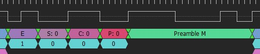

I then repeated the process for my implementation and bingo. That’s when I saw the problem: my transmitter was happily alternating between both versions of the preamble.

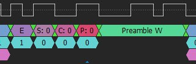

This immediately tickled my brain, why would the signal from Behringer only use one form of the preamble?

That’s when I remembered a modification I made earlier while adding support for user bits in my S/PDIF transmitter module 📝. I knew I'd need to include those in the parity calculation, so I updated the logic like this:

```vhdl
parity <= data_in_buffer(23) xor data_in_buffer(22) xor data_in_buffer(21) xor data_in_buffer(20) xor data_in_buffer(19) xor data_in_buffer(18) xor data_in_buffer(17)  xor data_in_buffer(16) xor data_in_buffer(15) xor data_in_buffer(14) xor data_in_buffer(13) xor data_in_buffer(12) xor data_in_buffer(11) xor data_in_buffer(10) xor data_in_buffer(9) xor data_in_buffer(8) xor data_in_buffer(7) xor data_in_buffer(6) xor data_in_buffer(5) xor data_in_buffer(4) xor data_in_buffer(3) xor data_in_buffer(2) xor data_in_buffer(1) xor data_in_buffer(0) xor user_status_shift(23) xor channel_status_shift(23);
```

But remember how I mentioned earlier that I had extended the user and channel status vectors to 384 bits to match the full length 📏 ? <br>Yeah. Well, the parity calculation? Still hardcoded to pull from bit 23.

As soon as I fixed the logic to XOR the correct final bits of the expanded vectors, bam. Everything lined up. It just worked 🔥. I also went ahead an added the missing validity bit in the calculation. The reason I got better sound when I added the channel status bits is probably due to the fact that the parity calculation was correct more often for some reason 😅.

It would seem that in every project there is an issue where I sink countless hours of debugging just to find out it's one of the stupidest mistakes ever. But hey, that's life … 🤡

### It's working (encore)?

Yes! This time, it’s really working! 🎉

After around two and a half months of intense work, countless hours of testing, and plenty of moments wondering if I was losing my mind, I finally have a fully functional transmitter and receiver implementation of Ultranet.

This was no small feat. Ultranet is a proprietary protocol, it is based on AES3, but with its own quirks and implementation challenges. Without access to official documentation, a good portion of the process involved reverse-engineering, experimenting, and a lot of trial and error. But ultimately, it paid off.

Both the transmitter and receiver are now reliably exchanging data in sync, and the system is behaving as expected 🥳. 

Demo video

## What's next

So… what’s next? 🤔 If you’ve been reading closely, you probably noticed me hinting at a part 2 more than a few times throughout this article. For once, I’m actually going to split both the development process and the write-up into two parts. This first "prototype" phase is already a beast on its own, and I want to give the next phase of the project the attention it deserves.

Part 2 will pick up where this leaves off. Here's a brief look at what that will include:

- 🧮 (Hopefully) Tackling the channel indexing issue: **This is the one big unknown about Ultranet that is still left**, and I want to figure out the damn thing.
- 🔌 Schematic: I want to revisit the audio side of the design, particularly on adding proper balanced inputs and outputs.
- 🧩 Final PCB layout(s): This first version was mostly a proof of concept. Part 2 will focus on finalizing the board design which will probably be multiple interconnected ones.
- 📦 1U/2U Racked case: Time to move from bare PCB on the bench to something that actually looks and feels like a finished product.

Now, just to set expectations: this second part is still a long way off. I usually don’t start writing about a project until it’s at least 90-95% complete, and as of right now… well, the design phase hasn’t even begun. It is comming because I have a (very loose) deadline, but might be a while before you see the next article about this project 📅.

## Conclusion

Throughout this project, I questioned, more than once whether sticking with an FPGA implementation was the right call 🤔. There were definitely moments where the idea of switching to the AK4114 felt tempting. It would’ve simplified many things and saved me from a few late nights staring at timing diagrams wondering what broke this time. But the AK4114 is officially end-of-life, not to mention pretty expensive for what it does so that option was quickly shelved 🗄️.

There are other chips on the market from Texas Instruments and others, that could’ve filled the gap. But let’s be honest: where’s the fun in taking the easy route when you could be fighting with VHDL and constraints files instead? 😭.

I don't think I would go with the FPGA route if this was a work project but as this is a side project that will be used in a non-critical part of my infrastructure, I acheived my primary goal with these huge projects: learning 👨🏻‍🎓. Diving into the deep end with the FPGA kept the challenge alive, and it ended up being a fantastic learning experience

By sticking to the original goals, I set out at the beginning, I had to understand how things and why. And as frustrating as that was at times, it paid off. My understanding of FPGAs, and real-time audio protocols has improved quite a bit. Honestly, there’s no better way to learn than by getting your hands dirty, messing around with stuff, breaking it 🪓, and then figuring out how to fix it. It’s chaotic 💥, but it works.

Looking back, I'm incredibly happy with what I’ve built so far 🤩. This is only Part 1 of the journey, but even at this stage, it's a solid milestone 🚩.

If you’ve made it this far, thanks for reading! I hope Part 2 ends up being even better, and who knows, maybe next time I’ll even sleep. Maybe.


