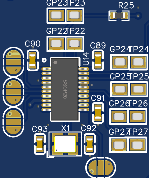

Deep-diving into Ultranet and re-implementing both a receiver and transmitter on FPGA.

<!--more-->


This is a stupidly long article, it details the different phases thoroughly, you'll need probably some time to really read it


## Why

In my last article about the open-source SDI to fiber converter, I briefly talked about my brand new MPO-12 cable with 12 OM3 fibers 🔦.
I've also hinted that I might use the two spare fibers I had for audio 🔊.

These audio channels will be used mostly as side-channels, stuff like LTC time code, backup sound pickup, intercom (maybe)

When I started this project, there were four "mainstream" ways I thought I could tackle this:

- [S/PDIF (Sony/Philips Digital Interface)](https://en.wikipedia.org/wiki/S/PDIF) (or it's professional big brother [AES/EBU](https://en.wikipedia.org/wiki/AES3)). It's a digital audio interface transmitted over various connectors, or even (plastic) fiber-optic cables. This would be the most obvious option, AES3 can already be transmitted over fiber so it wouldn't be that difficult to adapt it to OM3 with an SFP module for example.
    - The main upside is that there are plenty of cheap modules that already exist to convert analog to digital and vice versa
    - The main downside is that it is only two channels per link 🤔
- [ADAT Lightpipe](https://en.wikipedia.org/wiki/ADAT_Lightpipe). Lightpipe uses the same connection hardware as S/PDIF: fiber optic cables (hence its name) to carry data, with Toslink connectors and optical transceivers at either end. The main difference stems from the fact that ADAT supports up to 8 audio channels at 48 kHz, 24 bits.
    - The main upside is that 8 channels is pretty good 
    - The main downside is that from some quick research there isn't a recent IC or implementation that exists and devices that implement the protocol cost far too much for my use.
- [Multichannel Audio Digital Interface (MADI) / AES10](https://en.wikipedia.org/wiki/MADI). This interface supports serial digital transmission over coaxial cable or fiber-optic lines of 28, 56, 32, or 64 channels and sampling rates to 96 kHz and beyond with an audio bit depth of up to 24 bits per channel.
    - The main upside is the number of channels and the fact that it already runs over multimode fiber 🔦. 
    - The main downside is that it's even worse than ADAT, there isn't a recent/easy implementation that exists and devices that implement the protocol have a prohibitive cost for hobbyist use.
- [Dante](https://en.wikipedia.org/wiki/Dante_(networking)) / [AES67](https://en.wikipedia.org/wiki/AES67). This is a combination of software, hardware, and network protocols that delivers uncompressed, multichannel, low-latency digital audio over a standard Ethernet network 🌐 using Layer 3 IP packets.
    - The main upside is that there are plenty of channels (max 512) 📈, it's easy to **use**, and it's implemented on countless devices
    - The main downside is that implementing it to get low latency ⏱ will be a nightmare


I didn't really like any of these 😕, I did try to build a prototype ADAT board based on the AL1401/A1L402 ICs, but I didn't have any luck 🙁.

I did dip my toes in AES67 for another project, but access to the full specification as a hobbyist is a bit complicated and the overall setup required to get it working at all without dealing with latency requires a lot of work ⏳.

Then the universe dropped this gem 💎 from Christian Nöding:



And this is really what kickstarted the whole thing. From the video, it seemed that Ultranet, a protocol that I have seen but never used, is somewhat based on two AES3 signals each containing 8 channels.
This would mean either 8 channels bidirectional or 16 uni-directional channels on two fiber 🤩. 
Moreover, I do have (limited) access to hardware that can send and receive Ultranet so I can easily test my implementation.
But the most important thing is that Christian proved it was possible to do it 🥳!

*Note: for the story's sake, events, and discoveries aren't necessarily in chronological order.*

## Research

As always for big projects, I started by doing some research 📜, this part also contains discoveries and light-bulb moments I had during the project.

### AES/EBU

I mentioned that Ultranet is based on AES3, also known as AES/EBU so let's start there, how the hell does this work, and where do we start?

The [Audio Engineering Society (AES)](https://www.aes.org/), is a professional society 🏢 devoted exclusively to audio technology. Alongside other groups like the [European Broadcasting Union (EBU)](https://www.ebu.ch/) 🎥 they standardize different technologies in the audio/broadcasting area. 

This article will talk exclusively about AES3. Newer standard are behind a paywall, fortunately AES3 is as older than me, it was first published in 1985 and was revised in 1992, 2003 and 2009. That means that we can find semi-recent leaked PDFs without much difficulty.

Moreover, there are a bunch of other documents linked to AES3 from which we can scoop up information:
  - [AES/EBU EG](https://tech.ebu.ch/docs/other/aes-ebu-eg.pdf) - Engineering Guidelines - (The AES/EBU audio interface)
  - [EBU Tech 3250-2004](https://tech.ebu.ch/docs/tech/tech3250.pdf) - Specification of the digital audio interface (The AES/EBU interface)
  - [IEC60958](https://webstore.iec.ch/en/publication/62829) - Digital audio interface - Part 1: General
  - AES-2id - Guidelines for the use of the AES3 interface

#### Electrical signals

AES3 can be transmitted over two main kinds of connections:
- **IEC60958 Type I**: This defines a balanced, three-conductor, 110-ohm twisted pair cable with XLR connectors. Type I connections are most often used in professional installations and are considered the standard connector for AES3
- **IEC60958 Type II**: It defines an unbalanced electrical or optical interface for consumer electronics applications. This implementation is the one used by S/PDIF. S/PDIF and AES3 are interchangeable at the protocol level, but differ at the physical level (voltage / impedances).
- **BNC connectors**: AES/EBU signals can also be run using an unbalanced 75-ohm coaxial cable. The unbalanced version has a very long transmission distance, instead of the 150 meters maximum for the balanced version. The AES-3id standard defines a 75-ohm BNC electrical variant of AES3.

From the `EBU Tech 3250-2004` document, we can get a bunch of information about the electrical characteristics of AES3, which boils down in my opinion to the most important being that the system needs an impedance of 110 Ohm ± 20% with an amplitude that lies between 2 and 7 V peak-to-peak.

#### Data encoding

AES3 was designed primarily to support stereo [PCM](https://en.wikipedia.org/wiki/PCM) 📊 encoded audio in either [DAT](https://en.wikipedia.org/wiki/Digital_audio_tape) format at 48 kHz 🎤 or [CD](https://en.wikipedia.org/wiki/CD) format at 44.1 kHz 💿. Instead of using an elaborate scheme to support both rates, AES3 allows instead to be run at any rate 💪, and encodes the clock and the data together using [biphase mark code (BMC)](https://en.wikipedia.org/wiki/Biphase_mark_code).

Biphase mark code, also known as differential Manchester encoding, is a method to transmit data in which the data 💾 and clock 🕓 signals are combined to form a single two-level self-synchronizing data stream. Each data bit is encoded by a presence or absence of signal level transition in the middle of the bit period (known as time slot for AES3), followed by the mandatory level transition at the beginning of the period. This also means that by design the encoding is insensitive to an inversion of polarity 🔀.

There are two variants of BMC:
 - Transition on 1 which is the one used for AES3
 - Transition on 0 which is irrelevant for this project

Here is an example diagram representing how the signal behave, there is a transition on each solid line plus a transition on the dotted line if the bit is a one:


Differential Manchester encoding has the following advantages:
- A transition is guaranteed at least once every bit, for robust clock recovery.
- If the high and low signal levels have the same magnitude with opposite polarity, the average voltage around each unconditional transition is zero. Zero DC bias reduces the necessary transmitting power and minimizes the electromagnetic noise produced by the transmission line.

All of these positive features come at the expense of clock speed 🏃‍♂️. BMC needs a clock twice as fast as the data rate to encode the bit stream

#### Blocks, frames, time slots

Now that we know how to read the bits, let's talk about what those bits actually mean!

AES3 is composed of what is called `Audio blocks` these audio blocks are composed of 192*`Frames` each frame contains 2*`Subframes` which in turns contain 32*`Time slots`


A subframe is composed of:

| Time slot     | Name                        | Description                                                                                                                    |
| ------------- | --------------------------- | ------------------------------------------------------------------------------------------------------------------------------ |
| 0–3           | Preamble                    | A synchronization preamble                                                                                                     |
| 4–7           | Auxiliary sample            | A low-quality auxiliary channel used as specified in the channel status word.                                                  |
| 8–27          | Audio sample                | Audio sample stored MSB last. It can be extended to use the auxiliary sample to increase quality                                  |
| 28            | Validity (V)                | Unset if the audio data is correct and suitable for D/A conversion.                                                           |
| 29            | User data (U)               | Forms a serial data stream for each channel.                                                                                   |
| 30            | Channel status (C)          | Bits from each subframe of an audio block are collated, giving a 192-bit channel status word.                                   |
| 31            | Parity (P)                  | Even parity bit for detection of errors in data transmission. Excludes preamble; Bits 4–31 need an even number of ones.        |


The preamble can be one of three values:

|  Name  | Timeslot (Last was 0) | Timeslot (Last was 1) | Function                                                                     |
|:------:|:---------------------:|:---------------------:|------------------------------------------------------------------------------|
| Z or B |        11101000       |        00010111       | Marks a word for channel A (left) and the start of an audio block            |
| X or M |        11100010       |        00011101       | Marks a word for channel A (left), besides at the start of an audio block |
| Y or W |        11100100       |        00011011       | Marks a word for channel B (right).                                          |

#### Practical example 

That's a lot to take in, so let's look at a practical example from my logic analyzer:


Let's see what we can figure out:
- This subframe starts with the B preamble, this tells us that it's the **start of an audio block** and that it's the **left channel** left.
- We are going to consider that the auxiliary bits are used for audio. This gives us 0xadffff, if we change the bit order from LSB-first (AES3) to MSB-first 🔀 (what is generally used for audio) the 24bit **audio data is 0xffffb5**
- Even tho we have data the validity bit tells us that **this frame is invalid** 🛑 and that it shouldn't be played
- Then comes the user bit with an undefined structure
- There is the channel status word, this tells us that the first bit of the word is **a 0 indicating S/PDIF data**
- Finally the parity bit **is 0** because the number of **asserted bits in the 4-30 range** already are an **even number of 1s** 🧮

And that's it really, the M preamble will then be used for the rest of the left channel subframes and the W will be used for the right channel. 
Then after 384 subframe, there will be another B preamble signaling a new block.

### Ultranet

Now, how does Ultranet differ from AES3?

As there is no official documentation that is publicly available (or any leaks for that matter), everything that not straight out of a product sheet is informed speculation, reverse-engineering and trial & error and might not reflect exactly the actual protocol

#### What we know from product sheets:

I read through the datasheets / quick guides from several Ultranet compatible devices from Behringer and its subsidiaries. Here is what is always present and important to this project:

- **Digital Processing**
  - **A/D conversion:** 24-bit, 44.1 kHz / 48 kHz sample rate
  - **Latency:** <0.9 ms (from [P16-I](https://www.behringer.com/product.html?modelCode=0609-AAA) to [P16-HQ](https://www.behringer.com/product.html?modelCode=0609-AAP))
- **System**
  - **Signal:** 16 channels, plus bus-power
  - **Power**: 
    - P16-M consumes max. 5W
    - P16-D consumes max. 40W
- **Cabling**
  - **Connectors:** RJ45
  - **Cables:** Shielded CAT5
  - **Cable length:** max. 246 ft (ca. 75 meters) recommended

Apart from the channel count, given the audio format & latency plus the fact that the signal runs over CAT5, it sounds a lot like AES3 🤔. The product sheet also tells us that power is running on the same cable somehow.

#### Probing and reverse-engineering the electronics 🍑 

As I said before, the work that Christian did is what kickstarted this project, at this point he already published his video and figured out that as Ultranet uses generic CAT5 cables which means they most likely that they also use standard wiring.

As it turns out (and we'll see why later in the protocol section), Ultranet does not send 16 channels down a single stream, instead, it sends 8 channels over two separate (but synchronized) streams.
That means 2 out 4 pairs are used for audio, and leaves 2 pairs for power, which looks a lot like 100BASE-T with POE mode B 😅.

| Pin | Pair | Use for 100BASE-T<br>with POE mode B | Use for Ultranet |
|:---:|:----:|--------------------------------------|------------------|
| 1   | 3    | 📤 TX+                               | 🔊 CH_1-8_+     |
| 2   | 3    | 📤 TX-                               | 🔊 CH_1-8_-     |
| 3   | 2    | 📥 RX+                               | 🔊 CH_1-8_+     |
| 4   | 1    | 🔌 48VDC                             | 🔌 15VDC        |
| 5   | 1    | 🔌 48VDC                             | 🔌 15VDC        |
| 6   | 2    | 📥 RX-                               | 🔊 CH_1-8_+     |
| 7   | 4    | 🔌 48VDC                             | 🔌 15VDC        |
| 8   | 4    | 🔌 48VDC                             | 🔌 15VDC        |

Earlier I briefly talked about the AES3 electrical specifications. Again the `EBU Tech 3250-2004` document comes to the rescue, there is a whole section on differential pairs and how AES3 should be wired 🔌:


Here are a few other important characteristics that have to be respected:
> The interconnecting cable shall be balanced and screened (shielded) with nominal characteristic impedance of 110 Ohms at frequencies from 0.1 to 128 times the maximum frame rate.

> The line driver shall have a balanced output with an internal impedance of 110 Ohm ± 20%, at frequencies from 0.1 to 128 times the maximum frame rate when measured the output at terminals.
  
> The signal amplitude shall lie between 2 and 7 V peak-to-peak, when measured across a 110 Ohm resistor connected to the output terminals, without any interconnecting cable present.

> Any common mode component at the output of the equipment shall be more than 30 dB below the signal at frequencies from DC to 128 times the maximum frame rate.

That's a bunch of information, and there is even more in the document. But to be honest, for a prototype, I just YOLO-ed the design 🤡 based on a quick datasheet read through and the work of Christian.

So to summarize, the important things are:
  - 110 Ohms ± 20%
  - Between 2 and 7 volts peak-to-peak
  - The AES3 bit stream is 6.144 Mbit/s for 48Khz 2ch and if we assume that Ultranet is 8ch/stream, that is 24.576 Mbit/s
  - Behringer seem to skirt the "this breaks the spec" line of every specification they based Ultranet upon.

So we can safely assume 🧐 that they are using a standard line driver running at 5V over a generic Ethernet pulse transformer which are typically 100 Ohms (which fits the tolerance)

During his project, Christian made a small PCB to receive Ultranet, he used the [SI-52008-F](https://www.mouser.fr/datasheet/2/643/belfs08419_1-2290057.pdf) an RJ-45 connector with integrated magnetics and POE capability. This connector is then wired to the [AM26LV32](https://www.ti.com/lit/ds/symlink/am26lv32.pdf), a `Low-Voltage, High-Speed Quadruple Differential Line Receiver` that can handle up to 32MHz data rates, can receive 5V signals and outputs 3.3V.


images/chrome_2025-03-23_14-24-40_2037adcc-535c-4214-934e-fe13cc91facc.png
images/chrome_2025-03-23_14-23-39_c403c642-afb7-4cc8-b862-0bc40edab97f.png
images/chrome_2025_03_20_11-23-59_MV5yxRStla.png



This seems pretty good, but writing this article I did notice that the common-mode range is 2 volts under the AES3 spec, but I doubt it's going to cause massive issues 🧨 for the prototype and I probably won't be swapping it for something else for part 2.

The [AM26LV32](https://www.ti.com/lit/ds/symlink/am26lv32.pdf) also has a brother, the [AM26LV31](https://www.ti.com/lit/ds/symlink/am26lv31.pdf) a `Low-Voltage High-Speed Quadruple Differential Line Driver` which has just about the same specs but goes into the other direction:


> While writting this article I say things as tho they are obvious and the only option. Truth is until very late into the project I was extremly unsure about the electronics. At the time, I was struggling getting a signal in/out from real hardware and I was suspecting these circuit more and more.

All of this uncertainty lead me down the path of trying to reverse-engineering the electrical side of a proprietary protocol with nothing but google images 🖼. After much research, I stumbled onto the [Klark Teknik DM80-Ultranet](https://www.thomann.fr/klark_teknik_dm80_ultranet.htm) an Ultranet expansion card for the [DM8000](https://www.klarkteknik.com/product.html?modelCode=0829-AAC). What was fascinating was the very nice, high resolution 🔍, top view of the pcb.

After loading the image into gimp I began tracing out connections and with the help of [The ultimate SMD marking codes database](https://smd.yooneed.one/), I managed to get the information I was looking for:


images/15667910.jpg
images/ultranet_hardware_2.png
images/ultranet_hardware_1.jpg


The AES3 signals both go into a [SN74LVC1G04](https://www.ti.com/lit/ds/symlink/sn74lvc1g04.pdf) `Single Inverter Gate` and a [SN74LVC1G125](https://www.ti.com/lit/ds/symlink/sn74lvc1g125.pdf) `Single Bus Buffer Gate` which gives a 5V differential signal. It then goes into what I assume to be filters, a protection diode, and a common mode choke, before going into either, the connector directly or through magnetics 🧲 (we can only guess here, but I think it goes straight to the connector).

The input circuitry goes from the connector (again, maybe through magnetics, but I doubt it) through what I assume to be a common mode choke into what I guess is a pulse transformer and I didn't bother going further as I already had this working, and it worked for Dr. Nöding.

After this evening, I was confident that the implementation that we'll see later was correct enought to work 😎!

#### Reverse-engineering the protocol

So how would you send 16 channels of digital audio down a CAT5 cable?

An important thing to remember is that while is its own unique thing, Ultranet is based on existing protocols and, from what I've seen, they try not to break ⛓ them too much.

From different photos of main boards of products that implement Ultranet, we can see a recurring pattern, there always seem to be two of the same ICs, the [AK4114](https://media.digikey.com/pdf/Data%20Sheets/AKM%20Semiconductor%20Inc.%20PDFs/AK4114.pdf). This IC is a `High Feature 192kHz 24bit Digital Audio Interface Transceiver` 🔊

> The AK4114 is a digital audio transceiver supporting 192kHz, 24bits. The channel status decoder supports both consumer and professional modes. The AK4114 can automatically detect a Non-PCM bit stream. When combined with the multi channel codec (AK4527B or AK4529), the two chips provide a system solution for AC-3 applications. The dedicated pins or a serial µP I/F can control the mode setting.

Features include:
  - AES3, IEC60958, S/PDIF, EIAJ CP1201 Compatible
  - Unlock & Parity Error Detection
  - Validity Flag Detection 
  - Up to 24bit Audio Data Format
  - Master Clock Outputs

From all of this, it seems that it's a bog-standard AES3/SPDIF receiver. Which means that once again, Behringer didn't go too far into customizing the protocol 🔧.

So how do you fit 16 channels 🗜 into the 192kHz the chip supports?  Well, you don't, as I mentioned before, there are two chips. <br>
But wait, this still leaves 8 channels, so how do you do this? Well, 48Khz is for two channels, math tells us that `2 * 4 = 8` and that `48 * 4 = 192` that means it can fit, with some tinkering 🤔.

Okay, enought guessing: it would seem that Ultranet basically is AES3 running at 192Khz with the 8 channels multiplexed together. 


You'll see later why I think that something fishy 🐟 is going on and that there is more to channel ordering than this, but it's the basic idea!

That leaves the content of those bits, are they different? Well, yes, somewhat!
  - Because they use standard ICs the preambles need to be the same
  - As well as the audio data.
  - The validity bit seems to be inverted, which is a good call when you think about it.
  - The user bits seem to be unused
  - The channel bits are used but not idea for what, yet changing them seemed to have no audible effect.
  - And again, since they use standard ICs, the parity bit simply cannot change (which I discovered the hard way) 

And that's it, really. Behringer created a very elegant solution 😎 stretching existing specification/protocols to meet their needs and didn't completely reinvent the wheel!

## Building a dev-board

I decided that my first step would be to design a prototype development board where I could easily explore different avenues before going straight into a final-ish design. This approach will allow me to test various configurations and functionalities without committing too much time or resources upfront.

Where to start? A microcontroller seems like an good choice, but dealing with the specific signals required for this project is impractical on traditional MCUs (not to mention latency issues). While it might be possible to implement everything using a standard MCU, it would most likely require a specialized digital interface chip (DIX) such as the AK4114. Given these constraints and my interest in exploring new technologies, This was the perfect project to finally start working with FPGAs.

FPGAs have been on my radar for quite some time now but never had a practical use case until now. Shifting bits around is exactly what an FPGA does best! By using an FPGA, I can implement complex digital logic directly in hardware, which offers significant advantages over software-based solutions when it comes to speed and efficiency.

### But which FPGA

FPGA characteristics are far and wide; they range from tiny FPGAs capable of running very simple tasks to monstrous devices that can handle hundreds of gigabits of data per second. 

Given my project requirements, I need something that is powerful enough to receive and transmit two AES3 streams at 192 kHz, I also want something powerfull enought in case I want to do fancier stuff in the future.

So it mainly came down to what I could get on a devboard for cheap and fast, there are two options I considered:
  - [Arduino MKR Vidor 4000](https://docs.arduino.cc/hardware/mkr-vidor-4000/)
    - This board uses the Intel Cyclone 10CL016 FPGA. 
    - It offers an integrated ARM Cortex-M0+ microcontroller and a full suite of onboard peripherals, making it versatile for various applications. 
    - The Cyclone 10CL016 is capable of handling moderate complexity tasks and has sufficient resources to manage the AES3 streams efficiently. [It can even do SDI with some help](https://blog.tempus-ex.com/pro-video-with-arduinos-an-intro-to-sdi-video-and-pcb-fab/)
  - [SiPEED Tang Nano 9K](https://wiki.sipeed.com/hardware/en/tang/Tang-Nano-9K/Nano-9K.html)
    - This board uses the Gowin GW1NR-9 FPGA. 
    - It provides a cost-effective solution with an integrated USB interface, making it easy to program and debug. 
    - The GW1NR-9 FPGA is smaller in size but still offers enough logic resources for my project's requirements.

In the end, despite that the HDL was successfully tested on the Arduino MKR Vidor 4000, I decided to proceed with the SiPEED Tang Nano 9K due to its cost-effectiveness, ease of use, robust community support, and adequate performance for my project's needs. This choice will allow me to focus on developing the core FPGA functionality without unnecessary complications.

### Analog domain

When it comes to handling audio signals within the project, there are numerous options available. You can use dedicated DACs (Digital-to-Analog Converters) and ADCs (Analog-to-Digital Converters), or you can opt for CODECs (Combined Codec and Modulator), each with its own advantages. However, in this case, the choice came down to familiarity with the specific chips and ease of configuration. Given that both the PCM1808 and PCM5102A are well-documented and widely used components by both enthousiasts and professionals, they provide a reliable foundation for my project requirements.

The Analog-to-Digital Conversion (ADC) part, is using the [PCM1808](https://www.ti.com/lit/ds/symlink/pcm1808.pdf). This device is a high-quality single-ended, analog-input 24-bit ADC capable of operating at up to 96 kHz sample rate in stereo mode.

For the Digital-to-Analog Conversion (DAC) part, I opted for the [PCM5102A](https://www.ti.com/lit/ds/symlink/pcm5102a.pdf). This device is a high-performance audio stereo DAC with an integrated PLL (Phase-Locked Loop), capable of handling up to 384 kHz sample rates and supporting 32-bit PCM interfaces. 


 Annotation needed on images 

### Clocks

Clock signals are the heartbeat of any digital circuit, providing a consistent timing reference that ensures all operations within the system occur in harmony. Without precise clock signals, components like microcontrollers and FPGAs would operate chaotically, leading to data corruption and unreliable performance. 

The Tang 9k has a 27MHz crystal on board and two PLLs on-chip, which could theoretically be used to generate the "master-clock".

However, after conducting preliminary tests before designing the PCB, I found it challenging to achieve precise clock generation from these on-chip resources. The internal PLLs did not provide the exact frequencies needed for audio processing requirements, and configuring them was a bit complex.

Given that I simply didn't want to deal with this, I decided to use a dedicated clock generation chip, specifically the [PLL1707](https://www.ti.com/lit/ds/symlink/pll1707-q1.pdf).
This chip is awesome and a perfect example of "don't re-invent the wheel". For a few bucks more, it's an excellent choice for generating precise and stable clock signals, especially since it's designed for audio applications. One of its key features is its ability to generate frequencies up to 512 (768 actually) times the sampling frequency, which means it can produce a 24.576 MHz clock signal (48kHz * 512) exactly as needed for my project's requirements.

For internal operations within the FPGA that require faster speeds, instead of deriving from the 27MHz clock, I utilized this 24.576 MHz signal and multiplied it by 10 to achieve higher-frequency clock signals for internal processing tasks. 



 Annotation needed on images 

### I/O

For I/O capabilities, I went all in and included a wide range of functionalities that would make this development board versatile and usefull for multiple projects. Below are the key components I integrated into the design:
  - Of course there is the 8 input and 8 output audio channels. The second part of this projet will probably have footprints for 16in/16out but I think that 8 is enough for now. Doing it this way, I can send or receive a full half of an ultranet stream.
  - As I mentioned in the very beginning, the end goal of this project is to run it over fiber so I decided to incorporate an SFP cage along with appropriate line [driver](https://www.ti.com/product/SN65LVDT2/part-details/SN65LVDT2DBVR) and [receiver](https://www.ti.com/product/SN65LVDS1/part-details/SN65LVDS1DBVR). 
  - I also included footprints for DLT1150R and DLT1150T Toslink connectors. These optical audio connectors support up to 16 Mbps data transfer rates and provide an additional layer of flexibility for connecting various audio devices. 
  - Finally, the star feature of this project is the inclusion of ultranet transmit and receive ports. 

 Needs re-wording, this is crap 


 Better photo / annotation 

### Board bring-up & mistakes

The bring-up is the process that involves initial testing the board to ensure everything function correctly. This includes setting up power, verifying analog connections, and ensuring digital interfaces work as intended.

One of the first things I noticed is that when I plugged my logic analyser on the board, was that there was absolutly no activiy on the clocks for the analog side. This is wired because the mast clock was present but the first PCM1808 is in charge of generating the word clock and bit clock. Turns out, I had forgotten to connect the 3.3VA and 5VA to their respective power lines. These connections were essential for powering the ADCs and DACs.

Thankfully, as I had plastered the board with test points and 0-ohm resistors, the fix was really easy.

Further down in the devellopment, I also needed to change the configuration of the PCM5102A from the I2S format to the left justified format which is a bit easier to deal with when you just began working with FPGAs and don't grasp all the concepts yet.

An other less important issue is that in my haste to get his devboard out the door, I swapped the left and right channels of the DACs.
Continuing with issues on the DAC side, I also messed up the the output filters which reduced the audio quality quite a bit!

Appart from this, everything surprisingly worked just fine.

 Photo with bodge annotation 

## Blind implementation

Ok, let's start writting code (well for FPGAs it's called HDL). 

At this point I did not have access to any hardware that supports ultranet so I started by writting a blind implementation meaning I wrote bothe the transmitter and receiver parts at the same time validating that they were working by connecting them together and looking a logic analyser captures.

### Transmitter

Here is a pretty good overview of how the transmitter works:


#### Clock

The `Clocks` block is in charge of deriving the required clock signals for differents parts of the module based on the master clock. It takes the 24.576 Mhz clock and generates the follwing clocks:
- AES3 bit clock running at 24.576 Mhz (simply "buffered")
- AES3 word clock running at 192Khz
- I2S Bit clock running at 3.072 MHz
- I2S Word clock running at 48Khz

The process of dividing a clock is quite simple to do, you simply need a counter. Here is for example the process for the bit clock:
```vhdl
i2s_bit_clock: process(mclk)  begin
    if(rising_edge(mclk)) then
        count_i2s_bclk <= count_i2s_bclk + 1;
        if(count_i2s_bclk = 3) then
            i2s_bclk <= not i2s_bclk;
            count_i2s_bclk <=0;
        end if;
    end if;
end process;
```

As I said the aes3 bit clock can simply be "buffered" like so:
```vhdl
aes_bclk <= mclk;
```

#### I2S Deserialiser

The `I2S Quad deserializer` block is in charge of reading the bits of the serial audio data in sync with the different clocks.
The special thing about this block is that it takes four different serial input and integrates the demuxer to output the eight different 24bit vectors.

Even tho the PCM1808 is a 24bit ADC, it will "happilly" accept 32 cycles, this significantly simplifies the clock generation and also allocate me a bit of time to process it.

The module starts with a few edge detectors, the processes run on the much higher +100Mhz clock and their soul purpuse is to detect a rising/falling edge. Here is an example for the bit clock:
```vhdl
detect_bclk_edge: process(clk) begin
    if rising_edge(clk) then
        zbclk <= bclk;
        zzbclk <= zbclk;
        zzzbclk <= zzbclk;
        if zzbclk = '1' and zzzbclk = '0' then
            bclk_pos_edge <= '1';
        elsif zzbclk = '0' and zzzbclk = '1' then
            bclk_neg_edge <= '1';
        else
            bclk_pos_edge <= '0';
            bclk_neg_edge <= '0';
        end if;
    end if;
end process;
```
Then there is two processes, the firdt one is the one that makes the counters tick and more generally where the flow of data is "managed".
The second one is the one that is reading the serial data on the positive edge of a bit clock into the appropriate buffer when told so by the first process.
```vhdl
detect_sample: process(clk) begin
    if rising_edge(clk) then
        if bsync_pos_edge = '1' then
            -- Sync detected, reset every signal
            bit_cnt <= 0;
            new_data <= '0';
        else
            if lrck_edge = '1' then
                -- Left/right clock edge detected this means new channel -> reset the bit counter
                bit_cnt <= 0;
            end if;

            if bclk_pos_edge = '1' then
                -- Bit clock positive clock edge detected -> increment the bit counter
                bit_cnt <= bit_cnt + 1;
            end if;

            if bclk_neg_edge = '1' then  	
                -- Bit clock negative clock edge detected ->
                -- Only read the first 24 bits, check the counter and set the signal appropriatly
                if bit_cnt = 0 then
                    has_data <= '1';
                elsif bit_cnt >= 24 then
                    has_data <= '0';
                end if;
            end if;

            -- Raise new_data at the end of the last bit, only for one clk cycle
            if bit_cnt = 31 and bclk_neg_edge = '1' and lrclk = '0' then 
                new_data <= '1';
            else
                new_data <= '0';
            end if;

              -- Output the data
            if lrck_pos_edge = '1' then
                sample_out_ch_1_r <= sample_ch_1_r_buf;
                sample_out_ch_2_r <= sample_ch_2_r_buf;
                sample_out_ch_3_r <= sample_ch_3_r_buf;
                sample_out_ch_4_r <= sample_ch_4_r_buf;
            end if;
            if lrck_neg_edge = '1' then
                sample_out_ch_1_l <= sample_ch_1_l_buf;
                sample_out_ch_2_l <= sample_ch_2_l_buf;
                sample_out_ch_3_l <= sample_ch_3_l_buf;
                sample_out_ch_4_l <= sample_ch_4_l_buf;
            end if;
        end if;
    end if;
end process;

get_data: process(clk) begin
    if rising_edge(clk) then
        if bclk_pos_edge = '1' and has_data = '1' then
            if lrclk = '1' then
                sample_ch_1_l_buf <= sample_ch_1_l_buf(sample_ch_1_l_buf'high-1 downto sample_ch_1_l_buf'low) & sdata1;
                sample_ch_2_l_buf <= sample_ch_2_l_buf(sample_ch_2_l_buf'high-1 downto sample_ch_2_l_buf'low) & sdata2;
                sample_ch_3_l_buf <= sample_ch_3_l_buf(sample_ch_3_l_buf'high-1 downto sample_ch_3_l_buf'low) & sdata3;
                sample_ch_4_l_buf <= sample_ch_4_l_buf(sample_ch_4_l_buf'high-1 downto sample_ch_4_l_buf'low) & sdata4;
            else
                sample_ch_1_r_buf <= sample_ch_1_r_buf(sample_ch_1_r_buf'high-1 downto sample_ch_1_r_buf'low) & sdata1;
                sample_ch_2_r_buf <= sample_ch_2_r_buf(sample_ch_2_r_buf'high-1 downto sample_ch_2_r_buf'low) & sdata2;
                sample_ch_3_r_buf <= sample_ch_3_r_buf(sample_ch_3_r_buf'high-1 downto sample_ch_3_r_buf'low) & sdata3;
                sample_ch_4_r_buf <= sample_ch_4_r_buf(sample_ch_4_r_buf'high-1 downto sample_ch_4_r_buf'low) & sdata4;
            end if;
        end if;
    end if;
end process;
```

#### Ultranet mux

The `Ultranet mux` block has a very simple job, each time the AES3 word clock rises or falls it needs to increment a channel counter and output it. Additionally each time it see that new dta is rising it takes a "copy" of the input vectors.

The module starts with some edge detectors but the main logic is this one as you cna see it's pretty simple!
```vhdl
process(clk) begin
    if (rising_edge(clk)) then
        if new_data_pos_edge = '1' then
            -- Buffer the sample for each input channel
            ch1_buffer <= ch1_in;
            ch2_buffer <= ch2_in;
            ch3_buffer <= ch3_in;
            ch4_buffer <= ch4_in;
            ch5_buffer <= ch5_in;
            ch6_buffer <= ch6_in;
            ch7_buffer <= ch7_in;
            ch8_buffer <= ch8_in;

            -- Reset the channel counter
            channel_cnt <= 0; 
        end if;

        if aes_lrck_edge = '1' then		
            -- Increment the channel counter on each pulse
            channel_cnt <= channel_cnt + 1; 

            -- Output the corrsponding sample
            if channel_cnt = 0 then
                ch_out <= ch1_buffer;
            elsif channel_cnt = 1 then
                ch_out <= ch2_buffer;
            elsif channel_cnt = 2 then
                ch_out <= ch3_buffer;
            elsif channel_cnt = 3 then
                ch_out <= ch4_buffer;
            elsif channel_cnt = 4 then
                ch_out <= ch5_buffer;
            elsif channel_cnt = 5 then
                ch_out <= ch6_buffer;
            elsif channel_cnt = 6 then
                ch_out <= ch7_buffer;
            elsif channel_cnt = 7 then
                ch_out <= ch8_buffer;
            end if;

        end if;
    end if;
end process;
```

#### AES3 Transmitter

Here I can't take all the credit I heavilly based my work on the following S/PDIF transmitter project:



But I adapted it to support the long 384-bit vector for the channel status as well as supporting the user bits and validity bit. Spoiler this is going to bite me in the ass later!

### Receiver 
#### AES3 Receiver
#### Clocks
#### Ultranet Deserialiser
#### Ultranet Demuxer
#### I2S Transmitter

### Alllll the channels
### It's working ?

## Testing on real hardware
### Transmitter
### Receiver
### Transmitter again
#### Oh, f---, that was the issue!
### It's working (encore) ?

## What's next

## Conclusion


<!-- During the project I thought multiple times about ditching the FPGA implementation and using the AK4114, however, it's EOL and was quite expensive. There are alternatives from TI for example but where's the fun in that 😭? -->
