Continuing the Ultranet adventure by building a fully functional 8-channel stagebox.

<!--more-->


This is a continuation of an already stupidly long adventure; you can read <a href="/ultranet-adventures-part-1/">part 1 here</a> but you'll probably need some time to really read it. If you are here just for the demo of the end product, you can click <a href="#demo">here</a>!


Welcome back! 

In the last article, I heavily focused on understanding & reverse-engineering Ultranet and getting a proof of concept working on FPGA. That was mostly about the protocol side: understanding the physical side, how data flows, timings, and wrestling with bits until both transmitter and receiver behaved correctly. As we'll see later it turns out that I was wrong about the implementation!

But now, it's time to shift gears and design a product that I would actually use in live production.

The whole point of this project is to create an 8-channel stagebox for auxiliary audio lines that I will use in my live production. I recently received the dates and song list for the 2026 "tour" so timelines on multiple projects, including this one, got very real 🤩! 

As discussed in [part 1](/ultranet-adventures-part-1/), there are many options on the market ([ADAT](https://en.wikipedia.org/wiki/ADAT_Lightpipe), [MADI](https://en.wikipedia.org/wiki/MADI), [Dante](https://en.wikipedia.org/wiki/Dante_%28networking%29), …), but those are (mostly) locked down and expensive. Reusing an existing protocol (like Behringer's Ultranet) is an easy way to design a futureproof(-ish) system while ensuring compatibility with many existing devices, all the while learning about the intricaties of system. This makes me more aware of the limits of a setup and lets me understand why things go wrong and how to bodge said things when it breaks 1h before go-time 😢.


Due to various reasons, I will stop referring to my project as Ultranet.
As it is based on AES3, which is an open standard, I doubt I will annoy Behringer too much by publishing this project under a different name. 😅
Therefore, please welcome to the stage: <b>HyperNet</b> 🥁


## Where I left off

At the end of [part 1](/ultranet-adventures-part-1/), everything was technically working, but not exactly production-ready: 
- 🧮 Channel indexing is still an issue; for some reason, real Ultranet receivers are still not fully compatible with HyperNet, and the HyperNet receiver had indexing issues.
- 🔌 The audio frontends of the DACs and ADCs were mediocre at best.
- 🧩 The PCB layout design was oriented more as a devboard than a real product
- 📦 The project was a bare PCB without any case


## Quick recap / Correction
### AES3

As a reminder, AES3 is designed primarily to support stereo [PCM](https://en.wikipedia.org/wiki/PCM) 📊 encoded audio encoded using [biphase mark code (BMC)](https://en.wikipedia.org/wiki/Biphase_mark_code).

> Biphase mark code, also known as differential Manchester encoding, is a method to transmit data in which the data 💾 and clock 🕓 signals are combined to form a single two-level self-synchronizing data stream. 

AES3 is composed of what are called audio blocks, these audio blocks are composed of 192 frames, each frame contains 2 subframes, which, in turn, contain 32 time slots. 

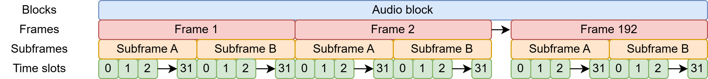

A subframe is composed of:

| Time slot     | Name                        | Description                                                                                                                    |
| ------------- | --------------------------- | ------------------------------------------------------------------------------------------------------------------------------ |
| 0–3           | Preamble                    | A synchronization preamble                                                                                                     |
| 4–7           | Auxiliary sample            | A low-quality auxiliary channel used as specified in the channel status word.                                                  |
| 8–27          | Audio sample                | Audio sample stored MSB last. It can be extended to use the auxiliary sample to increase quality                                  |
| 28            | Validity (V)                | Unset if the audio data is correct and suitable for D/A conversion.                                                           |
| 29            | User data (U)               | Forms a serial data stream for each channel.                                                                                   |
| 30            | Channel status (C)          | Bits from each subframe of an audio block are collated, giving a 192-bit channel status word.                                   |
| 31            | Parity (P)                  | Even parity bit for detection of errors in data transmission. Excludes preamble; Bits 4–31 need an even number of ones.        |

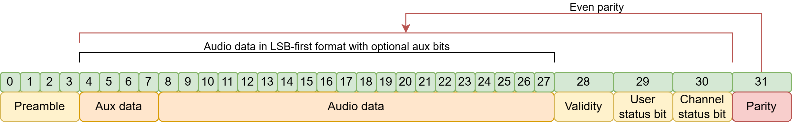

The preamble can be one of three values:

|  Name  | Timeslot (Last was 0) | Timeslot (Last was 1) | Function                                                                     |
|:------:|:---------------------:|:---------------------:|------------------------------------------------------------------------------|
| Z or B |        11101000       |        00010111       | Marks a word for channel A (left) and the start of an audio block            |
| X or M |        11100010       |        00011101       | Marks a word for channel A (left), besides at the start of an audio block |
| Y or W |        11100100       |        00011011       | Marks a word for channel B (right).                                          |


Between the AES3 and S/PDIF standards, the contents of the 192-bit channel status word differ significantly, although they mutually agree that the first channel status bit distinguishes between the two 🤝. In the case of AES3, the standard describes, in detail, the function of each bit.

Broadly speaking, the channel status word indicates the type of data and has information about the clock and various metadata such as channel origin/destination.


Reword


# Ultranet

The initial assumption that Ultranet squishes 🗜️ eight 48 kHz audio channels into a single 192 kHz AES3 stream turned out to be correct. In other words, the eight channels are interleaved into one high-rate AES3-like stream so that each 48 kHz channel fits into the 192 kHz timing without resampling.

However, initially, I assumed that Ultranet relied on the AES3 B-frame for channel synchronization, which seemed logical since the protocol is based on AES3 🤔. That assumption was partly correct; it allowed me to receive audio, but it failed when it came to consistent channel indexing while receiving. At the same time, the transmitter either produced misaligned channels or didn't work whatsoever, revealing that the actual synchronization mechanism had to be different 🫤.

## The P16-M tangent
This is when Christian Nöding contacted me again. He was trying to write the code for the Ultranet output of the X32 for the [OpenX32](https://github.com/OpenMixerProject/OpenX32) project.

He tested it on a P16-M, and all he got was garbage 🗑️, random noise instead of usable audio. That immediately caught my attention, because if his implementation didn't work on an actual Behringer device, something was probably very wrong in our understanding of the protocol. 

By pure luck 🍀, I stumbled across a used P16-M listed for almost nothing on my local marketplace, so I grabbed it as soon as I could. Once it arrived, I hooked it up to my setup (the same one that worked flawlessly with the TFX122M-AN) and got the same garbage output. That was both good and bad news: on one hand it meant my implementation wasn't truly compatible, but on the other hand I now had a reliable way to reproduce the problem on real hardware and dig deeper into what was actually going on.

I then spent quite a while trying to debug things; at some point I got close and got channels 1-2 working, but after 2 days on the problem I had enought and decided that I wasn't going to test things blindly anymore 👀.

After a break, I promptly started to disassemble the mixer. At first glance/probe, I was surprised that none of the AK4114 appeared to have their B-frame pins connected to the XMOS chip 🤔. This is what set off alarm bells. I promptly soldered jumper wires on the SPI bus used to configure the chips and was again surprised by how little communication there was:

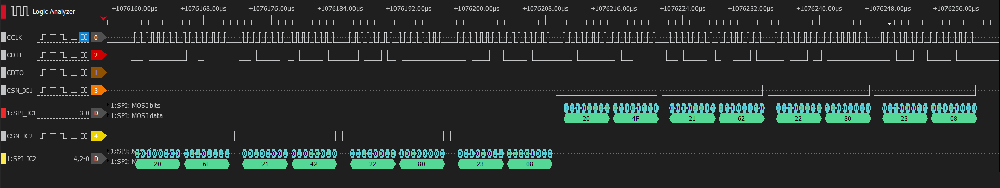

After a quick read of the datasheet, it turns out that their config is very standard. The config sent to the chips is setting one of them to use the crystal as a clock source and the other one as a slave. The config also re-routes their input directly to the output pin for the passthrough port.

I then snooped on the I2S output and B-frame output, which looked like what you would expect. I was so determined to find something weird that I went as far as managing to rebuild a WAV file from a 20-second capture done with the logic analyzer, which also worked just fine 🔊.

Relunctantly, I decided that I'll learn things by desoldering the chips 🔥. This confirmed that the only thing connected to the XMOS chip was the I2S signal and the "valid" output. This effectively confirmed that **synchronization was in no way tied to the B-frame,** and as the channel and user bits weren't connected either, it left only one place where the XMOS chip could sync: **the sample data**

## Back to research

Now, a sync signal in the sample data sounds wrong. How the hell do they fit 24-bit audio + sync into 24 time-slots 🤨 ????

After some google foo, it turns out that they don't. Ultranet simply is not 24-bit it is **22-bit**.<br>
In hindsight, I should have noticed it earlier; most quick start guides from Behringer mention that their A/D conversion is 24-bit, but they do not mention anything about the actual data.

However the guide of some devices (like the [DL32](https://www.la-bs.com/ObjetsMultimedia/42473/FR/DL32_MIDAS_me.pdf)) has an interesting line: 
> ULTRANET networking @ 48 or 44.1 kHz, 22-bit PCM

At the time I thought that was a typo 🤦, but I know realise that it is indeed correct. While the P16-M (and other devices that receive Ultranet) might use 24 bits for their internal signal processing and the digital-to-analog conversion, the actual digital data transmitted over Ultranet is only 22-bit. 

So, what is in those two bits? A bit more digging later, I found a few things on the web:
 - https://reverseengineering.stackexchange.com/a/11337
 - https://github.com/tuck1s/UltranetReceiver/blob/master/app_ultranet/src/i2s-32bit-simple.xc#L137
 - https://github.com/doughadfield/Ultranet-to-I2S/blob/main/ultranet.c#L248

All of these projects implement some sort of sync based on the sample data 🤯.

## Ultranet sync & channel index

Ok enought teasing, as I said before, the block structure was already correct (the channel index starting from one is pure choice for this article):

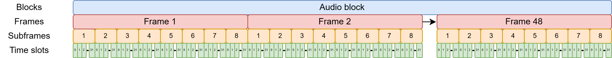

The subframe however is a bit different:

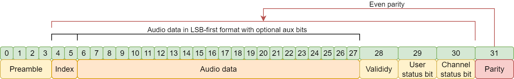

| Time slot     | Name                        | Description                                                                                                                    |
| ------------- | --------------------------- | ------------------------------------------------------------------------------------------------------------------------------ |
| 0–3           | Preamble                    | Synchronization preamble, same as AES3                                                                                         |
| 4–5           | Channel index               | Index of a "left/right" channel pair                                                                                           |
| 6–27          | Audio sample                | Audio sample stored MSB last.                                                                                                  |
| 28            | Validity (V)                | Set if the audio data is correct and suitable for D/A conversion.                                                              |
| 29            | User data (U)               | Unused, set to 0.                                                                                                              |
| 30            | Channel status (C)          | Used but structure is currently unknown                                                                                        |
| 31            | Parity (P)                  | Even parity bit for detection of errors in data transmission. Excludes preamble; Bits 4–31 need an even number of ones.        |

As you can see, it's stupidly simple, and after a quick analysis with the logic analyzer, here are the channel indicies:

| Channel  | Index      |
| -------- | ---------- | 
| 1        | 00 - Left  |
| 2        | 00 - Right |
| 3        | 01 - Left  |
| 4        | 01 - Right |
| 5        | 10 - Left  |
| 6        | 10 - Right |
| 7        | 11 - Left  |
| 8        | 11 - Right |

The choice of two bits is interesting, they could have used a third bit but instead chose to group them by two. That grouping explains why the channels offset always moved two at the same time 🙄.

It's also interesting that TFX122M-AN worked at all last time 🤔. It must use a different sync "procedure" than the P16-M.

This is superb news 🥳 because while we lose some fidelity the implementation just became WAY easier than using the B-frame signal:
 - To receive, you just have to wait for two samples that have the same index and output them to the correct DAC. 
 - To transmit it's even simpler, just put the correct index with the correct channel .

What's funny is that the channel status bits are still sometimes needed. I still have no idea what they mean but for some reason it doesn't *always* work without them. Since they are not used anywhere I guess that it's a simple pattern that is enough for the AK4114 to start decoding 🤷.

## What's new ?

Now that I've set the record straight, let's actually start with part 2. After wrestling with the prototype implementation, it's now time to clean up the move beyond the spaghetti. This round of changes is all about making the design more robust, modular, and rack-friendly. In short: less "prototype held together with hopes and prayers" more "something I can actually trust".  

When I did my last PCB order I snuck in a devboard for the [DIX9211](https://www.ti.com/lit/ds/symlink/dix9211.pdf), a `216-kHz Digital Audio Interface Transceiver`. This chip is similar to the AK4114 that's being used for almost every Ultranet product I've seen so far. It's being used to replace the PLL1707 👋. This chip was responsible for generating the 24.576MHz system clock that the FPGA used to decode and generate the AES3 data streams. I'll talk about it later but this has been replaced by the DIX9211, which can output a buffered clock from its crystal! In fact, the receiver entierly run on the I2S clocks (which means I support both 48k and 44.1k 🤯), only the transmitter needs a separate clock!

Also new are new modular DAC and ADC boards with proper analog frontends. This ensures flexibility, upgradability and reparability within the system. Imagine haveing to rebuild the whole board because someone blew-up an input 🤦

I'm also introducing an RP2040 as a supervisor MCU. It will be used to set up everything to its proper state and interface between the FPGA and other components. This project is at its core an 8-in 8-out signal processor with interconnects so it could be used for much more than a digital snake!

A much-needed improvement is a proper 1U case and CAD models to fit everything properly (okay, okay you got me, a shelf with 3d printed faceplates, I promise it looks good and feels solid 😉, you'll see!)

The last thing I need to mention is the move from fully opensource implementations to using built-in IPs inside my FPGA. Specifically, the transmitter is now using the [Gowin SPDIF TX](https://www.gowinsemi.com/en/support/ip_detail/194/) IP. While I do believe that a fully open implementation would be preferable. I also believe that using the best tools for the job is the better route to take. I'm still very novice in the FPGA world and while I could probably fix the previous implementation to make it do what I want, it's just easier to use something that already works. Also while this IP is proprietary it is free so … 🤷

## Electronics redesign
### DAC
For the outputs I decided to stick with the same DAC chip as in the prototype. It performed pretty well for my application and integrated nicely with the FPGA 👍. The big change is moving from single-ended outputs to a fully balanced design. That means cleaner audio, lower noise, and better compatibility with professional gear, especially when running long cables on stage or in a studio.

With the move to balanced audio it also meant new connectors 🔌. While I've seen balanced audio on TRS jacks before (in fact, my sound card, the UA25EX do it this way) the proper connector to use is the XLR connector which is way bigger than the small 3.5 mm jack I was using before.

The PCM5100A part of schematic of the is super standard, it's basically a copy-paste 📋 of the datasheet. It's just configured for left-justified operation (via solder jumpers). Unfortunately, the PCM5100A is not a DAC with balanced outputs so I need to adapt it somehow. The goto, place & forget IC for this is the DRV134 or the DRV135. These chips are wonderful but they also cost 5eur a piece in low quantities that would mean 80eur of line drivers for the whole system 🤑. Much too expensive!

Instead I choose to do a bit more work and use the NE5532. Here is how it looks:

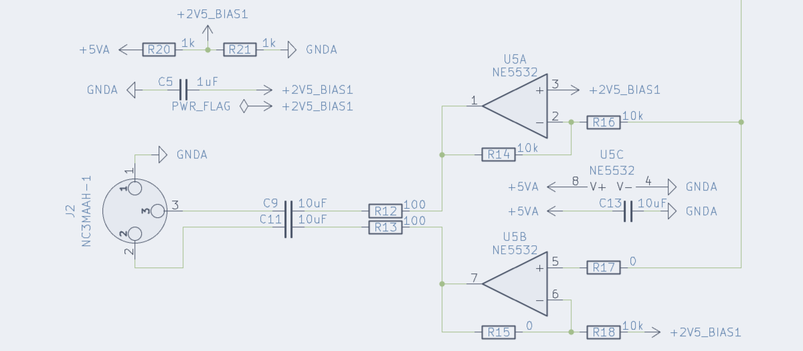

So let's break it down, the NE5532 is composed of two independent operational amplifiers:
 - The first one, U5B, is a simple non-inverting buffer ➡️, as I don't have a negative supply on this system, the audio signal is biased to be centered around 2.5V.
 - The second one, U5A, is again a simple buffer 🔀 but this time in an inverting configuration.

It then goes to protection resistors and DC-blocking caps and finnaly end up in the connector 🔌. The same frontend is repeated for the 2nd channel 

The PCB itself is quite simple although I took special care while routing the analog and digital parts to ensure that they didn't cross. The two ground planes are connected a connected at one point under the PCM5100A as specified in the datasheet.

I also set a specific size limit to the PCB so that I could start 3d modeling 📐 as soon as possible:

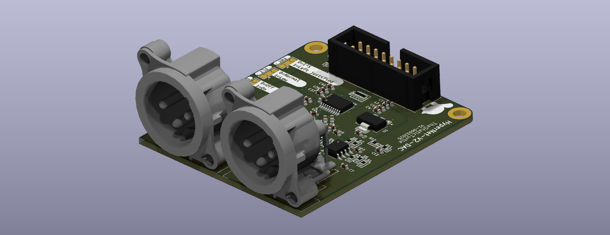

### ADC
The input side follows the same philosophy 🎓: keep the same ADC chip, but redesign the analog front-end for balanced operation. As said before, balanced inputs are essential to reject interference and ground noise. Since balanced inputs are used, the next "logical" step was adding phantom power. While the new board doesn't feature any configurable pre-amplifier (you could technically change the gain of the amp) to boost microphones and whatnot, I figured that adding phantom power couldn't hurt.

If I don't need it I can simply disable it, but if I want to use microphones I can simply use inline pre-amplifiers like the [Klark Teknik Mic Booster CT1](https://www.thomann.de/lu/klark_teknik_mic_booster_ct1.htm), which is a `compact dynamic microphone booster with high-quality preamps`. Super easy and pretty cheap!

It does add some complexity (especially since this modification came later which meant the PCB had to stay the same size to avoid redesigning CAD models), extra power regulation, and proper protection circuit but it opens up much more flexible use cases. Here is how one channel looks:

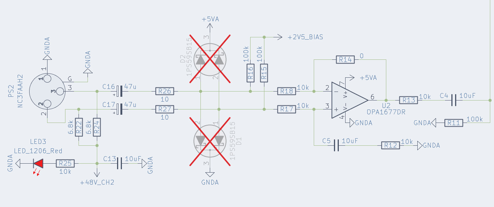

As you might have guessed there's also a go-to IC for this application, the INA137. But same as before, this chip is far too expensive 💸 (less so but still). Instead I choose to use the OPA1677.

But first we need to talk about what the hell phantom power is 👻. Phantom power is the standard way of powering devices through the same XLR cable that carries the audio signal. Instead of running a separate power line, 48V is applied equally to pins 2 and 3 of a balanced input relative to pin 1. Because the voltage is identical on both pins, it doesn't disturb the differential audio signal. Fortunately, IEC 61938:2018 outlines the technical specifications. Basically the max current is 10mA and you only need to connect a 6.81k resistors between each signal pin and the power source. On the schematic, this is the job of R22 and R24. If you would like to learn more about phantom I can recommend you read this page: https://sound-au.com/articles/p-48.htm

Note that the specification says 6.81k but I instead used 6.8k, this is because apparently, at the time getting 6.8k resistors with a low tolerance was complicated 🤷. By choosing 6.81k the specifications ensured the proper tolerance. However these days it isn't really a problem anymore.

Just after this is the protection circuit, first the signal goes through DC-blocking caps followed by protection resistors and protection diodes. This circuit ensures that the signal will never have a voltage so far from the absolute maximum that it's going to break something. You'll notice that they are marked as DNP 🤔. It turns out they clamped the signal too much so I just removed them. If you have suggestions please let me know!

The signal is then biased to 2.5V and fed to an OPA1677 configured as a simple buffer after which the signal goes through some passives and then goes to the PCM1808!

As before, the PCB itself is quite simple and I also took care while routing the analog and digital parts. As with the DAC, the two ground planes are connected a connected at one point under the PCM1808, as hinted in the datasheet.

I also reused the size limit of the PCB that I defined before.

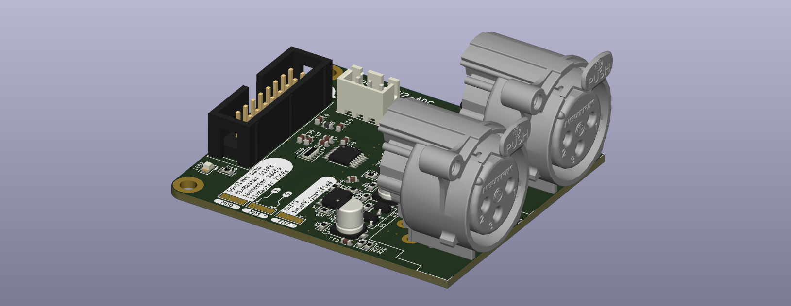


### Mainboard

The mainboard changed a lot, in fact it changed twice while I started the writing process for this article:

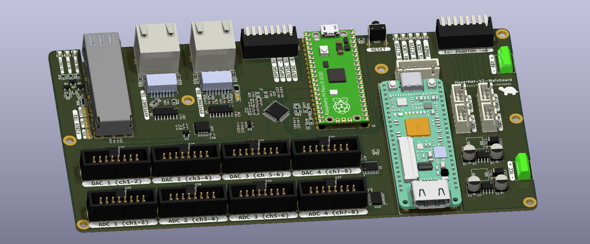

As you can see the SFP, and Hypernet ports are basically unchanged. 

This also applies to the FPGA, which is still the same Tang 9k that I used last time. It works very well and is easy to use so why change it 🙂!

The whole right side of the board is dedicated to power management (3.3v digital, 5v analog and 48v phantom) ⚡.

The most significant change is probably the IDC ports to connect the ADCs and DACs boards. I choose IDC connectors mainly because they are very resilient, cheap and widely used. That said if I were to redesign everything I would use FFC connectors to reduce the size 📏. These ports provide:
  - An I2C port 💬 (Unused and unpopulated for my boards)
  - An I2S port 🔉
  - Two GPIOs (Only used for the DAC connector to carry the mute signal 🔇) 
  - 3.3V Digital power ⚡
  - 5V Analog power ⚡


#### Digital interface transceiver: DIX9211

Which brings me to the DIX9211. This chip is basically an AES3/SPDIF receiver that spits out I2S. This simplifies so much of the FPGA logic since receiving I2S is **way** easier than receiving AES3!

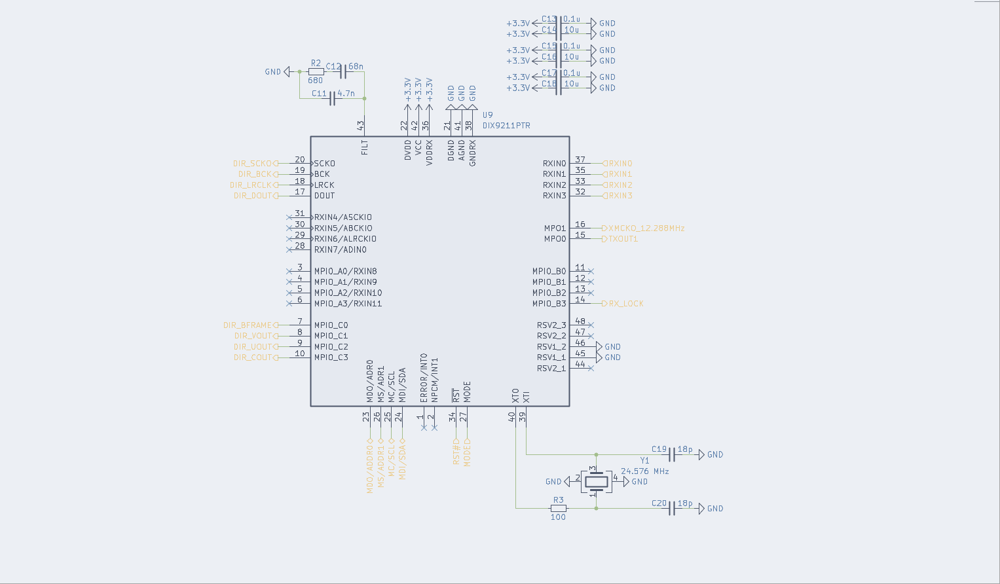

As I'll explain later I'm also using it as a "biphase router" (a bit like in the P16-M, actually). I can configure what input port is used as the input for the DIR, and I can also choose which input port is used for the biphase output.

This gives a huge amount of flexibility to the system!

 Maybe add a few words 

#### Supervisor MCU

The supervisor MCU is a raspberry pico, I could have used the chip directly but to be honest it's just easier and cheaper to do it that way 🤷. The only use of this chip is to read the 8 DIP switches and configure the DIX9211.

In the future I might be able to use it as audio bridge or something. I added an SPI bus between the FPGA and the pico that I could use to stream audio or something.

 Schematic, implementation details, etc… 

#### High level view of the mainboard


 Small explanation 


## HDL redesign
### Clocks & Sync
### Receiver

Here is a diagram showing how the receiver works from a high-level view:

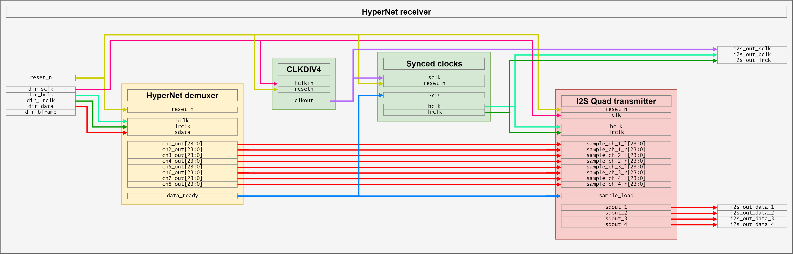

The demuxer itself is the interesting part, it's is pretty simple. You can find parts of the code below. Basically it can be summarized to, loads bits from DOUT on the BCLK rising edge and when LRCLK transitions, saving the sample. When two successive samples have the same LSB, output them to the correct port. 

There's a bit more stuff to handle, like reset and signaling but that's the basic idea.

```vhdl
-- Detect LR transition (channel boundary)
is_lr_changed  <= '1' when zlrclk /= lrclk else '0';
    
-- Extract active part of the audio signal and the current LSB of said signal.
-- The sample_data signal is 32bit but only the upper 24 bits matter
sample_audio_data <= sample_data(31 downto 10) & "00"; -- Remove the LSB as this is used for the channel index
sample_lsb_data <= sample_data(9 downto 8);

-- Main deserialization process
deserialize_i2s : process(bclk) begin
	if rising_edge(bclk) then
        if reset_n = '0' then
            -- Reset all outputs and counters
            sample_data            <= (others => '0');
            prev_sample_audio_data <= (others => '0');
            prev_sample_lsb_data   <= (others => '0');
            ch1_out <= (others => '0');
            ch2_out <= (others => '0');
            ch3_out <= (others => '0');
            ch4_out <= (others => '0');
            ch5_out <= (others => '0');
            ch6_out <= (others => '0');
            ch7_out <= (others => '0');
            ch8_out <= (others => '0');
            data_ready <= '0';

            -- Keep the edge detector running while in reset
            zlrclk <= lrclk;
        else
            -- Shift serial input data into buffer (MSB first). 32 bits are shifted but only the upper 24 are valid data
            sample_data <= sample_data(sample_data'high-1 downto sample_data'low) & sdata;

            -- Save LRCLK for edge detection
            zlrclk <= lrclk;
                
            -- On word clock transition:
            if is_lr_changed then

                -- Check if current LSB matches previous LSB
                if sample_lsb_data = prev_sample_lsb_data then
                    -- Two successive samples with same LSB whe are successfuly synced - output them
                    case sample_lsb_data is
                        when "00" =>
                            ch1_out <= prev_sample_audio_data;
                            ch2_out <= sample_audio_data;
                        when "01" =>
                            ch3_out <= prev_sample_audio_data;
                            ch4_out <= sample_audio_data;
                        when "10" =>
                            ch5_out <= prev_sample_audio_data;
                            ch6_out <= sample_audio_data;
                        when "11" =>
                            ch7_out <= prev_sample_audio_data;
                            ch8_out <= sample_audio_data;

                            -- When channel 8 is written, flag that the data is ready for 1 bclk cycle 
                            -- The choice of lsb=11 is arbitrary, unless the input data is really fucked-up it shouldn't matter. There really should be a separate data ready signal for each pair
                            data_ready <= '1';
                    end case;
                end if;

                -- Store sample and LSB as previous for next comparison
                prev_sample_audio_data <= sample_audio_data;
                prev_sample_lsb_data   <= sample_lsb_data;

            else
                -- Still reading data
                -- Clear the data ready flag
                data_ready <= '0';
            end if;
        end if;
	end if;
end process;
```
### Transmitter

Here is a diagram showing how the transmitter works from a high-level view:

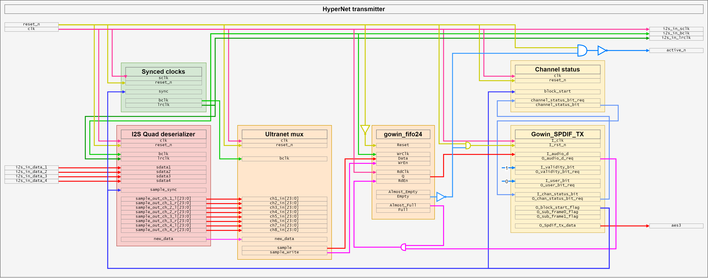

As you can see it WAY more complicated than the receiver. This is mainly because I'm using a pre-made FIFO and S/PDIF transmitter block, there's not much code to show besides the diagram but the most "interesting" part is the mux that pushes a burst of eight audio samples to the FIFO. Basically it waits for the signal that says that the FIFO is almost empty (eg, finished with the last batch) and pushes the samples:

```vhdl
push_data : process(clk) begin
	if falling_edge(clk) then
		if reset_n = '0' then
            -- Reset all outputs and counters
            burst_write_counter <= 0;
            sample_write <= '0';
            sample <= "000000000000000000000000";
        else
            -- Data from the I2S reader is ready, burst write the data to the FIFO
            if data_ready = '1' then
                burst_write_counter <= 8;
            end if;
            
            -- Write samples on a bclk pos edge
            if bclk_pos_edge = '1' then
                if burst_write_counter = 8 then
                    sample <= ch1_in(23 downto 2) & "00";
                elsif burst_write_counter = 7 then
                    sample <= ch2_in(23 downto 2) & "00";
                elsif burst_write_counter = 6 then
                    sample <= ch3_in(23 downto 2) & "01";
                elsif burst_write_counter = 5 then
                    sample <= ch4_in(23 downto 2) & "01";
                elsif burst_write_counter = 4 then
                    sample <= ch5_in(23 downto 2) & "10";
                elsif burst_write_counter = 3 then
                    sample <= ch6_in(23 downto 2) & "10";
                elsif burst_write_counter = 2 then
                    sample <= ch7_in(23 downto 2) & "11";
                elsif burst_write_counter = 1 then
                    sample <= ch8_in(23 downto 2) & "11";
                end if;

                if burst_write_counter > 0 then
                    sample_write <= '1';
                    burst_write_counter <= burst_write_counter - 1;
                end if;
            elsif bclk_neg_edge = '1' then
                sample_write <= '0';
            end if;
		end if;
	end if;
end process;
```

## Firmware

Since I choose to go with the DIX9211, I need a way to control it 🎛️. This could have been done in the FPGA, however I didn't feel like implementing it 🥱 so I decided to use a raspberry pi pico.

Right now it's only configuring the chip, but as I said earlier, I did connect an SPI bus with two extra pins to the FPGA, this could be used to output/input audio over USB, for example.

I also alluded to earlier that I use the DIX9211 as a router 🔀, this is configured by the supervisor from some DIP switches:

| Config      | Behavior                                                           |
|-------------|--------------------------------------------------------------------|
| xx00        | The output HyperNet signal is coming from fiber input              |
| xx01        | The output HyperNet signal is coming from the Ultranet 1-8 input.  |
| xx10        | The output HyperNet signal is coming from the Ultranet 9-16 input. |
| **xx11**    | **The output HyperNet signal is coming from the FPGA**             |
|-------------|-------------------------------------------------------|
| **00xx**    | **The DIR input is coming from fiber input**          |
| 01xx        | The DIR input is coming from the Ultranet 1-8 input.  |
| 10xx        | The DIR input is coming from the Ultranet 9-16 input. |
| 11xx        | The DIR input is coming from the FPGA (loopback)      |


There are a few additional registers to configure. The full config can be seen on the setup script bellow.<br>
Again, I didn't feel like setting up a full C++ project with the pico-sdk (or even Arduino) so I just left Circuit Python and made it so that the script runs at boot. This has the downside of a small 500ms delay before it's configured after reset but I can live with that 🤷!

It could be improved by periodically watching the inputs 👀 and reconfiguring accordingly which would remove the need to push the reset button after changing the config.

```python
import board
import busio
import digitalio
import time
from adafruit_bus_device.i2c_device import I2CDevice

source_map = ["Fiber", "HyperNet 1-8", "HyperNet 9-16", "FPGA"]

i2c = busio.I2C(sda=board.GP12, scl=board.GP13)

device_dix = I2CDevice(i2c, 64)
    
def read(device, register, size=1):
    buf = bytearray(size)
    with device_dix:
        device_dix.write_then_readinto(bytes([register]), buf)
    return buf
        
def write(device, register, data):
    buf = bytearray(1)
    buf[0] = register
    buf.extend(data)
    with device_dix:
        device_dix.write(buf)

config_outsrc_1 = digitalio.DigitalInOut(board.GP0)
config_outsrc_1.direction = digitalio.Direction.INPUT
config_outsrc_2 = digitalio.DigitalInOut(board.GP1)
config_outsrc_2.direction = digitalio.Direction.INPUT
config_inpsrc_1 = digitalio.DigitalInOut(board.GP2)
config_inpsrc_1.direction = digitalio.Direction.INPUT
config_inpsrc_2 = digitalio.DigitalInOut(board.GP3)
config_inpsrc_2.direction = digitalio.Direction.INPUT

config_outsrc = (not config_outsrc_1.value) << 0 | (not config_outsrc_2.value) << 1
config_inpsrc = (not config_inpsrc_1.value) << 0 | (not config_inpsrc_2.value) << 1

print(f"DIR Input source: {source_map[config_inpsrc]}")
print(f"DIR Output source: {source_map[config_outsrc]}")


write(device_dix, 0x2F, [0b00000101])    # DIR Output Data Format
                                         #   24-bit MSB first, left-justified
                          
write(device_dix, 0x31, [0b00000000])    # XTI Source, Clock (SCK/BCK/LRCK) Frequency Setting
                                         #   SCK=24.576M BCK=12.288M LRCK=192k 
                          
write(device_dix, 0x34, [config_inpsrc]) # DIR Input Biphase Source Select, Coax Amplifier Control
                                         #   rxin0amp normal / rxin1amp normal / rxin2 source
                          
write(device_dix, 0x6F, [0b00011100])    # MPIO_A, MPIO_B, MPIO_C Group Function Assign
                                         #   MPIO_A = Biphase Input Extension (RXIN8 to RXIN11)
                                         #   MPIO_B = DIR Flags Output or GPIO (Selected by MPB3SEL, MPB2SEL, MPB1SEL, MPB0SEL)
                                         #   MPIO_C = DIR BCUV OUT, BFRAME/VOUT/UOUT/COUT
                          
write(device_dix, 0x71, [0b00000000])    # MPIO_B, MPIO_C Flags or GPIO Assign Setting
                                         #   DIR Flags, set by MPB1FLG / MPC0FLG
                          
write(device_dix, 0x74, [0b01010101])    # MPIO_B1, MPIO_B0 Output Flag Select
                                         #   LOCK LOCK
write(device_dix, 0x75, [0b01010101])    # MPIO_B3, MPIO_B2 Output Flag Select
                                         #   LOCK LOCK
                          

write(device_dix, 0x78, [0b11001110])    # MPO1, MPO0 Function Assign Setting
                                         #   MPO1=XMCKO MPO0=RECOUT0 
                          
write(device_dix, 0x24, [0b00010100])    # Oscillation Circuit Control
                                         #   OSCAUTO=0 (always operates) XMCKENX=1 (Output) XMCKDIV=01 (XTI/2 (12.288 MHz))


write(device_dix, 0x35, [config_outsrc]) # RECOUT0 Output Biphase Source Select
                                         #   RECOUT0=RXIN3 MPO0MUT=Output
```

## 3D Design

Designing the physical enclosure for this project turned out to be almost as challenging as the electronics 😫. 
I would rather not spend a bunch of money on a custom rack case, so instead I opted for the Scrooge McDuck 🦆 solution and used a standard 1U rack shelf. I've used this method in the past for my SDI over fiber project so I knew it could work.

It's far from the best solution, but once everything is assembled it's strong and most importantly very affordable. Using a shelf also means I don't have to worry about a custom front-panel or things like that. Instead I can just 3D-print the front and rear plates myself 👍. 

Since the DAC and ADC modules have the same size, connector placement and mounting holes, it was straightforward to design a holder for each. However since this will be rack-mounted I can't have screws on the bottom to attach the 3D prints. To solve this I have 3 aluminum bars running for the whole length. These bars are then screwed in from the side:

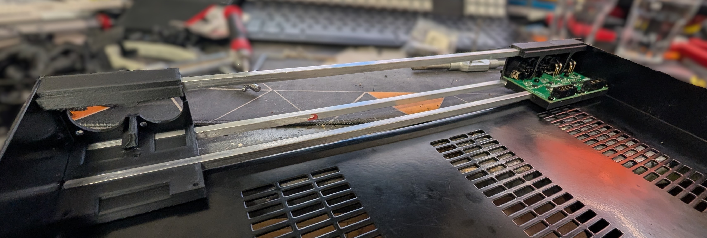

I initially thought it wouldn't be enough and bought some double-sided tape. To my surprise it turned out that it is surprisingly strong once all the holders are present 💪! My design made it so that 8 holders don't fill the full width, there's about a centimeter left that I use for status LEDs (like power, active, sync, ….).

### DAC & ADC Holder

For the DAC/ADC holder, I designed a compact holder on which I can slide the board in from the rear and lock it against the faceplate with four M3 screws into the XLR connectors. Additionally, there are three M3 screws on the PCB itself, this increases the overall rigidity of the holder and makes sure it won't break when plugging in cables.


images/PXL_20251025_223201201.PORTRAIT.jpg "DAC with the holder (Front)"
images/PXL_20251025_223156227.PORTRAIT.jpg "DAC with the holder (Back)"


The only difference between the ADC and DAC holder is that the ADC one has an extra hole near each XLR connector for an LED, which will indicate the presence of phantom power 💡.


images/PXL_20251025_223232217.PORTRAIT.jpg "ADC with the holder (Front)"
images/PXL_20251025_223243798.PORTRAIT.jpg "ADC with the holder (Back)"


 Dust covers 

### Main board

The mainboard is going to get stuck on the shelf with double-sided tape so i just needed a simple plate on the bottom to isolate the PCB from the metal shelf. And to make everything look good, I also made a front plate to cover most of the components:


images/PXL_20251025_220910286.PORTRAIT.jpg "Mainboard with bottom plate"
images/PXL_20251025_223110398.PORTRAIT.jpg "Mainboard with bottom and top plate"


### Assembly

And it's finally time for assembly 🤩!

I started by putting the four DACs and four ADCs on their respective holders and sliding them onto the shelf:

 Photo with the sleds only 

I then stuck the mainboard (and power supply) with some strong double-sided tape:

 Photo with the sleds , mainboard and power supply 

And finally I made "a few" custom cables to make sure everything looks neat:

 Final product gallery


## Validation

Validation was quite fun because I discovered a few issues 😢:
> *These issues have bee corrected in the schematics above*
- Audio was leaking to the 2 channels of each DAC board.
  - This turned out to be caused by my 2.5V bias supply, I used a simple divider connected to both channels, I should have used either a 2.5V LDO or what I ended up doing was adding a 2nd voltage divider just for the 2nd channel.
- Gain issue with the DAC board:
  - Solved it by using a 0-ohm resistor for the feedback resistor of the opamp for positive output instead of the 10k I had before.
- Same gain issue with the ADC board:
  - Also solved it by using a 0-ohm resistor for the feedback resistor of the opamp instead of the 10k I had before.
- Fiber input not working on the mainboard:
  - Missing 100k pull down resistor on the negative signal of the differential pair comming from the SFP.

But after solving these, everything worked 🥹 ! Lets see the demo:
## Demo
### Hypernet to Hypernet
 Video 

### Hypernet to Ultranet
 Video 

### Ultranet to Hypernet
 Video 

## Conclusion / What's next

This project started with me wanting to carry timecode and a few other signals from stage to FOH and back. It then promptly spiraled out of control 🌪️ and fed my curiosity about the inner workings of Behringer's Ultranet and ended up as a robust, open hardware system I can actually trust on stage. 

Just like my previous project, it taught me a lot. I learned about AES3 (and Ultranet) internals, clock domains ⌚, and analog design, etc. This is huge because now when something goes wrong I actually know what to look for, I can better estimate the limits of the systems I use and I can figure out solutions to problems way faster.
Working on a project like this not only gives you an insane amount of knowledge on the systems you are studying but it also gives you a huge amount of respect for how much engineering goes into moving "just sixteen channels of audio".

Unlike the first part, I feel confident enough with my implementation to release this publicly on my github. I do have to warn you that it's not a plug-and-play solution and requires a lot of work!:




While it would be cool to look at XMOS chips, AES50, or even StageConnect now that it's [opensource](https://github.com/OpenMixerProject/StageConnect) thanks to Chris, I don't think I'll touch audio stuff for a while now. However I'm no where near done with live production tools. I've been playing with intercoms ☎️ (think ClearCom, RTS, …) for a few years now and I've already invested quite a lot of time (and money) into making opensource analog and digital prototypes!