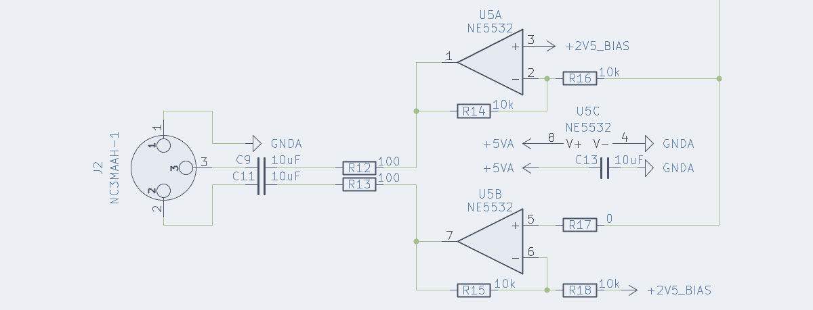
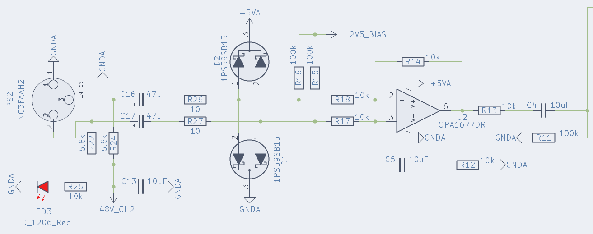

Continuing the ultranet adventure by building a fully functional 8 channel stagebox.

<!--more-->


This is a continuation of an already stupidly long adventure, you can read <a href="/ultranet-adventures-part-1/">part 1 here</a> but you'll need probably some time to really read it. If you are here just for the demo of the end product you can click <a href="#demo">here</a>!


Welcome back! 

In the last article, I heavily focused on understanding & reverse-engineering Ultranet and getting a proof of concept working on FPGA. That was mostly about the protocol side: understanding the physical side, how data flows, timings, and wrestling with bits until both transmitter and receiver behaved correctly. As we'll see later it turned out that I was wrong about the implementation!

But now, it's time to shift gears and design a product that I would actually use in live production.

The whole point of this project is to create 8 channel stagebox for auxiliary audio lines that I will use in my live production. I recently received the dates and song list for the 2026 "tour" so timelines on multiple projects including this one got very real 🤩! 

As discussed in part 1, there are many options on the market ([ADAT](https://en.wikipedia.org/wiki/ADAT_Lightpipe), [MADI](https://en.wikipedia.org/wiki/MADI), [Dante](https://en.wikipedia.org/wiki/Dante_%28networking%29), ...) but those are (mostly) locked down and expensive. Re-using an existing protocols (like Behringer's Ultranet) is an easy way to design a futureproof(-ish) system while ensuring compatibility with many existing devices all the while learing about the intricaties of system. This makes me more aware of the limits of a setup and let me understand why things go wrong and how to bodge said things when it breaks 1h before go-time 😢.


Due to various reasons, I will stop reffering about my implementation as ultranet.
As it is based on AES3 which is an open standard, I doubt I will annoy Berhinger too much by publishing this project under a different name. 😅
Therefore, please welcome to the stage: <b>HyperNet</b> 🥁


## Where I left off

At the end of part 1, everything was technically working, but not exactly production-ready: 
- 🧮 Channel indexing is still an issue, for some reason real ultranet receiver are still not fully compatible with Hypernet and the Hypernet receiver had indexing issues.
- 🔌 The audio frontend of the DACs and ADCs were mediocre at best.
- 🧩 The PCB layout design was oriented more as a devboard than a real product
- 📦 The project was a bare PCB without any case

## Quick recap / Correction
### AES3

As a reminder AES3 is designed primarily to support stereo [PCM](https://en.wikipedia.org/wiki/PCM) 📊 encoded audio encoded using [biphase mark code (BMC)](https://en.wikipedia.org/wiki/Biphase_mark_code).

> Biphase mark code, also known as differential Manchester encoding, is a method to transmit data in which the data 💾 and clock 🕓 signals are combined to form a single two-level self-synchronizing data stream. 

AES3 is composed of what is called audio blocks, these audio blocks are composed of 192 frames, each frame contains 2 subframes, which in turns, contain 32 time slots. 

A subframe is composed of:

| Time slot     | Name                        | Description                                                                                                                    |
| ------------- | --------------------------- | ------------------------------------------------------------------------------------------------------------------------------ |
| 0–3           | Preamble                    | A synchronization preamble                                                                                                     |
| 4–7           | Auxiliary sample            | A low-quality auxiliary channel used as specified in the channel status word.                                                  |
| 8–27          | Audio sample                | Audio sample stored MSB last. It can be extended to use the auxiliary sample to increase quality                                  |
| 28            | Validity (V)                | Unset if the audio data is correct and suitable for D/A conversion.                                                           |
| 29            | User data (U)               | Forms a serial data stream for each channel.                                                                                   |
| 30            | Channel status (C)          | Bits from each subframe of an audio block are collated, giving a 192-bit channel status word.                                   |
| 31            | Parity (P)                  | Even parity bit for detection of errors in data transmission. Excludes preamble; Bits 4–31 need an even number of ones.        |

The preamble can be one of three values:

|  Name  | Timeslot (Last was 0) | Timeslot (Last was 1) | Function                                                                     |
|:------:|:---------------------:|:---------------------:|------------------------------------------------------------------------------|
| Z or B |        11101000       |        00010111       | Marks a word for channel A (left) and the start of an audio block            |
| X or M |        11100010       |        00011101       | Marks a word for channel A (left), besides at the start of an audio block |
| Y or W |        11100100       |        00011011       | Marks a word for channel B (right).                                          |

Between the AES3 and S/PDIF standards, the contents of the 192-bit channel status word differ significantly, although they both agree that the first channel status bit distinguishes between the two 🤝. In the case of AES3, the standard describes, in detail, the function of each bit.

Broadly speaking, the channel status word indicates the type of data, has information about the clocks and various metadata such as channel origin/destination.


Reword


# Ultranet

The initial assumption that Ultranet squishes eight 48 kHz audio channels into a single 192 kHz AES3 stream turned out to be correct. In other words, the eight channels are interleaved into one higher-rate AES3-like stream so that each 48 kHz channel fits into the 192 kHz timing without resampling.

However, I initially assumed the protocol relied on the AES3 B-frame for channel sync, which made sense given that Ultranet is based on AES3. That assumption did allow me to receive audio (so the basic decoding path was functional), but it proved insufficient for correct channel indexing and transmitting either had indexing issue or failed out right. This meant that the true sync mechanism is different.

## The P16-M tangent
This is when Christian Noeding contacted me again. He was trying to write the code for the Ultranet output of the X32 for his [OpenX32](https://github.com/OpenMixerProject/OpenX32) project.

He tested it on a P16-M and all he got was garbage. By pure luck I found a very cheap P16-M on my local marketplace and imediatly picked it up.
After testing with my setup (which did work with the TFX122M-AN) I also got garbage which was both good and bad news.

I spent quite a while trying to debug things, at some point I got close and got channels 1-2 working but after 2 days on the problem I had enought and decided that I wasn't going to test things blindly anymore.

After a break, I promptly started to dissasamble the mixer. At first glance/probes I was surprised that none of the AK4114 appeared to have their B-frame pins connected to the XMOS chip. This is what set off alarm bells. I promptly soldered jumpers wires on the SPI bus used to configure the chips and was again surpised by how little communication there was:

After a quick read of the datasheet, it turns out that their config is very standard. The config sent to the chips is setting one of them to use the xtal as a clock source and the other one as a slave. The config also re-route their input directly to the output pin for the passthrough port.

I then snooped on the I2S output and B-frame output, which looked like what you would expect. I was so determied to find something weird that I went as far as managing to rebuild a WAV file from a 20sec capture done with the logic analyser which also worked just fine.

Relunctantly, I decided that I'll learn things by desoldering the chips. This confirmed that the only thing connected to the XMOS chip was the I2S signal and the "valid" output.

**This effectively confirmed that synchronisation was in no way tied to the B-frame and as the channel and user bits weren't connected either it left only one place where the XMOS chip could sync: the sample data**

## Back to research

Now, a sync signal in the sample data sound wrong. How the hell do they fit 24bit audio + sync into 24 timeslots ????

After some google foo, it turns out that they don't. Ultranet simply is not 24-bit it it **22-bit**. 
In hindsight, I should have noticed it earlier, most quick start guides from Berhinger mentions that their A/D conversion is 24-bit but they do not mention anything about the actual data.

However the guide of some devices (like the [DL32](https://www.la-bs.com/ObjetsMultimedia/42473/FR/DL32_MIDAS_me.pdf)) have an intersting line: 
> ULTRANET networking @ 48 or 44.1 kHz, 22-bit PCM

At the time I thought that was a typo but I know realise that it is indeed correct.

So, what is in those two bits? At bit more digging later I found a few thing on the web:
 - https://reverseengineering.stackexchange.com/a/11337
 - https://github.com/tuck1s/UltranetReceiver/blob/master/app_ultranet/src/i2s-32bit-simple.xc#L137
 - https://github.com/doughadfield/Ultranet-to-I2S/blob/main/ultranet.c#L248

All of these projects implements some sort of sync based on the sample data.

## Ultranet sync & channel index

Ok enought teasing, as I said before the block structure was already correct (the channel index starting from one is pure choice for this article):

The subframe however is a bit different:

| Time slot     | Name                        | Description                                                                                                                    |
| ------------- | --------------------------- | ------------------------------------------------------------------------------------------------------------------------------ |
| 0–3           | Preamble                    | Synchronization preamble, same as AES3                                                                                         |
| 4–5           | Channel index               | Index of a "left/right" channel pair                                                                                           |
| 6–27          | Audio sample                | Audio sample stored MSB last.                                                                                                  |
| 28            | Validity (V)                | Set if the audio data is correct and suitable for D/A conversion.                                                              |
| 29            | User data (U)               | Unused, set to 0.                                                                                                              |
| 30            | Channel status (C)          | Used but structure is currently unknown                                                                                        |
| 31            | Parity (P)                  | Even parity bit for detection of errors in data transmission. Excludes preamble; Bits 4–31 need an even number of ones.        |

As you can see it's stupidly simple and after a quick analysis with the logic analyser here is the channel indicies:

| Channel  | Index      |
| -------- | ---------- | 
| 1        | 00 - Left  |
| 2        | 00 - Right |
| 3        | 01 - Left  |
| 4        | 01 - Right |
| 5        | 10 - Left  |
| 6        | 10 - Right |
| 7        | 11 - Left  |
| 8        | 11 - Right |

The choice of two bits is interesting they could have used a third bit but instead choose to group them by two. That grouping explains why the channels offset always moved two at the same time.

It's also interesting that TFX122M-AN worked at all it must use a different sync method than the P16-M


Figure this out, why the fuck did it worked at all?


This extremly good news because while we loose some fidelity the implementation just became WAY easier than using the B-frame signal:
 - To received you just have to wait for two samples that have the same index and output them to the correct DAC. 
 - To transmit it's even simpler, just put the correct index with the correct channel .

## What's new ?

After wrestling with the prototype implementation in Part 1, it's now time to clean up the move beyond the spaghetti. This round of changes is all about making the design more robust, modular, and rack-friendly. In short: less "prototype held together with hopes and prayers" more "something I can actually trust".  

When I did my last PCB order I snuk-in a devboard for the [DIX9211](https://www.ti.com/lit/ds/symlink/dix9211.pdf), a `216-kHz Digital Audio Interface Transceiver`. This chip is similar to the AK4114 that's being used for almost every Ultranet product I've seen so far. 

The next thing on the list is: bye-bye to the PLL1707 👋. This chip was responsible for generating the 24.576MHz system clock that the FPGA used to decode and genrate the AES3 data streams. I'll talk about it later but this has been replaced by the DIX9211 which can output a bufferd clock from it's crystal!

Also new, are new modular DAC and ADC boards with proper analog frontends. This ensure flexibility, upgradability and reparability within the system. Imagine haveing to rebuild the whole board because someone blew-up an input 🤦

I'm also indroducing a small supervisor MCU. It will be used to setup everything to their proper state and interface between the FPGA and other components. This project is at it's core a 8-in 8-out signal processor with interconnects so it could be used for much more than a digital snake!

A much needed improvement is a proper 1U case and CAD models to fit everything properly (okay, okay you got me, a shelf with 3d printed faceplates, I promise it looks good and feels solid 😉)

The last thing I need to mention is the move from fully opensource implementations to using built-in IPs inside my FPGA. Specifically, the transmitter is now using the [Gowin SPDIF TX](https://www.gowinsemi.com/en/support/ip_detail/194/) IP. While I do belive that a fully open implementation would be preferable. I also belive that using the best tools for the job is the better route to take. I'm still very novice in the FPGA world and while I could probably fix the previous implementation to make it do what I want, it's just easier to use something that already works. Also while this IP is proprietary it is free so ... 🤷

## Electronics redesign
### DAC
For the outputs I decided to stick with the same DAC chip as in the prototype. It performed well for my application and integrated nicely with the FPGA. The big change is moving from single-ended outputs to a fully balanced design. That means cleaner audio, lower noise, and better compatibility with professional gear, especially when running long cables on stage or in a studio.

With the move to balanced audio it also meant new connectors. While I've seen balanced audio on TRS jacks before, (in fact, my sound card, the UA25EX do it this way) the proper connector to use is the XLR connector which is way bigger than the small 3.5mm jack I was using before.

The schematic of the PCM5100A is super standard, it's basically a copy-paste of the datasheet. It's just configured for left-justified operation. Unfortunatly the PCM5100A is not a DAC with balanced outputs so I need to adapt it somehow. The go-to, place & forget IC for this is the DRV134 or the DRV135 these chips are awesome but they also cost 5eur a piece in low quantities that would mean 80eur of line drivers for the whole system. Way to expensive!

Instead I choose to do a bit more work and use the NE5532. Here is how it looks:

So let's break it down, the NE5532 is composed of two independant operational amplifiers:
 - The first one, U5B, is a simple non-inverting buffer, as I don't have a negative supply on this system, the audio signal is biased to be centered arround 2.5V
 - The second one, U5A, is again a simple buffer but this time in a inverting configuration.

It then goes to protection resistors and DC-blocking caps and finnaly end up in the connector. The same frontend is repeated for the 2nd channel 

Verify the signal with an oscilloscope, something seems fishy

The PCB itself is quite simple although I took special care while routing the analog and digital parts to ensure that they didn't cross. The two ground planes are connected a connected at one point under the PCM5100A.

I also set a specific size limit to the PCB so that I could start 3d modeling as soon as possible:

### ADC
The input side follows the same philosophy: keep the same ADC chip, but redesign the analog front-end for balanced operation. As said before, balanced inputs are essential to reject interference and ground noise. Since balanced inputs are in place, the next logical step was adding phantom power. While the new board doesn't feature any pre-amplifier to boost microphones and whatnot, I figured that adding phantom power couldn't hurt.

If I don't need it I can simply disable it, but if I want to use microphones I can simply use inline pre-amplifiers like the [Klark Teknik Mic Booster CT1](https://www.thomann.de/lu/klark_teknik_mic_booster_ct1.htm) which is a `compact dynamic microphone booster with high-quality preamps`. Super easy and pretty cheap!

It does adds some complexity (especially since this modification came later which meant the PCB had to stay the same size to avoid re-designing CAD models), extra power regulation, proper protection circuit but it opens up much more flexible use cases. Here is how one channel looks:

As you might have guessed there's also a go-to IC for this application, the INA137. But same as before, this chip is way too expensive (less so but still). Instead I choose to use the OPA1677.

But first we need to talk about what the hell is phantom power. Phantom power is the standard way of powering devices through the same XLR cable that carries the audio signal. Instead of running a separate power line, 48V is applied equally to pins 2 and 3 of a balanced input relative to pin 1. Because the voltage is identical on both pins, it doesn’t disturb the differential audio signal. Fortunatly, IEC 61938:2018 outlines the technical specifications. Basically the max current is 10mA and you only need to connect a 6.81k resistors between each signal pin and the power source. On the schematic, this is the job of R22 and R24.

Note that the specification says 6.81k but I instead used 6.8k, this is because apparently, at the time getting 6.8k resistors with a low tolerance was complicated. By choosing 6.81k the specifications ensured the proper tolerance. However these days it isn't really a problem anymore.

Just after this is the protection circuit, first the signal goes through DC-blocking caps followed by protection resistors and protection diodes. This circuit ensures that the signal will never have a voltage so far from the absolute maximum that it's going to break something. With these diodes the signal will be clamped somewhere arround -0.3V to +5.3V which is good enought for me

The signal is then biased to 2.5V and fed to an OPA1677 configured as a simple buffer which after some more passives is being fed to the the PCM1808!

As before, the PCB itself is quite simple and I also took care while routing the analog and digital parts. As with the DAC the two ground planes are connected a connected at one point under the PCM1808.

I also re-used the size limit of the PCB that I defined before.

### Mainboard

The mainboard changed a lot, in-fact it changed twice while I stared the writting process:

As you can see the SFP, and Hypernet ports are basically unchanged. 

This also applies to the FPGA which is still the same Tang 9k that I used last time. It works very well and is easy to use.

The whole right side of the board is dedicated to power managment (3.3v digital, 5v analog and 48v phantom).

The bigest change is probably the IDC ports to conenct the ADCs and DACs boards, these provide an I2C port, and I2S port, two GPIOs (used to mute the DACs only) and digital and analog power. These connectors make it easy to connect & disconnect boards and tools during devellopment.

#### Digital interface transciver: DIX9211

Which brings me to the DIX9211. This chip basically an AES3/SPDIF receiver that spits out I2S:

I'm also using it as a router for the output (a bit like in the P16-M acutally):
  - I can configure what input port is used as the input for the DIR which is then output to the DACs:
    - RXIN0 Is wired to the SFP port
    - RXIN1 & RXIN2 Are wired to the Hypernet port
    - RXIN3 Is wired to the biphase output of the FPGA
  - I can also choose which input port is used for the actual output which is fed into a buffer to send the signal to all 3 output ports.

By default it will be configured to use the RXIN0 port for the DIR and the RXIN3 port of the output but this gives me a pretty good amout of flexibility!

#### Supervisor MCU

The supervisor MCU is a raspberry pico, I could have used the chip directly but to be honest it's just easier and cheaper to do it that way. The only use of this chip is to read the 8 DIP switches and configure the DIX9211.

In the future I might be able to use it as audio bridge or something. I added an SPI bus between the FPGA and the pico that I could use to stream audio or something.

#### High level view of the mainboard

## HDL redesign
### Clocks & Sync
### Receiver
#### DIX Interface
#### Demux and output ports
### Transmitter
#### I2S Receiver
#### FIFO & Gowin SPDIF TX

## Firmware design
### Reset system
### I2C bus
### DIX Configuration

## CAD Design
### Using a shelf
### DAC Holder
### ADC Holder
### Main board

## Demo
### Hypernet to Hypernet
### Hypernet to Ultranet
### Ultranet to Hypernet

## What's next

In hindsight, I think I could have done a better job with the DAC/ADC connectors I probably could have used FFC connectors, maybe with daisy-chaining, but that's for another project.

## Conclusion