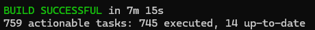
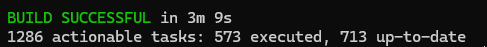
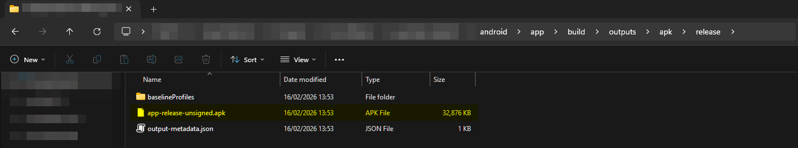
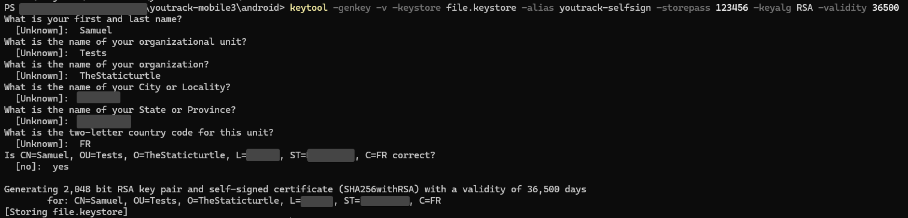
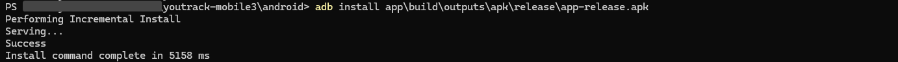

Adding supported for self-signed certificates back to the YouTrack android application.

<!--more-->


While this article is tagged as <code>tutorial</code>, keep in mind that information in this article will probably be out of date at some point. It is not meant as a "point-by-point how-to" but as a general "how I did it"


## Why

Even though most of my projects are typically developed independently, working solo does not eliminate the need for structure 🤠. As projects grow in scope, especially those that involve interconnected systems, keeping track of tasks, ideas, and progress becomes increasingly difficult without some form of organized management. 

To address this challenge, I experimented with various project management tools in an attempt to find something that aligned naturally with my workflow. I explored lightweight Kanban-style 📊 solutions such as [Wekan](https://wekan.fi/) and more comprehensive platforms such as [Openproject](https://www.openproject.org/).

My projects rarely follow a strict, predefined schedule, and I generally do not operate personal projects within fixed timelines 🕑. As a result, Gantt-based planning and deadline-driven workflows tend to be overly rigid for my needs.

The one that ultimately fitted my needs best was [Youtrack](https://www.jetbrains.com/youtrack/) from JetBrains. After experimenting with various alternatives, it stood out as the most balanced solution between simplicity and depth. It manages to provide powerful features without feeling bloated or overly complex, which was what I was looking for.

 It ticks many boxes ✅:
  - The platform offers a comprehensive set of tools for issue tracking, workflows, tagging and reporting. However, what makes it particularly appealing is that these features remain unobtrusive. If I don't need something, it doesn't clutter the interface or complicate my workflow.
  - Since I primarily work with JetBrains IDEs for software projects, the seamless integration is a major advantage.
  - Straightforward to use & Modern UI
  - Custom fields, workflows, boards, and project structures can be adjusted without excessive overhead. It provides flexibility without requiring complex setup procedures.
  - While it is clearly designed with software development in mind, its flexibility makes it suitable for organizing other types of projects as well. Whether it's infrastructure planning, research, documentation, or personal task management, it adapts surprisingly well.

With all that in mind, I decided to set up a self-hosted 🖥️ instance on my local network and started using it for my projects.

It worked well for quite some time, and I used it across several projects without any major issues. The structure, flexibility, and integrations all did exactly what I needed them to do.  However, while YouTrack handled software-oriented workflows pretty well, I found myself interacting with it less and less, especially for hardware projects 🤔.

One big thing about how my brain works is that I need very low friction when capturing ideas. If I have to go through 10 steps just to create a new issue or card when inspiration strikes, I simply won't do it. 

Which finally brings us to the main issue: I want to use YouTrack on my phone 📱.

Most of the services running in my homelab sit behind a reverse proxy that handles HTTPS termination. Certificates are issued through a self-hosted ACME server, which means I operate my own internal certificate authority. As a result, I need to install my custom CA certificate on any device that wants to access those services securely 🔒. In practice, this setup works extremely well. Once the CA is installed, everything behaves just like a publicly trusted HTTPS endpoint, and I retain full control over my infrastructure.



The first and most straightforward option is simply to use the web interface through a web browser. Since my CA certificate is installed on my phone, I can access the YouTrack instance directly via its internal URL without any certificate warnings or TLS errors. From a purely technical standpoint, this works perfectly fine.

However, while functional, it is far from ideal. The web interface, although modern and responsive on the desktop, feels relatively clunky on a smaller screen ⚙️. Navigation is less fluid, certain interactions require more taps than they should, and the overall experience doesn't feel optimized for quick, on-the-go usage. Moreover, browser-based notifications are inconsistent.

The second option is to use the native mobile application. In theory, this should be the cleanest solution. Most mobile applications rely on the system's certificate trust store, meaning that if a custom CA is installed at the system level, the app should automatically trust any certificates issued by it. This is standard behaviour on Android for properly developed apps.

Unfortunately, YouTrack's mobile application does not support this setup 😢. It does not recognize or trust certificates issued by my internal CA, even though the certificate is properly installed on the device. As a result, the native app refuses to connect to my self-hosted instance, effectively blocking the most convenient way of accessing it from my phone.

## Or does it?

There is an 8-year-old issue on the public YouTrack tracker of the mobile app that discusses support for self-signed certificates:



Now, this is slightly different from my setup. Trusting a single self-signed certificate system-wide on Android so that every application recognizes is a pain in the ass. The correct approach is to operate a proper certificate authority and install it on the device. That's precisely what I'm doing in my homelab.

Unfortunately, there is another 5-year-old issue that describes essentially the same limitation but this time with a CA:



What makes this particularly interesting is that the discussion mentions support for system CAs being added to the Android app in 2017 — only to be removed eight days later 😓





Seeing that sequence of commits raises some questions. My suspicion is that the change may have been introduced as an experimental fix for the earlier issue, then quickly reverted. While it looks like a deliberate lack of support on JetBrains's part, which might be true to some extent, I think the more likely reason of why it was removed was feature parity ☯️.

The patch would only affect the Android implementation. The iOS version of the app would remain unaffected which would create a feature gap between the two platforms. For a product maintained by a company like JetBrains, feature parity across platforms is understandably important. Maintaining consistency between Android and iOS may have outweighed the benefit of enabling this functionality for only one side 🤷‍♂️.

Fortunately for me, I couldn't care less about the iPhone 🗑️ app. And to be completely honest, as long as it works for my setup, I'm not particularly concerned about keeping the mobile app updated. Since I access my homelab exclusively through a VPN, the traffic never leaves my internal network 🌐. While it's not a textbook-perfect setup, in the context of my threat model, it's an acceptable trade-off.

## Compiling the app 

This is where it gets complicated.

First I'm going to spare you the 2h of troubleshooting, at the time of writing, you will need at least:
 - NodeJS & YARN
 - JDK 17 available in the PATH
 - Android Studio:
   - Android 15 (VanillaIceCream) SDK 15
   - `Android SDK Platform 35`
   - `Intel x86 Atom_64 System Image`
   - `Android SDK Build-Tools` in the PATH
   - `Android SDK Command-line Tools (latest)` in the PATH
   - For tests only: `Android Virtual Device`
   - Add the SDK directory (`Android\Sdk`) to the ANDROID_HOME environment variable
   - Add the platform tools (`Android\Sdk\platform-tools`) to the PATH
 - A firebase app (free)
 - A sentry app (free)

### Getting the source code

Thankfully the source code of the mobile app is open-source 🎉, it uses react-native to build a cross-platform app for both Android and iOS. We will only be looking at the former in this article.

```shell
git clone https://github.com/JetBrains/youtrack-mobile
cd youtrack-mobile
yarn install
```

### Patching the config back

The patch itself is stupidly simple, starting from Android Nougat (7) a new security feature called `Network Security Configuration` was introduced. This new feature arrived, intending to allow developers to customise their network security settings without modifying app code. An additional modification was also included in the default configuration for connections to SSL/TLS services; **if the application targets an SDK higher or equal to 24, only the system certificates are trusted** 🔐.



We are simply going to modify the config to allow certificates in the user store by:

 - Adding new XML resource file `android/app/src/main/res/xml/network_security_config.xml` with:
```xml
<?xml version="1.0" encoding="utf-8"?>
<network-security-config>
	<base-config cleartextTrafficPermitted="true">
		<trust-anchors>
			<!-- Trust preinstalled CAs -->
			<certificates src="system" />
			<!-- Additionally trust user added CAs -->
			<certificates src="user" />
		</trust-anchors>
	</base-config>
</network-security-config>
```
 - Modifying the manifest to add `android:networkSecurityConfig="@xml/network_security_config"` inside the `<application` element. I also had to add `android:extractNativeLibs="true"` so that I could install the app later on.
```xml
<manifest xmlns:android="http://schemas.android.com/apk/res/android" xmlns:tools="http://schemas.android.com/tools" package="com.jetbrains.youtrack.mobile.app">
    ...
    <application
        android:name=".MainApplication"
        android:allowBackup="false"
        android:icon="@mipmap/ic_icon"
        android:label="@string/app_name"
        android:requestLegacyExternalStorage="true"
        android:roundIcon="@mipmap/ic_icon_round"
        android:theme="@style/AppTheme"
        android:usesCleartextTraffic="true"
        tools:ignore="GoogleAppIndexingWarning"
        android:networkSecurityConfig="@xml/network_security_config"
        android:extractNativeLibs="true">
```

### Configuring sentry

Sentry is an error tracking and performance monitoring tool that helps developers find and address issues quickly 👀. It captures detailed context like stack traces, user interactions, and environment info, making debugging faster and more precise. Supporting multiple languages and platforms, Sentry also provides performance insights to spot slow transactions or bottlenecks before they affect users.

The YouTrack application uses sentry and while there's probably a way to disable it completely, it was way easier to create a free account and add a "YouTrack" project.

Once you have created an organisation and a project, you can create a file in `android/sentry.properties` with the following content:
```properties
defaults.org = <fill in your organisation slug>
defaults.project = <fill in your project slug>

auth.token = <fill in your auth token>
```

### Configuring Google Services

The Google Services Plugin is a tool that simplifies integrating Google APIs into your Android projects 🔗. It automates configuration for services like Firebase, Google Analytics, and Maps, generating the necessary resources and settings, so developers can focus on building features instead of managing boilerplate setup. 

Again, there's probably a way to remove it completely, but it's far easier to create a new project on firebase and add an android app with the correct package name. Once this is done, you can download the `google-services.json` file and save it to: `android/app/google-services.json`

### Compiling the app

The whole repo is set up to run on Linux and doesn't really play well with Windows 💾, so there was a bit more work involved, like fixing the path length issue with ninja (note that I have the `ninja.exe` binary in `C:\bin\`). 

`android/app/build.gradle`
```gradle
externalNativeBuild {
	cmake {
		arguments "-DCMAKE_MAKE_PROGRAM=C:\\bin\\ninja.exe", "-DCMAKE_OBJECT_PATH_MAX=1024"
	}
}
```

Using the pre-defined NPM commands is also not possible, so I had to run them manually:

```shell
cd android
./gradlew bundleRelease
```
After a few minutes, you should see the following message 😀:



If you see anything related to:
  - Sentry / `:app:createBundleReleaseJsAndAssets_SentryUpload_com`
    - Make sure that the `android/sentry.properties` file is present and correct, it needs actual credentials to your org
  - Google / `:app:processReleaseGoogleServices`
    - Make sure that the `android/app/google-services.json` is present

```shell
cd android
./gradlew assembleRelease
```
After a few more minutes you should also get a successful build 🥳:




### Signing the app

At this point, you should have a `app-release-unsigned.apk` file inside the `android/app/build/outputs/apk/release/` folder:



First we need to run zipalign, as I understand it fixes the zip (APK) file.
```shell
zipalign -v 4 android/app/build/outputs/apk/release/app-release-unsigned.apk android/app/build/outputs/apk/release/app-release.apk
```

Next we'll need to create a keystore to hold the signing key for the app:
```shell
keytool -genkey -v -keystore file.keystore -alias youtrack-selfsign -storepass 123456 -keyalg RSA -validity 36500
```



Finally, we'll actually sign the app:

```shell
apksigner sign --ks ./file.keystore ./app/build/outputs/apk/release/app-release.apk
```

### Installing the app

The last step is to install the app. How you do this is up to you, you can simply send the file to your phone and do it this way.
I choose to do it via ADB because it was easier:

```shell
adb install app/build/outputs/apk/release/app-release.apk
```


After the app is installed, you can start it and login to your instance 🌐:


images/youtrack_2026-02-16_14-23-53_2c0f3e0e-87d9-4544-9764-64380afb1db9.png "App start screen"
images/youtrack_2026-02-16_14-24-40_1d29e823-2bf4-485c-8989-3e39a2ea37a1.png "Login page"
images/youtrack_2026-02-16_14-25-30_a27a655e-7af0-419b-9bd5-f09fae269b78.png "App settings"


## Conclusion

I'm pretty happy with this 😁, it took 5h to set up and figure out how to build everything, but I now have the mobile app working. Maybe an improvement would be to design a CI flow so that it could easily be rebuilt for an update, but as I said before I don't really care about this for now 🤷‍♂️.

Happy building!